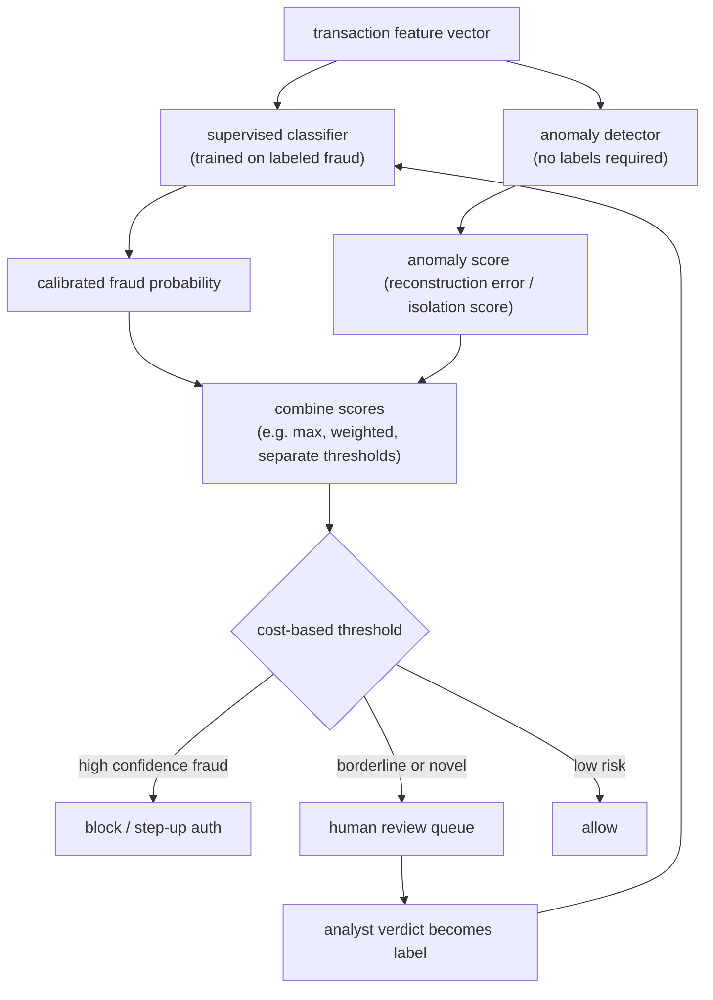

# 2. Framing it as an ML task

## Two paths: supervised classification and anomaly detection

The requirements describe two distinct problems that need two tools.

**Supervised classification** applies when we have labeled fraud. The model
learns to estimate $p(\text{fraud} \mid x)$ from historical (transaction,
label) pairs, and that calibrated probability (a score that means what it says:
of transactions scored 0.05, about 5 percent truly turn out to be fraud) feeds
the cost-sensitive threshold. Supervised models are accurate on known attack patterns and fast to
serve. Their blind spot is novelty: they cannot flag attacks they have never
seen labeled.

**Anomaly detection** applies when labels are absent or when the attack pattern
is new. Methods like Isolation Forest or autoencoder reconstruction error score
how unusual a transaction is relative to normal behavior, with no labels
required. The payoff is catching new fraud the supervised model has not yet
learned. The cost is a higher false-positive rate: unusual is not the same as
fraudulent. Anomaly hits feed the human review queue, and analyst verdicts there
become the labels that train the next supervised model.

The mature answer runs both in parallel: supervised for known fraud at high
precision, anomaly detection for novel attacks, and the human review queue
bridging the two.

**How it works.** A single transaction feature vector fans out to two scorers that run in parallel: a supervised classifier trained on labeled fraud and an unsupervised anomaly detector that needs no labels. The supervised branch emits a calibrated fraud probability while the anomaly branch emits a reconstruction or isolation score, and a combine step reconciles the two (a max, a weighted blend, or separate thresholds) into one decision input. That combined signal hits a cost-based threshold that routes each transaction three ways: high-confidence fraud is blocked or sent to step-up auth, low risk is allowed, and borderline or novel cases go to the human review queue. The queue closes the loop: an analyst verdict becomes a fresh label that feeds the next retraining of the supervised model, so novelty caught by anomaly detection gradually becomes known patterns the classifier can score directly.

## Compare and contrast: supervised fraud model vs anomaly detection

From the outside the two paths look interchangeable: both consume the same feature
vector, both run on the same real-time scoring path, and both emit a per-transaction
risk score that can gate a block or a review. The resemblance ends at what the score
means and where it comes from, and conflating the two leads to broken thresholds.

| Dimension | Supervised fraud model | Anomaly detection |
|---|---|---|
| Input and serving shape | same feature vector, same low-latency scoring path (same) | same feature vector, same path (same) |
| Emits a per-event risk score | yes (same) | yes (same) |
| What a high score means | "resembles fraud I was trained on" | "deviates from normal traffic," which includes rare but legitimate behavior |
| Learns from | (transaction, label) pairs; needs matured labels | the unlabeled distribution of normal traffic; no labels at all |
| Blind spot | novel attacks it has never seen labeled | common attacks that mimic normal behavior closely |
| Score semantics | calibratable to a true probability, so the cost-optimal threshold formula applies | arbitrary scale (isolation depth, reconstruction error); no probability interpretation, threshold set by alert-budget quantile |
| How it improves | every labeled retrain sharpens known patterns | only by refreshing the model of "normal" as traffic evolves |

The difference changes the design at the decision layer: a supervised probability
can be pushed through the cost-based threshold to auto-block, but an anomaly score
cannot be plugged into that formula, so anomaly hits must be routed to the review
queue (or a separate quantile threshold) where analyst verdicts convert them into
the labels the supervised model needs next.

## When to use which

| Reach for | When | Instead of |
|---|---|---|
| Supervised classifier (XGBoost, DNN) | you have mature labeled fraud and want high precision on known patterns | anomaly detection, which trades precision for novelty coverage |
| Anomaly detection (Isolation Forest, autoencoder) | novel attack with no labels yet, or as a first-pass layer to feed the review queue | supervised, which is blind to patterns it was never trained on |
| Both in parallel | you need high precision on known fraud AND want a safety net for novel attacks | either alone, which leaves one gap uncovered |
| Graph anomaly (GraphBEAN, RGCN) | fraud is coordinated across accounts sharing devices, cards, or addresses | per-transaction models that treat each event in isolation |

**Provenance.** The supervised branch rests on XGBoost (Chen and Guestrin, 2016) and
LightGBM (Microsoft, 2017). The unsupervised branch uses Isolation Forest (Liu et
al., 2008), which scores anomalies by how few random splits isolate a point, and
autoencoder anomaly detection, which flags points with high reconstruction error.

**Tools.** The supervised classifier is XGBoost or LightGBM (Microsoft) for tabular
features, or a PyTorch / TensorFlow DNN when sparse embeddings (learned numeric
vectors that stand in for high-cardinality categories like a device ID) help. Anomaly
detection uses scikit-learn's Isolation Forest or a PyTorch autoencoder scored by
reconstruction error, with imbalanced-learn on hand if any labeled resampling is
needed. Graph anomaly methods (RGCN, GraphBEAN) are built on PyG (PyTorch Geometric)
or DGL. Running both paths in parallel is an orchestration choice in the serving
code, not a separate library.

**Worked example.** A payments company has years of analyst-labeled fraud, so it
leans on a supervised classifier (XGBoost) for high precision on known attack
patterns and fast scoring. Because that model is blind to attacks it has never seen
labeled, it runs an Isolation Forest anomaly detector in parallel as a first-pass
layer feeding the human review queue, accepting the higher false-positive rate as the
price of novelty coverage. When fraud turns out to be coordinated across accounts
sharing devices and cards, it adds a graph anomaly model (GraphBEAN) that
per-transaction models would miss entirely. Analyst verdicts on the review queue
become the labels that train the next supervised model, so the two paths reinforce
each other rather than competing.

## The input feature vector

The model consumes a feature vector assembled at decision time from several
signal groups. Each group contributes a different kind of evidence.

**Transaction fields (raw).** Amount, currency, merchant category code,
merchant country, card BIN (the first six digits that identify the issuer and
card type), entry mode (chip, contactless, CNP), and time of day.

**Velocity and aggregate features.** Stateful counts (velocity features measure
how fast activity is happening for a card or account) precomputed over rolling
windows: transactions per card in the last minute / hour / 24 hours, distinct
merchants per card, total spend per account, number of distinct devices per
account, geo-velocity (two transactions from cities 1,000 km apart within an
hour). These are the most predictive signals and the hardest to serve correctly
(training-serving skew bites here).

**Graph and entity signals.** Whether the device, IP, or card has been linked
to known fraud accounts; connected-component size in the shared-entity graph;
hops-to-fraud in the identifier network; shared-device count. These surface
ring fraud that looks clean at the per-transaction level.

**Behavioral and session signals.** Typing cadence, mouse dynamics, device
orientation changes, time-on-page for the checkout flow. Feedzai uses these
as behavioral biometrics; they are hard for fraudsters to fake consistently.

**Identity signals.** Account age, email domain age, billing-to-shipping address
mismatch, whether the shipping address is a freight forwarder, device and
browser fingerprint.

## The output

The model outputs a **calibrated probability** $p(\text{fraud} \mid x) \in
[0, 1]$. Calibration matters because the cost-optimal threshold formula assumes
the score is a true probability. An uncalibrated model (for example a raw
logit, or a model trained on a resampled set) can be well-ranked but will place
the operating point at the wrong threshold.

The probability feeds a cost-based threshold that produces one of three actions:
allow, block, or route to review. The threshold is revisited whenever the cost
matrix or the base rate changes.
