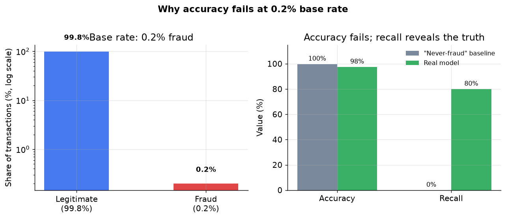

# 3. Data preparation

## Extreme class imbalance: handling the 0.2 percent problem

At a 0.2 percent fraud rate, the training set has roughly 499 legitimate
transactions for every fraud. A model that ignores this imbalance learns to
predict "legitimate" for everything, achieves 99.8 percent accuracy, and catches
zero fraud. The figure below shows exactly this failure: the "never-fraud"
baseline wins on accuracy but delivers zero recall.

*Left: the 0.2 percent / 99.8 percent split shown on a log scale. Right: the
never-fraud baseline scores 99.8 percent accuracy but 0 percent recall. A real
model trades some accuracy for meaningful recall. Illustrative figures.*

Three approaches address the imbalance at training time:

**Class weights.** Upweight the fraud class in the loss function so each fraud
example contributes more gradient than a legitimate one. If fraud is 0.2
percent, a weight ratio of 499:1 (or a round number like 100:1 tuned as a
hyperparameter) restores a balanced loss without touching the data. This is the
cheapest option and preserves every example. It is the right first move.

**Undersampling the majority.** Randomly discard legitimate examples until the
ratio reaches a target (say 10:1 or 1:1). Fast and simple. Throws away real
signal; the model never sees a large fraction of the legitimate distribution,
which can hurt calibration.

**SMOTE (synthetic minority oversampling).** For each minority point, find its
k nearest minority neighbors and interpolate synthetic new examples along the
line between them. Paired with light majority undersampling, SMOTE can lift
recall when labeled fraud is scarce. Its risks: interpolating near a noisy or
overlapping decision boundary invents unrealistic examples and blurs the very
boundary you care about; and SMOTE assumes a metric space, so raw categoricals
need encoding first.

A critical rule: **always evaluate on the true imbalanced distribution**, never
on a rebalanced eval set. Rebalancing training is legitimate; rebalancing eval
inflates precision to fiction.

### When to use which

| Reach for | When | Instead of |
|---|---|---|
| Class weights (upweight fraud) | baseline move; fast, keeps all data, no calibration distortion | SMOTE or undersampling as the first thing you try |
| Focal loss (see Section 4) | you want imbalance handled inside the loss with a smooth modulating factor | hard class-weight ratio that requires manual tuning |
| Undersampling majority | training data is huge and compute is the constraint | when every legitimate example carries rare signal you cannot afford to drop |
| SMOTE | labeled fraud is very scarce and recall is critically low despite class weights | when the decision boundary is overlapping or noisy (interpolation invents bad examples) |
| No resampling at eval time | always: measure on the real base rate | a rebalanced eval set, which makes precision look far better than it is |

## Label delay and the maturation window

Chargebacks arrive 30 to 120 days after the transaction. This creates a
poisoning problem in both training and evaluation.

**The maturation window.** Recent transactions have no settled label yet.
Treating them as "not fraud" is a labeling bug: many are fraud whose chargeback
simply has not arrived. The fix is a maturation window: only include examples
whose labels have had enough time to mature (typically 60 to 90 days). Training
therefore always lags the present by at least the maturation window, which is
exactly when a fast-adapting adversary has already moved on.

**Leading indicators.** While waiting for chargebacks, use fast signals as
leading indicators: instant customer disputes, analyst verdicts from the review
queue, and rule-based flags. These are noisier than chargebacks but they close
in minutes. Reconcile them against settled labels once available.

**Never treat unmatured data as negative.** This is the single most common
label-delay mistake. Filter out the maturation window entirely rather than
mislabeling recent fraud as legitimate.

## Point-in-time correctness: preventing feature leakage

When a chargeback arrives weeks after a transaction, the temptation is to join
the delayed label to current account state. That is a leakage bug: features
like "total disputes on this account" or "account age" will reflect the future
at the time of training but not at the time of serving, inflating offline
metrics and collapsing live performance.

The rule is: **join delayed labels to feature values as of the transaction
time**, not as of the label-arrival time. This requires a feature store with
point-in-time query support, or careful engineering of timestamped feature logs.
Velocity counters are especially dangerous: if the batch feature pipeline
computes "transactions in the last hour" as of today rather than as of the
original transaction time, every velocity feature leaks.

## Feature groups

| Group | Examples | Key property |
|---|---|---|
| Velocity / aggregate | txns per card in last 1m / 1h / 24h, distinct devices per account, geo-velocity | Most predictive; must be precomputed streaming aggregates to stay fresh at decision time |
| Graph / entity | shared-device count, component size, hops-to-fraud, ring membership flags | Surfaces coordinated fraud invisible to per-transaction models |
| Behavioral / session | keystroke timing, mouse dynamics, touch pressure, time-on-checkout-page | Hard to fake consistently; strong for account takeover and bot detection |
| Identity | account age, email domain age, billing-shipping mismatch, freight-forwarder flag, device fingerprint | Cheap static lookups; good baseline for new-account fraud |
| Transaction raw | amount, MCC, card BIN, entry mode, geo, time-of-day | Direct features from the authorization request; always available at decision time |

## Train / validation split: time-based only

The split must be time-based: train on the past, validate on the future. A
random split leaks future chargeback patterns into training, inflates every
offline metric, and destroys trust in the evaluation. Hold the most recent
settled window as the validation set and treat any data inside the maturation
window as unlabeled rather than negative.
