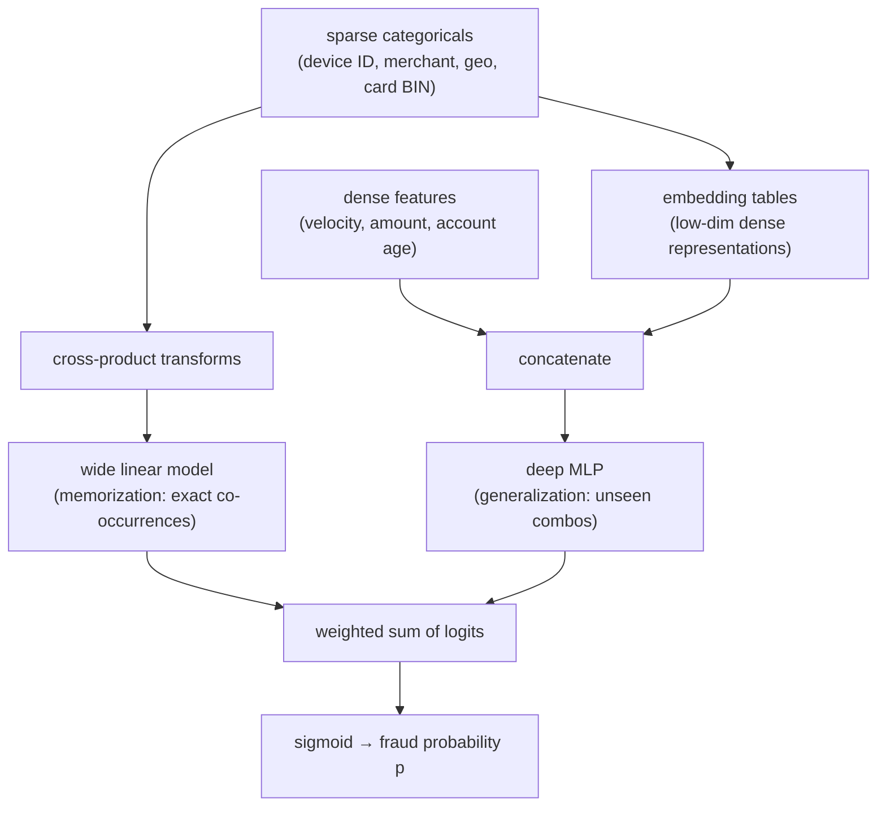
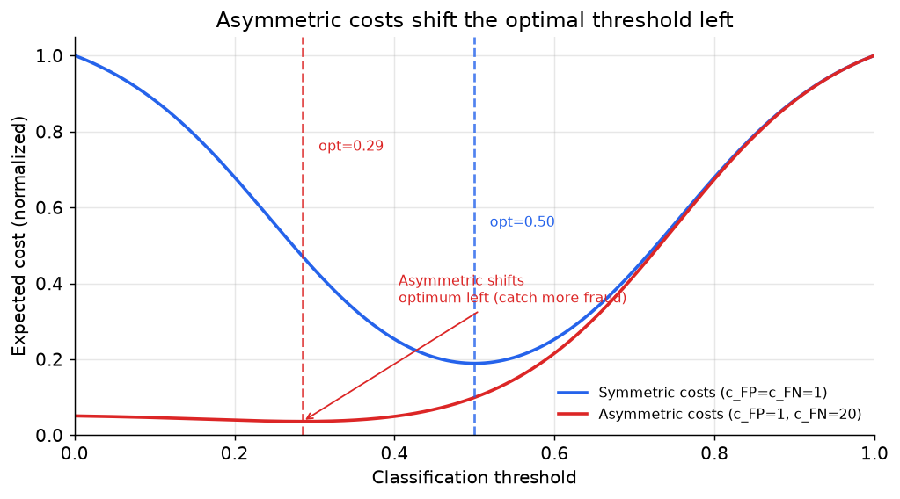
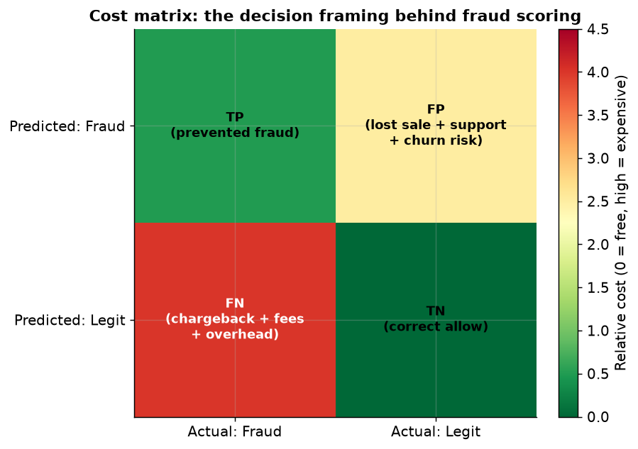

# 4. Model development

## Gradient-boosted trees: the tabular workhorse

For a tabular fraud problem with hundreds of engineered features, gradient-
boosted trees (XGBoost, LightGBM) are the first model to reach for. They handle
mixed feature types naturally, give feature importance for free, produce
well-calibrated probability estimates with isotonic regression or Platt scaling
applied post-training, and train fast enough for daily or even hourly retraining
cycles. Capital One's AML program uses a random forest to triage suspicious-activity
alerts, prioritizing cases for investigation across hundreds of features under
regulatory scrutiny where explainability is a hard requirement. The message: trees
are not a fallback; they are the right starting point for tabular fraud signals
and a strong baseline to beat before reaching for a DNN.

## Wide-and-Deep DNN

When the feature set includes high-cardinality sparse categoricals (device ID,
merchant ID, card BIN, geo cell), a deep model can learn richer interaction
patterns. The **wide-and-deep** architecture (Cheng et al., 2016) handles this
directly.

The wide side memorizes specific co-occurrences (device X plus merchant Y plus
time-of-day Z was always fraud last month). The deep side generalizes to unseen
combinations. They are trained jointly: the wide branch uses FTRL, the deep
branch uses Adam, and neither is trained in isolation. Stripe's Radar system uses
a supervised model over tabular features and entity embeddings that is
continuously retrained and must score each transaction in sub-100 ms.

Two points to state in an interview: (1) embedding tables dominate parameter
count, not the MLP layers, so the engineering cost of growing the embedding
dimension is in memory, not compute; (2) the joint logit distorts calibration
and must be recalibrated before using the cost-optimal threshold formula.

## Graph methods: RGCN for rings, graph-DB traversal for online latency

Individual transactions can look clean while the entity network screams. Fraud
rings share devices, cards, IPs, and addresses across many accounts. Two
approaches exploit this structure, at different latency points.

**RGCN (Relational Graph Convolutional Network).** Used by Uber and Grab. Each
edge type (shared card, shared device, shared city) gets its own transform
matrix so different relationship types carry different signal weights. Message
passing aggregates neighborhood information:

$$h_i^{(l+1)} = \sigma\!\left(W_0^{(l)} h_i^{(l)} + \sum_{r \in R}\sum_{j \in N_i^{r}} \frac{1}{|N_i^{r}|} W_r^{(l)} h_j^{(l)}\right)$$

Here $R$ is the set of relation types, $N_i^r$ is the set of neighbors of node
$i$ under relation $r$, and $W_r^{(l)}$ is the relation-specific weight matrix
at layer $l$. The key: a plain GCN would conflate a shared device with a shared
city; RGCN keeps them separate. Uber reported 15 percent better precision with
minimal added false positives feeding downstream risk models. Because training
and inference are batch jobs, RGCN scores are injected as features into the
online risk model rather than serving the GNN inline.

**Graph-DB traversal features.** Used by PayPal and Booking. A graph database
(PayPal's custom Gremlin-over-Aerospike; Booking's JanusGraph over Cassandra)
stores entity relationships and runs BFS or multi-hop traversal at request time.
PayPal links a new account to a known fraud ring within a sub-second at million-
QPS throughput. Booking extracts a `hops_to_fraud` scalar feature within a p99
of 300 ms. This path delivers online graph signal without training or serving a
GNN, at the cost of a specialized graph infrastructure.

## Anomaly detection methods

**Isolation Forest.** Builds an ensemble of random binary trees by splitting
features at random split points. Points that require fewer splits to isolate
score as more anomalous. Fast to train and serve, no labels, interpretable
anomaly scores. Suitable as a first pass for novel attacks or as a complement
to the supervised model.

**Autoencoder / GraphBEAN.** Grab's GraphBEAN is a bipartite-graph autoencoder
that reconstructs both node attributes and edge attributes on a consumer-merchant
graph. Points that reconstruct poorly are anomalous. The anomaly score is:

$$s(v) = \|x_v - \hat{x}_v\|^2 + \sum_{e \ni v}\|a_e - \hat{a}_e\|^2 + \text{BCE}(A, \hat{A})$$

The three terms are node reconstruction error, edge reconstruction error, and
structural reconstruction error (binary cross-entropy on the adjacency matrix).
Normal behavior reconstructs easily; novel fraud produces high combined error.
This catches novel fraud without labels, at the cost of high false positives on
unusual-but-legitimate behavior.

## Loss functions

### Focal loss

Standard cross-entropy treats every example equally. When 99.8 percent of
examples are easy legitimate transactions, the gradient is dominated by easy
negatives and the rare fraud class barely moves the model. Focal loss fixes this
by downweighting easy, well-classified examples:

$$\text{FL}(p_t) = -\,\alpha_t\,(1-p_t)^{\gamma}\log(p_t)$$

where $p_t = p$ when $y=1$ and $p_t = 1-p$ when $y=0$.

The modulating factor $(1 - p_t)^{\gamma}$ goes to zero for confident correct
predictions (easy legitimate transactions contribute almost nothing) while a
hard or misclassified fraud retains its full weight. $\alpha_t$ is a class-
weight term; $\gamma$ controls the focus strength (typically 2.0). Focal loss
is preferred over SMOTE when you want to handle skew inside the loss without
distorting the data distribution.

### Class-weighted binary cross-entropy

Simpler than focal loss: multiply the per-example BCE loss by a class weight.
If fraud is 0.2 percent, a weight of 499 on fraud examples restores a balanced
effective loss. Tune the weight as a hyperparameter against PR-AUC on the true
base rate.

### Airbnb three-action loss

When the action space is allow / friction / block (rather than binary), the
loss accounts for friction as a middle option:

$$L = \text{FP} \cdot G \cdot V + \text{FN} \cdot C + \text{TP} \cdot (1-F) \cdot C$$

Here $G$ is the good-user churn rate under friction, $V$ is the transaction
value, $C$ is the chargeback cost, and $F$ is the friction effectiveness
(fraction of fraud stopped by the friction step). The first term penalizes
false positives that drop good users through friction; the second penalizes
missed fraud; the third acknowledges that some fraudsters beat the friction
and still cause loss.

## Cost-sensitive thresholding

The model outputs a calibrated probability. The threshold that minimizes
expected cost in closed form is:

$$\tau^{\star} = \frac{c_{\text{FP}}}{c_{\text{FP}} + c_{\text{FN}}}$$

When a missed fraud costs 20 times a false positive ($c_{\text{FN}} = 20$,
$c_{\text{FP}} = 1$), this gives $\tau^{\star} = 1/21 \approx 0.048$. The
system blocks any transaction where the estimated fraud probability exceeds
4.8 percent. This is far below the default 0.5 and is why reporting a model
with a 0.5 threshold is almost always wrong in fraud.

For the full expected-cost curve across all thresholds:

$$L(\tau) = c_{\text{FP}} \cdot \text{FP}(\tau) + c_{\text{FN}} \cdot \text{FN}(\tau), \qquad \tau^{\star} = \arg\min_{\tau} L(\tau)$$

The figure below shows this curve for symmetric and asymmetric cost ratios, and
the shift in optimal threshold.

*Asymmetric costs (c_FN=20) shift the optimal threshold well to the left of the
symmetric case (c_FP=c_FN=1), catching more fraud at the cost of more false
alarms. The dashed verticals mark each optimum. Illustrative.*

The figure below shows the cost matrix that drives this calculation.

*TN (correct allow) costs zero. TP (prevented fraud) costs little. FP (blocked
good user) costs the lost sale plus support and churn. FN (missed fraud) is the
most expensive: the chargeback amount plus network fees. Illustrative.*

## When to use which model family

| Reach for | When | Instead of |
|---|---|---|
| Gradient-boosted trees (XGBoost, LightGBM) | tabular features, explainability required, fast retrain cadence, regulatory audit | deep models as the default; trees often match or beat DNN on tabular fraud |
| Wide-and-Deep DNN | high-cardinality sparse categoricals (device, merchant) reward embeddings and you have scale | trees when the feature set is mostly dense and well-engineered |
| RGCN / GNN | fraud is coordinated rings over shared cards, devices, addresses | per-transaction models that miss collusion; costly if latency is inline |
| Graph-DB traversal features | you want ring signal inline at serving time without training a GNN | learned GNN, when the inline latency budget allows and you need richer representations |
| Isolation Forest | first-pass anomaly detection for novel attacks with no labels | supervised only, which is blind to novel patterns it was never trained on |
| GraphBEAN / autoencoder | bipartite or graph-structured data, novel fraud, no labels | supervised anomaly, which needs labels it does not have |
| Ensemble (supervised + anomaly) | mature production system with both known and novel fraud | single model that covers only one threat mode |
