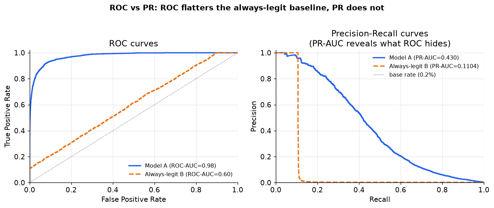

# 5. Evaluation

## Why PR-AUC beats ROC-AUC under extreme imbalance

ROC-AUC is the standard metric for binary classifiers, but it is silently
misleading when positives are rare. It measures the probability that the model
assigns a higher fraud score to a randomly drawn positive (fraud) than to a
randomly drawn negative (legitimate): $\text{ROC-AUC} = P(\hat{s}^+ \gt \hat{s}^-)$,
computed as the area under the curve of true-positive rate
$\text{TPR} = \text{TP}/(\text{TP}+\text{FN})$ against false-positive rate
$\text{FPR} = \text{FP}/(\text{FP}+\text{TN})$, sweeping over all score thresholds.
The reason it is misleading here is structural: at a 0.2 percent base
rate, there are roughly 500 negative examples for every positive. Even a model
with very poor precision can achieve a high true-positive rate without moving
the false-positive rate much, because the vast true-negative mass absorbs false
positives invisibly. The "always-legit" baseline has an ROC-AUC of exactly 0.5
(random), which correctly identifies it as useless. But a model that is only
slightly better than random on the rare positive class can still show an ROC-AUC
of 0.85+ by being good at the easy negatives.

```python
def roc_auc(labels, scores):   # P(random fraud scores higher than random legit); ties count 0.5
    import numpy as np
    labels, scores = np.asarray(labels), np.asarray(scores)
    pos = scores[labels == 1]                     # scores of the fraud examples
    neg = scores[labels == 0]                     # scores of the legit examples
    wins = 0.0
    for p in pos:
        wins += np.sum(p > neg) + 0.5 * np.sum(p == neg)   # count fraud-beats-legit pairs
    return float(wins / (len(pos) * len(neg)))    # fraction of all such pairs ranked correctly
# roc_auc([1,0,1,0], [0.9,0.8,0.7,0.1]) -> 3/4 = 0.75
```

PR-AUC (average precision) does not have this property. It is computed purely
from the precision-recall curve, which focuses entirely on the positive class.
The baseline curve for a classifier that outputs random scores sits at
approximately the base rate (0.002 at a 0.2 percent prevalence). Any model
that does better than this shows its improvement clearly.

The figure below makes this concrete.



*Left: ROC curves for a decent model (A) and an always-legit baseline (B). The
baseline sits at the diagonal (ROC-AUC=0.50), which correctly reads as random.
Right: PR curves for the same two classifiers. The baseline PR-AUC is
approximately the base rate (near zero), and the model's improvement is visible
and honest. Illustrative with synthetic distributions.*

## PR-AUC formula (average precision)

**Input / output.** The model takes transaction features and outputs a fraud
score $\hat{s} \in [0,1]$ per transaction; the metric sweeps every score
threshold, building the precision-recall curve, and summarizes the full curve
as a single scalar in $(0, 1]$.

$$\text{AP} = \sum_{k}(R_k - R_{k-1}) \cdot P_k$$

where $P_k = \text{TP}_k / (\text{TP}_k + \text{FP}_k)$ is the precision
(fraction of flagged transactions that are genuine fraud) and
$R_k = \text{TP}_k / (\text{TP}_k + \text{FN}_k)$ is the recall
(fraction of all genuine fraud flagged) at threshold $k$.
Average precision is the recall-weighted mean of precision values, summarizing
the entire curve into one number. It is the primary offline metric for fraud
scoring.

```python
import numpy as np
def average_precision(scores, labels):
    scores, labels = np.asarray(scores, float), np.asarray(labels, float)
    order = np.argsort(-scores)                 # rank transactions by fraud score, high to low
    labels = labels[order]
    tp = np.cumsum(labels)                      # true positives accumulated down the ranking
    fp = np.cumsum(1 - labels)                  # false positives accumulated down the ranking
    precision = tp / (tp + fp)                  # P_k at each threshold
    recall = tp / labels.sum()                  # R_k at each threshold
    dr = np.diff(recall, prepend=0.0)           # R_k - R_{k-1}
    return float(np.sum(dr * precision))        # recall-weighted sum of precision
# average_precision([0.9, 0.8, 0.3, 0.2], [1, 0, 1, 0]) -> 0.8333333333333333
```

## Precision at fixed recall

For a given operating constraint, report precision at a fixed recall floor
$R_{\min}$. Find the score threshold $\tau^{\star}$ that maximizes precision
while keeping recall at or above the floor, then read off the precision there:

$$P_{\text{at}\ R_{\min}} = P(\tau^{\star}), \quad \tau^{\star} = \arg\max_\tau\, P(\tau) \quad \text{s.t.}\ R(\tau) \geq R_{\min}$$

```python
def precision_at_recall(labels, scores, r_min):   # best precision while recall >= r_min
    import numpy as np
    labels, scores = np.asarray(labels), np.asarray(scores)
    order = np.argsort(-scores)                    # rank transactions high score first
    labels = labels[order]
    tp = np.cumsum(labels)                         # true positives down the ranking
    fp = np.cumsum(1 - labels)                     # false positives down the ranking
    precision = tp / (tp + fp)                     # P at each threshold
    recall = tp / labels.sum()                     # R at each threshold
    ok = recall >= r_min                           # thresholds meeting the recall floor
    return float(precision[ok].max())              # highest precision among them
# precision_at_recall([1,0,1,0], [0.9,0.6,0.5,0.1], 0.5) -> 1.0
```

The typical question is "what is the precision when recall equals 0.80?" This is the
right question for a cost-sensitive system where the business has decided it
must catch at least 80 percent of fraud and wants to know how many legitimate
transactions that requires blocking. PR-AUC summarizes the full curve, but
the precision-at-recall-target is what feeds the cost model and justifies
the threshold choice to stakeholders.

## Cost-weighted operating point

The correct offline evaluation is not just the PR curve shape; it is the
expected cost at each threshold. For each candidate threshold $\tau$ on the
validation set, compute:

$$L(\tau) = c_{\text{FP}} \cdot \text{FP}(\tau) + c_{\text{FN}} \cdot \text{FN}(\tau)$$

```python
def min_cost_threshold(labels, scores, c_fp, c_fn):   # sweep thresholds, return (tau*, cost)
    import numpy as np
    labels, scores = np.asarray(labels), np.asarray(scores)
    best = None
    for tau in np.unique(scores):                     # candidate thresholds = observed scores
        pred = scores >= tau
        fp = int(((pred == 1) & (labels == 0)).sum())  # blocked good users at this threshold
        fn = int(((pred == 0) & (labels == 1)).sum())  # missed fraud at this threshold
        cost = c_fp * fp + c_fn * fn
        if best is None or cost < best[1]:             # keep the cheapest threshold
            best = (float(tau), cost)
    return best
# min_cost_threshold([1,1,0,0], [0.9,0.8,0.2,0.1], 1, 20) -> (0.8, 0)
```

Plot this curve (normalized) and mark the minimum. The threshold that minimizes
expected cost on the validation set is the threshold that ships. This is a
decision-theory evaluation, not a leaderboard metric.

Report both:
- **PR-AUC** as the model-quality gate (model A is better than model B across
  the full operating range).
- **Cost at the chosen operating point** as the shipping gate (model A saves X
  dollars per thousand transactions versus the current system at the cost ratio
  in production).

## Time-based split is mandatory

The validation set must be future data relative to the training set. A random
split allows the model to train on chargebacks that postdate the transactions
in the validation set, which is a form of label leakage. Always split by time
and respect the maturation window: do not include transactions in the validation
set that do not yet have settled labels.

## Online metrics

Offline PR-AUC and cost-at-threshold are the pre-ship gates. The real ship
decision is made on live metrics measured against settled labels:

- **Blocked fraud dollars.** The dollar value of fraud stopped. The goal.
- **False-positive rate on settled labels.** Of the transactions the system
  blocked or routed to review, what fraction turned out to be legitimate once
  chargebacks settle. This is the false discovery rate on the actioned set:
  $\text{FDR} = \text{FP}/(\text{TP}+\text{FP}) = 1 - \text{precision}$,
  measuring the cost the system imposes on legitimate users. The constraint.
- **Review queue precision and throughput.** Of cases sent to analysts, what
  fraction are confirmed fraud? If it falls, the model is sending too many
  easy legitimates to the queue.
- **Human review audit.** Periodically sample analyst decisions and audit for
  consistency, since analyst verdicts become training labels.

The false discovery rate above is a one-liner over the actioned set:

```python
def false_discovery_rate(labels, scores, tau):   # FP / (TP + FP) among flagged; = 1 - precision
    import numpy as np
    labels, scores = np.asarray(labels), np.asarray(scores)
    flagged = scores >= tau                       # transactions the system blocked / reviewed
    tp = int((flagged & (labels == 1)).sum())     # flagged and truly fraud
    fp = int((flagged & (labels == 0)).sum())     # flagged but actually legit
    return fp / (tp + fp)                         # fraction of flagged cases that were legit
# false_discovery_rate([1,0,1,0], [0.9,0.8,0.2,0.1], 0.5) -> 1/2 = 0.5
```

## The metrics matrix: offline vs online, component vs end-to-end

The metrics above sort onto two axes: offline (replayed on logged transactions with a
time-based split) versus online (measured on live traffic against settled labels), and
component (the scoring model in isolation) versus end-to-end (the whole block-or-allow
system as the business feels it).

| | Offline | Online |
|---|---|---|
| **Component metric** | PR-AUC (average precision), precision at a fixed recall, and calibration/ECE for the fraud scorer in isolation | Score-distribution drift and per-decision serving latency for the scoring service |
| **End-to-end metric** | Cost at the chosen threshold on a held-out, time-split period, using the c_FP and c_FN cost matrix | A/B or holdback on blocked-fraud dollars against the settled-label false-positive rate |

The split is what makes a regression actionable: a component number (PR-AUC dropped)
localizes the model, but only the online end-to-end number (net fraud dollars saved
minus good-user friction) justifies shipping a new threshold or model.

## When to use which metric

| Reach for | When | Instead of |
|---|---|---|
| PR-AUC (average precision) | primary offline model quality gate at any base rate under 5% | ROC-AUC, which a near-random model can game via true-negative mass |
| Precision at fixed recall target | communicating the operating point to stakeholders ("we catch 80% of fraud, how often do we bother a good user?") | PR-AUC alone, which does not answer a specific operating question |
| Cost at the chosen threshold | choosing the threshold that ships, given the cost matrix | a default 0.5 threshold, which ignores the asymmetric cost structure |
| Accuracy | never, for fraud | PR-AUC; accuracy rewards predicting the majority class |
| ROC-AUC | only as a secondary sanity check alongside PR-AUC | as the primary metric; it flatters models on rare positives |
| Online blocked-fraud-dollars vs FP-rate | the final ship decision against settled labels | offline metrics alone, which do not reflect the live cost structure |
| Time-based val split | always | random split, which leaks future label information |

**Tools.** scikit-learn covers most of the offline metrics: average_precision_score
for PR-AUC, precision_recall_curve to read precision at a fixed recall floor, and
roc_auc_score for the secondary ROC sanity check. Cost at a threshold is a short
sweep over the precision_recall_curve outputs weighted by the cost matrix (c_FP,
c_FN). Time-based splitting is done with pandas or scikit-learn's TimeSeriesSplit,
never a random shuffle. Online blocked-fraud-dollars and the settled-label
false-positive rate come from the production logging and experimentation stack, joined
to chargeback outcomes once the labels mature.

**Worked example.** A payments company evaluates a fraud model at a base rate well
under 5 percent, so it leads with PR-AUC (average precision) rather than ROC-AUC,
which a near-random model can inflate through the huge true-negative mass. To justify
the launch to stakeholders it reports precision at a fixed recall floor, answering how
many good users get bothered to catch that share of fraud, then picks the shipping
threshold by minimizing expected cost under the production c_FN to c_FP ratio rather
than defaulting to 0.5. It never reports accuracy, which would reward always
predicting legitimate. All offline numbers use a time-based split that respects the
chargeback maturation window, and the real ship call is made online on blocked-fraud
dollars against the settled-label false-positive rate.
