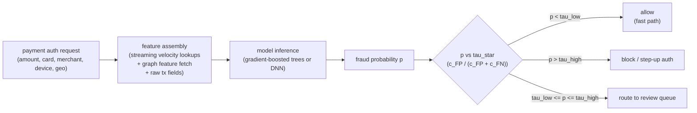

# 6. Serving and scaling

## The two serving paths

Fraud scoring has two temporal paths that must be designed together.

**Batch precompute.** Features that do not depend on the current transaction
(account history, graph embeddings, entity risk scores from RGCN runs) are
computed offline and written to a low-latency serving store. RGCN and GraphBEAN
produce batch scores that feed as features into the online model.

**Online scoring at authorization time.** The decision sits inline with payment
authorization. The feature assembly step retrieves precomputed velocity counters
and graph features from the serving store, appends raw transaction fields, and
calls the model. The model must be fast enough that the total path (feature
assembly + model inference + threshold) completes within the p99 latency budget.

## The inline scoring path

Every box in this path has a latency contribution. The model itself is usually
fast: a gradient-boosted tree ensemble with 500 trees scores in under 1 ms;
a DNN forward pass is under 5 ms. The bottleneck is usually feature assembly:
retrieving velocity counters from a Redis or Aerospike store adds 2 to 10 ms,
and a graph traversal adds 10 to 300 ms depending on implementation.

## Feature freshness and training-serving skew

Velocity counters are the most important features and the most dangerous source
of training-serving skew. A common pattern: the training pipeline computes
"transactions per card in the last hour" as a batch SQL window function over
the historical log. The serving path computes the same counter from a streaming
aggregation (Flink, Spark Streaming) over a Redis sorted set.

These two computations produce different numbers for the same card at the same
time. The model is trained on the batch numbers and served the streaming
numbers. The mismatch is silent: no error is thrown, metrics do not immediately
collapse, but the model is scoring garbage in production because the feature
distribution shifted from training.

The fix is to compute features once and share: either log the served feature
values back to the training pipeline (feature logging), or use the same
streaming aggregation for both training and serving. The feature store pattern
from the data infrastructure chapter addresses this directly. Never compute
velocity in batch for training and streaming for serving.

## Bottlenecks table

| Bottleneck | First sign | Fix | Tradeoff |
|---|---|---|---|
| Inline scoring latency over p99 budget | Auth p99 SLA breached | Cheaper model (trees over DNN), precomputed features, batch lookups with single round-trip | Model capacity vs speed |
| Velocity feature staleness | Counters are 5-15 minutes behind; attack slips through | Streaming aggregates (Flink) to low-latency store; reduce window checkpoint interval | Operational complexity, skew risk |
| Label delay | Most recent data has no mature label; recent fraud mislabeled as legitimate | Respect maturation window; use review-queue verdicts as fast leading signal | Train on stale data; leading indicators are noisier than chargebacks |
| Class imbalance | Recall collapses on validation; model always predicts legitimate | Class weights or focal loss; SMOTE if needed; never rebalance eval set | Calibration distortion from resampling |
| Threshold drift | FP or FN cost spikes; stakeholder complaints | Recompute operating point from cost matrix as costs and base rate shift; automate cost monitoring | Manual tuning cadence |
| Adversarial drift | Input feature distributions shift; score distribution narrows or shifts | Frequent retrain (daily to weekly); drift alarms on input and score distributions; anomaly path for novel attacks | Compute cost; false-positive churn during model transitions |
| Review queue overload | Analyst backlog grows; review SLA slips | Route by expected cost (review cases where wrong decision is most expensive); raise the review band threshold carefully; add analyst capacity | Coverage vs analyst load |
| Block-side blind spot | Model never learns it was wrong to block; block precision unknown | Small randomized allow-through hold-out for blocked cases; lean on review-queue verdicts for precision estimates | Exposing some blocked fraud to measure precision |
| Calibration drift | Cost-optimal threshold produces wrong operating point post-retrain | Recalibrate after every retrain (isotonic regression or Platt scaling); monitor expected calibration error | Calibration requires held-out data |
| Graph traversal latency | p99 spikes when graph query depth increases or shared-node degree grows | Cap BFS depth; prune high-degree nodes; pre-index hot entity links | Traversal depth caps can miss distant ring members |
| Training-serving skew on velocity | Live recall much lower than offline recall despite good metrics | Log served feature values; diff against training pipeline; unify computation path | Storage and compute overhead for feature logging |

Two details worth pinning down. First, the block-side blind spot is a selection-bias
loop: once the model blocks a segment, no outcome label is ever observed for it, so
the next retrain sees only the transactions the model allowed and its estimated block
precision drifts free of reality. The standard remedy is a small randomized
allow-through hold-out (a few basis points of would-be blocks let through and tracked
to settled labels) so the block region keeps producing ground truth, accepting a tiny
amount of realized fraud as the price of an unbiased precision estimate. Second, the
class-imbalance fix that reaches for SMOTE (Chawla et al., 2002) is risky exactly at
the fraud decision boundary: SMOTE interpolates new minority points between existing
fraud examples, and where fraud and legitimate transactions overlap those synthetic
points land among legitimates, so class weights or focal loss (which reweight without
inventing points) are the safer first move.
