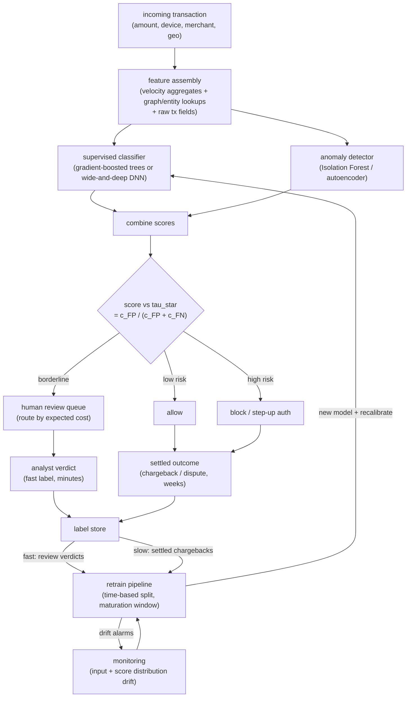

# 9. Summary

## One-page recap

- **Accuracy is useless at 0.2 percent base rate.** A never-fraud model scores
  99.8 percent and catches nothing. Optimize PR-AUC, and report precision and
  recall at the operating point you will actually deploy.

- **The threshold is the product, not a modeling default.** Derive it from the
  cost matrix: $\tau^{\star} = c_{\text{FP}} / (c_{\text{FP}} + c_{\text{FN}})$.
  At a 10:1 FN-to-FP cost ratio, the threshold is about 0.09, not 0.5. Revisit
  it whenever costs or the base rate shift.

- **Label delay is the defining property of the problem.** Chargebacks arrive
  30 to 120 days late. Respect a maturation window, never treat unmatured recent
  data as negative, and use review-queue verdicts as fast leading indicators
  until chargebacks settle. Training is always stale.

- **Imbalance is handled in the loss, not just the data.** Use class weights or
  focal loss first. Add SMOTE only when labeled fraud is very scarce and recall
  is critically low. Always evaluate on the true (imbalanced) distribution.

- **Adversarial drift is the default, not an edge case.** Fraudsters adapt the
  moment a tactic stops working. Build for short retrain cadence, drift alarms
  on input and score distributions as a safety system, and an anomaly path
  (Isolation Forest, autoencoder, GraphBEAN) for attacks with no labels yet.

- **Graph structure reveals fraud rings that per-transaction models miss.** Feed
  shared-entity graph features (hops-to-fraud, component size) into the tabular
  model for online latency, or run RGCN offline for richer representations. The
  human review queue bridges anomaly hits to supervised labels.

## The full system

## Test yourself

1. A model achieves 99.7 percent accuracy on a fraud test set. Should you ship
   it? What metric would you look at first, and why?

2. Walk through the cost-optimal threshold formula. If blocking a good user
   costs $10 and a missed fraud costs $200, what threshold would you set on a
   calibrated model? What changes if the model is uncalibrated?

3. Your training pipeline includes transactions from the last 90 days with their
   chargeback labels. What is wrong with including the most recent 60 days?
   What label would those transactions incorrectly receive?

4. Uber's RGCN improved precision by 15 percent and contributed the 4th most
   important feature out of 200 in the downstream risk model, yet it runs as a
   batch job, not inline with authorization. Why? And when would you choose
   graph-DB traversal features instead?

5. After a model retraining, live precision drops significantly. Walk through
   three hypotheses for why, ranked by how likely they are, and how you would
   diagnose each.

6. An analyst says: "I want to see fewer borderline cases in the review queue."
   How do you narrow the review band without silently causing more false negatives
   to be auto-approved?

## Further reading

- Dense reference with all comparisons, math, and quadrant plots:
  [topics/08-fraud-and-anomaly-detection.md](../../topics/08-fraud-and-anomaly-detection.md).
- Per-company teardowns with interview questions and gotchas:
  [tools/teardowns/08.md](../../tools/teardowns/08.md).
- Comparison table and math derivations:
  [tools/comparisons/08.md](../../tools/comparisons/08.md).
- Evidently AI ML system design database (800 case studies, filter for fraud):
  [evidentlyai.com/ml-system-design](https://www.evidentlyai.com/ml-system-design).
