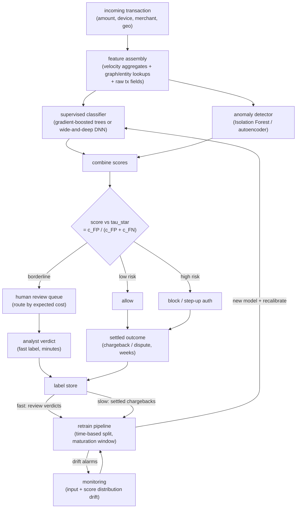

# 9. Summary

## One-page recap

- **Accuracy is useless at 0.2 percent base rate.** A never-fraud model scores
  99.8 percent and catches nothing. Optimize PR-AUC, and report precision and
  recall at the operating point you will actually deploy.

- **The threshold is the product, not a modeling default.** Derive it from the
  cost matrix: $\tau^{\star} = c_{\text{FP}} / (c_{\text{FP}} + c_{\text{FN}})$.
  At a 10:1 FN-to-FP cost ratio, the threshold is about 0.09, not 0.5. Revisit
  it whenever costs or the base rate shift.

- **Label delay is the defining property of the problem.** Chargebacks arrive
  30 to 120 days late. Respect a maturation window, never treat unmatured recent
  data as negative, and use review-queue verdicts as fast leading indicators
  until chargebacks settle. Training is always stale.

- **Imbalance is handled in the loss, not just the data.** Use class weights or
  focal loss first. Add SMOTE only when labeled fraud is very scarce and recall
  is critically low. Always evaluate on the true (imbalanced) distribution.

- **Adversarial drift is the default, not an edge case.** Fraudsters adapt the
  moment a tactic stops working. Build for short retrain cadence, drift alarms
  on input and score distributions as a safety system, and an anomaly path
  (Isolation Forest, autoencoder, GraphBEAN) for attacks with no labels yet.

- **Graph structure reveals fraud rings that per-transaction models miss.** Feed
  shared-entity graph features (hops-to-fraud, component size) into the tabular
  model for online latency, or run RGCN offline for richer representations. The
  human review queue bridges anomaly hits to supervised labels.

## The full system

```mermaid
flowchart TD
  TX["incoming transaction<br/>(amount, device, merchant, geo)"] --> ASSM["feature assembly<br/>(velocity aggregates + graph/entity lookups<br/>+ raw tx fields)"]
  ASSM --> SUP["supervised classifier<br/>(gradient-boosted trees or wide-and-deep DNN)"]
  ASSM --> ANOM["anomaly detector<br/>(Isolation Forest / autoencoder)"]
  SUP  --> MERGE["combine scores"]
  ANOM --> MERGE
  MERGE --> THRESH{"score vs tau_star<br/>= c_FP / (c_FP + c_FN)"}
  THRESH -->|"low risk"| ALLOW["allow"]
  THRESH -->|"high risk"| BLOCK["block / step-up auth"]
  THRESH -->|"borderline"| REVIEW["human review queue<br/>(route by expected cost)"]
  REVIEW --> VERDICT["analyst verdict<br/>(fast label, minutes)"]
  ALLOW  --> OUTCOME["settled outcome<br/>(chargeback / dispute, weeks)"]
  BLOCK  --> OUTCOME
  VERDICT --> LABELS["label store"]
  OUTCOME --> LABELS
  LABELS -->|"fast: review verdicts"| TRAIN["retrain pipeline<br/>(time-based split, maturation window)"]
  LABELS -->|"slow: settled chargebacks"| TRAIN
  TRAIN -->|"new model + recalibrate"| SUP
  TRAIN -->|"drift alarms"| MONITOR["monitoring<br/>(input + score distribution drift)"]
  MONITOR --> TRAIN
```

**How it works.** An incoming transaction first passes through feature assembly, which joins velocity aggregates and graph/entity lookups to the raw transaction fields, then fans out to a supervised classifier and an anomaly detector whose outputs are combined into one score. That score is compared against the cost-optimal threshold tau_star, routing the transaction to allow, block/step-up, or the human review queue depending on expected cost. Two label streams then flow back at different speeds: analyst verdicts from the review queue arrive in minutes, while settled chargeback and dispute outcomes on allowed and blocked transactions arrive in weeks, and both land in a shared label store. The retrain pipeline consumes those labels with a time-based split that respects the maturation window, producing a recalibrated model that replaces the supervised scorer. In parallel, monitoring watches input and score-distribution drift and raises alarms that trigger retraining, so the whole system is a closed loop rather than a one-shot deployment.

## Test yourself

Answers are collapsed. Attempt each question before opening one.

1. A model achieves 99.7 percent accuracy on a fraud test set. Should you ship
   it? What metric would you look at first, and why?

   

Answer

   No, and 99.7 percent is worse than the trivial baseline: at the scenario's 0.2
   percent base rate a model that predicts "never fraud" scores 99.8 percent
   accuracy while catching zero fraud. Accuracy rewards ignoring the positive
   class, which is the opposite of the job. Look at **PR-AUC (average precision)**
   first, because its random baseline sits at roughly the base rate (0.002 at 0.2
   percent prevalence), so any real improvement is visible and honest. ROC-AUC
   will not tell you: with 500 negatives per positive the true-negative mass
   absorbs false positives invisibly, and a model can post 0.97 ROC-AUC with a
   PR-AUC of 0.05. Then ask the two follow-ups that actually decide shipping:
   precision at a fixed recall floor ("we catch 80 percent of fraud, how many good
   users do we bother?") and expected cost at the chosen threshold. Finally
   confirm the test set was not rebalanced, since evaluating on anything but the
   true base rate inflates precision to fiction (sections
   [5](05-evaluation.md) and [3](03-data-preparation.md)).

   

2. Walk through the cost-optimal threshold formula. If blocking a good user
   costs \$10 and a missed fraud costs \$200, what threshold would you set on a
   calibrated model? What changes if the model is uncalibrated?

   

Answer

   $\tau^{\star} = c_{\text{FP}} / (c_{\text{FP}} + c_{\text{FN}}) = 10 / (10 + 200) \approx 0.048$,
   so block any transaction whose calibrated fraud probability exceeds about 4.8
   percent, roughly a tenth of the default 0.5. The derivation is one line:
   blocking is worth it exactly when the expected fraud loss beats the expected
   friction cost, $p \cdot c_{\text{FN}} \gt (1 - p) \cdot c_{\text{FP}}$, and
   solving for $p$ gives the formula. If the model is **uncalibrated** the formula
   does not land at a slightly wrong operating point, it lands at an unrelated
   one, because the arithmetic assumes the score is a true probability.
   Downsampled negatives, focal loss, heavy class weights, and a joint
   wide-and-deep logit all bias the score high in the same direction, so 0.048
   then blocks far more traffic than the cost math intended (ranking fine,
   probabilities biased high). Fix it before deriving the threshold: fit isotonic
   or Platt on a held-out slice drawn at the true base rate, or apply the
   closed-form sampling correction
   $p_{\text{true}} = r\, p_s / (1 - p_s + r\, p_s)$ when negatives were kept at
   rate $r$, and redo it after every retrain since the score distribution moves
   each time (sections [4](04-model-development.md) and [8](08-interview-qa.md)).

   

3. Your training pipeline includes transactions from the last 90 days with their
   chargeback labels. What is wrong with including the most recent 60 days?
   What label would those transactions incorrectly receive?

   

Answer

   Chargebacks arrive 30 to 120 days after the transaction, so rows from the most
   recent 60 days have no settled label yet, and the join silently hands them the
   **negative label, "not fraud"**. Many of them are fraud whose chargeback has
   simply not arrived, so the pipeline is teaching the model that recent fraud is
   fine, and nothing throws an error while it happens. The fix is a **maturation
   window** of typically 60 to 90 days (the chapter's build uses 90): exclude
   those rows entirely rather than mislabel them, and accept that training always
   lags the present by at least the window. Use fast signals as leading indicators
   in the meantime: analyst verdicts from the review queue close in minutes,
   alongside instant customer disputes and rule flags, reconciled against settled
   chargebacks once they arrive. The split must also be time-based and
   entity-disjoint, because a random shuffle leaks future chargeback patterns
   backward into training (sections [3](03-data-preparation.md) and
   [10](10-putting-it-together.md)).

   

4. Uber's RGCN improved precision by 15 percent and contributed the 4th most
   important feature out of 200 in the downstream risk model, yet it runs as a
   batch job, not inline with authorization. Why? And when would you choose
   graph-DB traversal features instead?

   

Answer

   Because RGCN training and inference are batch jobs, and message passing over
   the entity graph does not fit inside a p99 budget in the low tens of
   milliseconds imposed by the authorization flow. So the RGCN score is injected
   as a feature into the online risk model rather than serving the GNN inline,
   which is the general pattern: precompute the expensive representation offline,
   write it to a low-latency store, and let the online model read it as one more
   number. The cost is staleness, since a batch cadence lags a fast-moving attack.
   Choose **graph-DB traversal features** when you need ring signal inside the
   request itself: PayPal links a new account to a known fraud ring sub-second at
   million-QPS throughput on a custom Gremlin-over-Aerospike store, and Booking
   extracts a `hops_to_fraud` scalar from a JanusGraph BFS within a p99 of 300 ms.
   That path buys online graph signal with no GNN to train or serve, at the price
   of specialized graph infrastructure and a bounded traversal: depth caps and
   high-degree pruning are what hold the p99, and they can miss distant ring
   members. In the chapter's build the graph fetch is 8 ms of a 25 ms budget and
   the most variable term, which is why section [6](06-serving-and-scaling.md)
   tunes traversal depth rather than tree count (see also
   [4](04-model-development.md) and [7](07-how-teams-do-it-in-production.md)).

   

5. After a model retraining, live precision drops significantly. Walk through
   three hypotheses for why, ranked by how likely they are, and how you would
   diagnose each.

   

Answer

   Rank them by what the retrain itself touched. **One, calibration drift.** Every
   retrain moves the score distribution, and if isotonic or Platt was not refit on
   a held-out slice drawn at the true base rate, the fixed cost-derived threshold
   now sits at a different precision-recall point even though ranking is fine;
   diagnose by diffing the pre- and post-retrain score histograms and the expected
   calibration error before touching anything else. **Two, training-serving skew
   on velocity counters.** Offline PR-AUC holds while live precision sags, because
   the batch window function and the streaming aggregation produce different
   numbers for the same card at the same time; diagnose by diffing the logged
   served feature vector against the training-time recomputation for the same card
   and timestamp, which is a one-day job if you logged the vector and a month-long
   argument if you did not. **Three, label-window poisoning or adversary shift.**
   Unmatured rows that entered the training set as negatives teach the model that
   fresh fraud is fine, and the adversary may simply have moved between the
   training window and now; diagnose by re-checking the maturation cutoff on the
   training query, then reading the input-distribution and score-distribution
   drift alarms. Sections [6](06-serving-and-scaling.md),
   [8](08-interview-qa.md), and [3](03-data-preparation.md).

   

6. An analyst says: "I want to see fewer borderline cases in the review queue."
   How do you narrow the review band without silently causing more false negatives
   to be auto-approved?

   

Answer

   Narrow it from the bottom, not the top: raise the **review floor** so fewer
   low-score cases enter the queue, and leave the block threshold
   $\tau^{\star}$ exactly where the cost matrix put it. The two bounds answer
   different questions, which is the whole point: the block threshold tracks money
   and is derived from the cost matrix, while the review floor tracks people and
   is a staffing number (20 analysts at 60 cases per hour clear about 9,600 cases
   per day, a little over 1 percent of 833,000 daily transactions). Raising the
   block threshold to shrink the queue instead would convert blocks into allows,
   which is precisely the silent false-negative increase the question warns
   against. Inside the narrowed band, route by expected cost rather than by score
   alone, so the cases an analyst does see are the ones where a wrong decision is
   most expensive. Then measure the slice you stopped reviewing: follow its
   settled-label outcomes, watch review-queue precision and throughput, and
   monitor queue age and per-analyst agreement rather than volume alone, since
   rubber-stamped verdicts silently degrade as training labels. If the queue is
   genuinely undersized, the honest levers are analyst capacity or a friction
   action such as step-up auth, not a quieter threshold (sections
   [6](06-serving-and-scaling.md) and [10](10-putting-it-together.md)).

   

## Further reading

- The capstone: [the complete build](10-putting-it-together.md), where every
  choice in this chapter is committed once for the scenario, costed, rebuilt
  under two other constraint sets, and compressed into a runnable one-file
  threshold sweep.
- Dense reference with all comparisons, math, and quadrant plots:
  [topics/08-fraud-and-anomaly-detection.md](../../topics/08-fraud-and-anomaly-detection.md).
- Per-company teardowns with interview questions and gotchas:
  [tools/teardowns/08.md](../../tools/teardowns/08.md).
- Comparison table and math derivations:
  [tools/comparisons/08.md](../../tools/comparisons/08.md).
- Evidently AI ML system design database (800 case studies, filter for fraud):
  [evidentlyai.com/ml-system-design](https://www.evidentlyai.com/ml-system-design).
