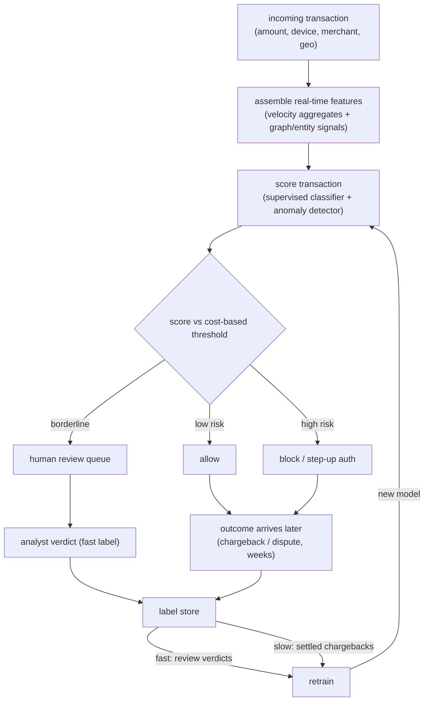

# Fraud and Anomaly Detection

An interviewer rarely says "design a fraud classifier." They say: **"Money is
moving through our platform. Design a system that flags fraudulent transactions
in real time, blocks the bad ones, lets the good ones through, and does not
enrage legitimate customers in the process."** That is the fraud problem, and
the modeling instinct (train a classifier) is the easy part. The trap is
everything around it: fraud is rare, so accuracy is a lie; the decision is
cost-sensitive, so the threshold is the product; labels arrive weeks later as
chargebacks, so your training set is always stale and your live eval is blind;
and the adversary adapts on purpose, so distribution drift is the default
state, not an edge case.

This chapter builds the system end to end, and shows how PayPal, Stripe, Uber,
Grab, Airbnb, Capital One, Wayfair, and Booking.com actually ship it.

## Sections

1. [Clarifying the requirements](01-clarifying-requirements.md) - the dialogue that scopes the problem.
2. [Framing it as an ML task](02-frame-as-ml-task.md) - supervised vs anomaly, inputs, outputs, and the two paths.
3. [Data preparation](03-data-preparation.md) - imbalance handling, label delay, point-in-time correctness, feature groups.
4. [Model development](04-model-development.md) - trees, wide-and-deep DNN, graph methods, anomaly detection, and the loss functions.
5. [Evaluation](05-evaluation.md) - why PR-AUC beats ROC-AUC, operating-point selection, and online metrics.
6. [Serving and scaling](06-serving-and-scaling.md) - inline scoring, real-time features, and the bottlenecks table.
7. [How teams do it in production](07-how-teams-do-it-in-production.md) - PayPal, Stripe, Uber, Grab, Airbnb, Capital One, Wayfair, Booking, Feedzai.
8. [Interview Q&A](08-interview-qa.md) - commonly asked, tricky, and commonly-answered-wrong.
9. [Summary](09-summary.md) - the one-page recap and self-test.

## The whole system on one page

The key insight the diagram makes concrete: there are two feedback loops. The
fast loop closes in minutes via analyst verdicts from the review queue. The slow
loop closes weeks later via settled chargebacks. Training always lags reality,
and the system must be designed around that lag rather than pretending labels
arrive instantly.

Read the sections in order the first time; they build on each other. Each opens
with the question an interviewer actually asks, then answers it.
