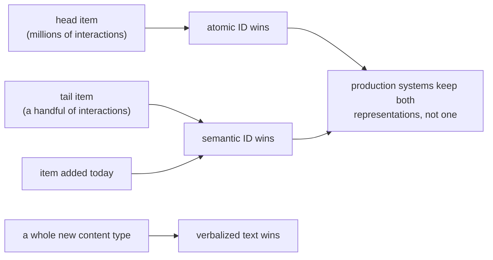

# 2. Framing it as an ML task

## Three ways to name an item

| Representation | What the model sees | Buys | Costs |
|---|---|---|---|
| **Atomic item ID** | One learned embedding per item | Precision on head items, simple serving | Nothing generalizes to a new item; the table grows with the catalogue |
| **Semantic ID** | A short tuple of discrete codes from a content embedding | Cold-start and long-tail generalization, a tiny output vocabulary, retrieval by decoding | A quantizer to train and refresh, collisions, a new drift failure |
| **Verbalized text** | The item's metadata as language | World knowledge, zero-shot on new content types, explanations | Latency and cost per request, prompt-shaped failures |

Almost all production generative retrieval means the middle row. The item's content
embedding is quantized by a residual quantizer into a tuple of codes, coarse to fine:

$$
\text{item} \rightarrow e \in \mathbb{R}^{d} \rightarrow (c_1, c_2, \ldots, c_m), \quad c_i \in \{1, \ldots, K\}
$$

## The vocabulary collapse is the mechanism

A classic sequence recommender predicts a distribution over items, so its output layer
is one logit per item. At 50 million items that layer is the model. Replace the item
with $m$ codes drawn from a codebook of size $K$ and the output layer becomes $K$
logits, applied $m$ times:

$$
\underbrace{|V| = N_{\text{items}} \approx 5 \times 10^{7}}_{\text{atomic}} \quad \longrightarrow \quad \underbrace{|V| = K = 256 \ \text{per position}, \ m = 4}_{K^{m} \approx 4.3 \times 10^{9} \text{ representable items}}
$$

```python
def representable_items(codebook_size, levels):
    """How many distinct items a semantic ID scheme can name."""
    return codebook_size ** levels

# representable_items(256, 4) -> 4294967296   (covers a 50M catalogue with room)
# the output layer is 256 wide, applied 4 times, not 50,000,000 wide
```

That collapse is why decoding a catalogue is tractable at all, and it is the first
thing to say when asked how this works.

## What the model predicts

Next-item prediction, with the target rewritten. Given a user's history as a sequence
of code tuples, predict the next item's tuple, one code at a time:

$$
p(\text{next item} \mid \text{history}) = \prod_{i=1}^{m} p(c_i \mid c_{\lt i}, \text{history})
$$

Two consequences that come up as follow-ups. The factorization is coarse to fine, so
the first code decides a broad content neighbourhood and the last disambiguates within
it, which is exactly why beam search over these codes behaves like a hierarchical
search. And nothing in that product forbids a tuple that maps to no item, so the decode
has to be constrained (section 6).

## Where the generalization comes from, and where it does not

Two items with similar content share their leading codes, so a model that has never
seen a new item still places it in the right region. State the scope of that claim
precisely, because a good interviewer will test it:

- It is a **content-similarity prior expressed in the vocabulary**. It adds no
  interaction information that did not exist.
- It helps most where interaction data is scarce: new items, the long tail, new
  content types.
- It helps least on head items, where an atomic embedding trained on millions of
  interactions is already better than anything content can tell you.
- If the metadata is thin or wrong, the codes are wrong, and the failure is now
  structural rather than a feature bug.



The last box is the design most teams actually ship: semantic IDs alongside atomic IDs
rather than instead of them.
