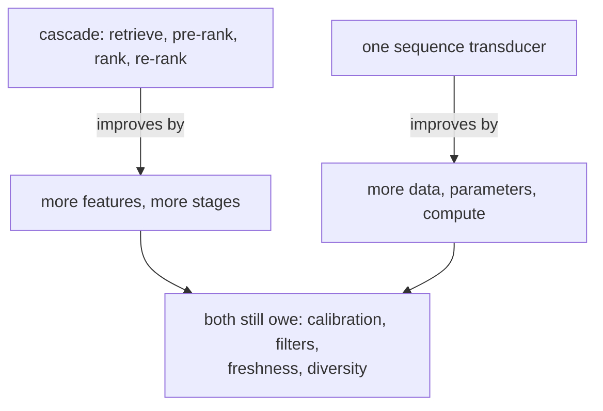

# 4. Model development

Three designs, in increasing order of how much of your existing system they replace.

## Semantic IDs as ranking features (start here)

The cheapest version keeps retrieval exactly as it is and feeds the codes into the
ranker as categorical features. It buys the same content-similarity prior on the same
slices, costs a feature rollout rather than an architecture migration, and answers the
question you actually need answered first: **is our content encoder good enough for
any of this?** A null result here indicts the encoder, not the idea, and that is worth
knowing before you rebuild retrieval.

## Generative retrieval

Feed the history, decode the next item's codes with beam search, map beams to items.
The model is the sequence recommender you already know with its output layer replaced.

| Design decision | Options | What it changes |
|---|---|---|
| Backbone | Encoder-decoder, or decoder-only over the tuple sequence | Training cost, and whether history and target share a stack |
| Code positions $m$ | 3 to 5, plus disambiguation | Decode steps per request, collision rate |
| Codebook size $K$ | 128 to 1024 | Output width, granularity per level |
| Beam width $b$ | Tens to low hundreds | Candidates returned, and cost |
| Constraint | Valid-prefix trie | Whether the model can invent items |

The thing to be able to derive at a whiteboard is the cost:

$$
C_{\text{gen}} \approx m \ \text{sequential steps} \times b \ \text{hypotheses}, \qquad C_{\text{ANN}} \approx 1 \ \text{index probe}
$$

Generative retrieval is not a latency optimization. It buys generalization and a
simpler data pipeline; it costs forward passes per request.

## Generative ranking, and the scaling-law bet

Push the same reformulation into ranking: the whole problem as sequential transduction
over the user's actions, with quality tracking a scaling law rather than feature count.
[HSTU](https://arxiv.org/abs/2402.17152) is the reference. What changes is the axis you
invest along: the cascade improves by adding features and stages, this improves by
adding data, parameters and compute, and that is a budgeting and staffing decision
before it is a modeling one.

What does **not** change: calibration for anything feeding an auction, hard filters,
freshness, and diversity. A generative model provides none of them for free.

## The LLM in the loop

Verbalize the history and the item metadata and let a language model rank or retrieve.
The most expensive per request, and the most capable on exactly what the other two
handle worst: new content types, surfaces with no interaction history, and anything
needing an explanation.

The motivation worth quoting is Netflix's in
[GenRec](https://netflixtechblog.com/genrec-towards-llm-native-recommendation-at-netflix-f20be6f643e3),
and it is not accuracy: their production stack relies on thousands of hand-crafted
features and specialized architectures, so onboarding a new content type or surface
costs feature engineering, architecture work and experimentation. **Engineering
velocity is the argument.** That reframes the evaluation too: the number to move is
weeks-to-onboard-a-surface, and it belongs in the proposal.

Costs: tokens and latency per request, a prompt that is now part of the model, and the
ranking-specific LLM failures (hallucinating items that do not exist, position and
verbosity bias). Most designs scope it to a subset of traffic, or use it as a teacher
for a cheaper student.

## When to use which

| Reach for | When | Instead of |
|---|---|---|
| Semantic IDs as ranking features | First, always, to test the content encoder | Rebuilding retrieval before you know the encoder is good |
| Generative retrieval | Cold start and the long tail are the real pain | Replacing a healthy ANN path and paying decode latency for nothing |
| A unified retrieve-and-rank model | Frontier scale, and cascade coordination is the bottleneck | A first project, since one model failing takes the surface |
| A scaled sequence transducer | You can commit compute as the improvement axis | Expecting scaling gains from a model you cannot afford to grow |
| An LLM ranker on one surface | A new content type has no features and no history | An LLM on all traffic |
| Keeping the cascade | Stable catalogue, rich interactions, tuned pipeline | Rebuilding because the frontier is interesting |

## Implementation and training pitfalls

| Pitfall | Symptom | Fix |
|---|---|---|
| Unconstrained decoding | Candidates that map to no item | A valid-prefix trie, and count violations as a metric |
| Beams collapsing | Ten results from one franchise | Deduplicate across beams, add a diversity constraint |
| Quantizer retrained alone | Recall falls off a cliff after a routine refresh | Version codebooks, retrain both models together |
| Dropping atomic IDs | Head-item quality regresses | Keep both representations |
| Sequence length ignored | Training cost multiplies by $m$ unexpectedly | Budget positions, not items |
| Sampled-candidate evaluation | Great offline, flat online | Full-catalogue metrics, then an online test |
