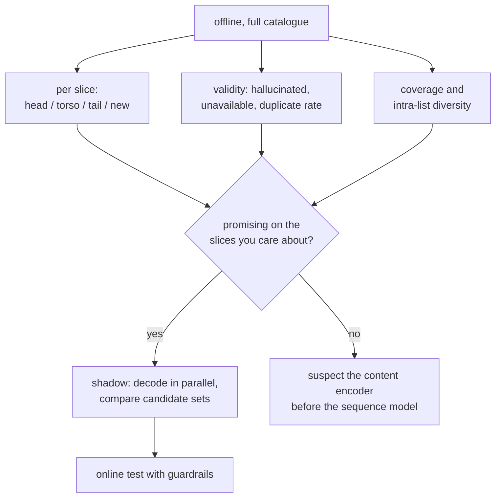

# 5. Evaluation

Generative recommenders break several evaluation habits at once, and every one of them
breaks in the flattering direction. This section is the one to read before quoting a
number from a paper or from your own notebook.

## The four ways these numbers mislead

| Habit | Why it flatters a generative recommender | What to do instead |
|---|---|---|
| Sampled candidates (rank the true item against 99 negatives) | The decode never had to distinguish the true item from 50 million others | Full-catalogue metrics, or say plainly that yours are sampled |
| Aggregate recall | The gain lives on cold and tail slices, and so does the risk | Report head, torso, tail, and items younger than a week |
| Filtering invalid outputs silently | Hides the hallucination rate | Count decoded tuples that map to nothing or to an unavailable item |
| Accuracy without diversity | Beam search is mode-seeking and concentrates output | Catalogue coverage and intra-list diversity, reported next to accuracy |

The first row is the big one. Sampled-candidate evaluation is standard in the
recommendation literature and it is not what happens in production, and the gap is
wider for generative retrieval than for a two-tower model because the candidate
distribution itself changed.

## The metric set that actually decides

- **Validity rate** is specific to this architecture and needs a target, not a filter.
  Three sub-rates: tuples that map to no item, items that exist but are unavailable to
  this user, and duplicates across beams.
- **Coverage** is the popularity-collapse detector. A generative retriever that trains
  on its own recommendations concentrates faster than a cascade with an explicit
  exploration arm, so keep the exploration path from
  [Cold Start and Exploration](../cold-start/).
- **Slice reporting** is not optional here, because the aggregate can be flat while the
  tail moves a lot, which is the outcome you are actually buying.

## Shadow before online

Decode in parallel with the live ANN path and compare the candidate sets before any
user sees the output. It answers questions an offline metric cannot: how often the
filters empty the generated set, how often the fallback fires, what the real p99 of the
decode is under production load, and how much the two candidate sets even overlap. A
low overlap is not automatically bad, but it does tell you the online test is measuring
a bigger change than you thought.

## The velocity metric, when that is the real goal

If the actual motivation is engineering cost rather than accuracy (section 1 said it
usually is), then measure that directly and put it in the proposal: **engineering weeks
to onboard a new surface or content type, before and after.** It is the number Netflix's
[GenRec post](https://netflixtechblog.com/genrec-towards-llm-native-recommendation-at-netflix-f20be6f643e3)
argues from, and a proposal that hides a velocity argument inside an accuracy claim
will be judged on the accuracy claim and lose.

## Test yourself

**1.** Your generative retriever beats the two-tower baseline by 12 points of recall@100
offline with 99 sampled negatives. What do you expect online?

Answer

Much less, possibly nothing. Sampled-candidate evaluation asks the model to beat 99
random items, which is the task the vocabulary collapse makes easy. Re-run against the
full catalogue, then shadow, then test online. If the full-catalogue number is close to
flat while the tail slice moves, that is the honest result and it may still be worth
shipping.

**2.** After a routine content-encoder refresh, recall drops sharply and nobody changed
the sequence model. What happened?

Answer

Retraining the encoder or the codebooks changes every item's semantic ID, so the
sequence model is now reading a vocabulary it was not trained on. The two refresh cycles
are coupled. Version the codebooks, retrain both together, and keep the old mapping
through a deprecation window.

