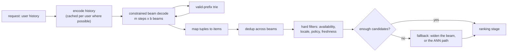

# 6. Serving and scaling

## The request path

Four things in that path do not exist in a two-tower retriever, and each is a place
production systems get bitten.

**Constrained decoding.** Nothing in the model forbids a code tuple that maps to no
item. A valid-prefix trie built alongside the item map restricts each step to codes
that can still lead somewhere real. Without it you get plausible-looking candidates
that resolve to nothing, and the failure is silent because the downstream join simply
returns fewer rows.

**Deduplication across beams.** Several beams reach the same item, especially after
disambiguation positions. Deduplicate before you count candidates, or the ranker gets
fewer options than the beam width suggests.

**Over-generation for filters.** Hard filters run after the decode, so a beam of 200
can become 12 candidates for a user in a small locale. Over-generate deliberately,
measure how often the fallback fires, and keep the ANN path warm as that fallback.

**Diversity.** Beam search is mode-seeking. Without an explicit constraint it will
return ten items from one franchise, which is a product regression that no accuracy
metric reports.

## The cost, stated plainly

$$
C_{\text{gen}} \approx m \ \text{sequential decoder steps} \times b \ \text{hypotheses}, \qquad C_{\text{ANN}} \approx 1 \ \text{index probe}
$$

At $m = 4$ and a beam of 128, that is four sequential model steps on a batch of 128,
per request, against a single probe. Batching across requests helps throughput and not
the sequential depth, which sets the latency floor. This is why the first production
deployments target the surfaces where generalization is worth the most, rather than
every surface at once.

Practical levers, in the order to reach for them:

| Lever | Effect | Cost |
|---|---|---|
| Cache the encoded history per user | Removes the encode from most requests | Staleness between actions |
| Shrink $m$ (fewer code positions) | Fewer sequential steps | More collisions, coarser items |
| Shrink the beam | Less compute per step | Fewer candidates, more fallback |
| Batch across requests | Throughput | Nothing for single-request latency |
| Quantize or distill the decoder | Cheaper steps | The usual quality gate |
| Serve generative for a traffic slice | Bounded blast radius and cost | Two systems to operate |

## Capacity and rollout

- **Two systems in parallel is the real cost of the project.** During migration the
  cascade and the generative path both run. Budget it as such rather than as a
  replacement.
- **The quantizer refresh is a coordinated deploy**, not a data job. Codebook version,
  item map and sequence model move together.
- **Rollback has to be one flag.** Because the failure modes here (invalid candidates,
  empty sets after filters, popularity collapse) show up as product regressions rather
  than as errors, the operator needs to be able to fall back to ANN without a deploy.
- **Monitor what is specific to this design**: validity rate, fallback rate, beam
  utilization after dedup, quantization error on newly ingested items, and code usage
  entropy.
