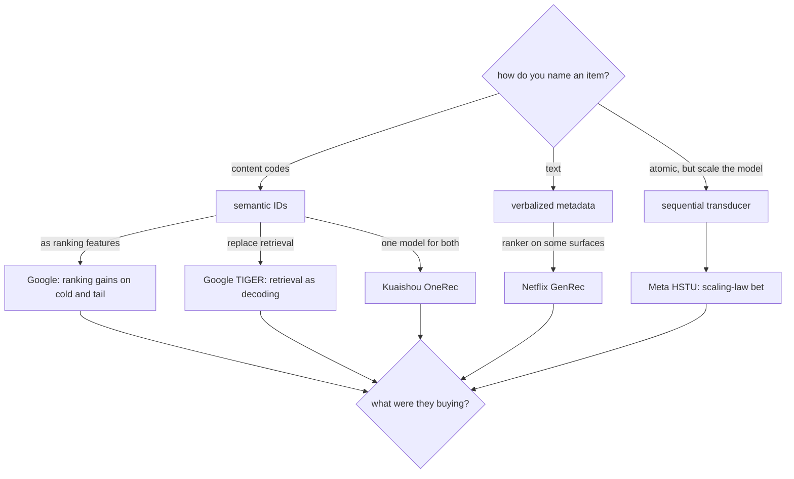

# 7. How teams do it in production

Every system here replaced the opaque item ID with something a model can generalize
over, modeled the history as a sequence in that vocabulary, and generated instead of
looking up. What separates them is which representation they chose and how much of the
cascade they were willing to give up.

## Where the real designs diverge

| Team | Chose | Replaced | What they were buying | Gave up |
|---|---|---|---|---|
| Google (TIGER) | RQ-VAE semantic IDs | The retrieval index | Cold-start and tail generalization | Decode cost, and a quantizer to operate |
| Google (ranking) | Semantic IDs as features | Nothing | The same prior at feature-rollout risk | Only the encoder work |
| Meta (HSTU) | Actions as a sequence | The ambition is the cascade | A scaling-law improvement axis | Serving cost, and an organizational commitment |
| Kuaishou (OneRec) | Semantic IDs, one model | Retrieval and ranking | Removing cascade coordination | Blast radius: one model is the whole surface |
| Netflix (foundation model) | Pretrained history model | Nothing directly | Amortizing one model across surfaces | Integration effort per surface |
| Netflix (GenRec) | Verbalized text | The ranker, some surfaces | Engineering velocity on new content types | Token cost and latency per request |
| P5, M6-Rec, TALLRec | Text prompts | Varies | World knowledge, few-shot tasks | Scale, and sampled-metric optimism |

## The systems (first-party links)

- **Google** [Recommender Systems with Generative Retrieval (TIGER)](https://arxiv.org/abs/2305.05065) - RQ-VAE semantic IDs plus a sequence-to-sequence decoder, the reference design.
- **Google** [Better Generalization with Semantic IDs](https://arxiv.org/abs/2306.08121) - the same representation used as ranking features, with gains on cold-start and long-tail slices.
- **Meta** [Actions Speak Louder than Words (HSTU)](https://arxiv.org/abs/2402.17152) - recommendation as sequential transduction at trillion-parameter scale.
- **Kuaishou** [OneRec](https://arxiv.org/abs/2502.18965) - retrieval and ranking unified in one generative model with iterative preference alignment.
- **Netflix** [Foundation Model for Personalized Recommendation](https://netflixtechblog.com/foundation-model-for-personalized-recommendation-1a0bd8e02d39) - one pretrained model over user history, reused across surfaces.
- **Netflix** [GenRec: Towards LLM-Native Recommendation](https://netflixtechblog.com/genrec-towards-llm-native-recommendation-at-netflix-f20be6f643e3) - an LLM ranker over verbalized histories, argued from onboarding cost rather than accuracy.
- **Google** [Transformer Memory as a Differentiable Search Index](https://arxiv.org/abs/2202.06991) - the document-retrieval ancestor: decode the identifier directly.
- **Alibaba** [M6-Rec](https://arxiv.org/abs/2205.08084) - open-ended generative recommendation, and an honest account of what breaks.
- **TALLRec** [Aligning an LLM with recommendation](https://arxiv.org/abs/2305.00447) - how little data efficient alignment takes.
- **P5** [Recommendation as Language Processing](https://arxiv.org/abs/2203.13366) - many recommendation tasks as one text-to-text model.
- **RQ-VAE** [Autoregressive Image Generation using Residual Quantization](https://arxiv.org/abs/2203.01941) - the quantizer this whole line is built on, borrowed from image generation.

## What to take from the set

1. **Everyone kept the ranker.** Even the systems that replaced retrieval feed an
   existing ranking stage, and the ones that unified both did it at a scale most
   companies do not have.
2. **The published gains are slice gains.** Cold start and the long tail, which is
   exactly what a content-derived prior should buy, and nothing more.
3. **The strongest production argument is not accuracy.** It is that a stack of
   thousands of hand-crafted features makes every new surface expensive, and one
   representation makes it cheaper. Say that out loud in an interview: it is the part
   most candidates miss, and it is the part the people who shipped it wrote down.
