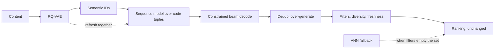

# 9. Summary

## One-page recap

- **The item representation is the design.** Atomic ID, semantic ID, or verbalized
  text decides whether retrieval is a lookup or a decode, whether new items generalize,
  and what a request costs.
- **A semantic ID is a content embedding quantized coarse to fine** by a residual
  quantizer into a tuple of codes.
- **The vocabulary collapse is the mechanism.** One logit per item (tens of millions)
  becomes $K$ logits per position applied $m$ times: $256^4 \approx 4.3$ billion
  representable items with a 256-wide output layer.
- **The generalization is a content prior, not new information.** It pays on cold and
  tail items and pays nothing on head items, so report per slice.
- **It is not cheaper to serve.** $m$ sequential decoder steps times $b$ beams against
  one ANN probe.
- **The decode must be constrained** to valid prefixes, beams deduplicated, candidates
  over-generated for filters, and diversity enforced explicitly.
- **The quantizer refresh is coupled to the sequence model.** Retraining it changes
  every ID and invalidates the model that consumed them.
- **Evaluation flatters this architecture** through sampled candidates, aggregate
  metrics and silently dropped invalid outputs. Fix all three before believing a
  number.
- **The strongest production argument is engineering velocity**, not accuracy: a stack
  of thousands of hand-built features makes every new surface expensive.
- **Start with semantic IDs as ranking features.** Same prior, feature-rollout risk,
  and it tells you whether the content encoder is good enough before you rebuild
  retrieval.

## The system on one page

## Test yourself

**1.** A 50M catalogue, $m = 4$, $K = 256$. What is the output layer width, and how
many items can the scheme name?

Answer

The output layer is 256 wide, applied four times. The scheme can name
$256^4 \approx 4.3 \times 10^{9}$ items, which covers 50M with room for collisions and
a disambiguating position.

**2.** Your team proposes replacing the ANN index with generative retrieval to reduce
retrieval latency. What do you say?

Answer

That the direction of the latency effect is wrong. A beam decode is several sequential
forward passes; an ANN probe is one lookup. Generative retrieval is bought for
generalization on cold and tail items and for a simpler representation story, and it
costs latency. If latency is the goal, this is the wrong project.

**3.** After enabling generative retrieval, engagement is flat but complaints about
"the same five shows" go up. What happened, and what should have been measured?

Answer

Beam search is mode-seeking, so the candidate set concentrated. Catalogue coverage and
intra-list diversity should have been reported alongside accuracy, and a diversity
constraint should be applied after dedup. If the model is also training on its own
recommendations, the concentration compounds, which is what the exploration arm exists
to prevent.

**4.** Which project would you run first, and why?

Answer

Semantic IDs as features in the existing ranker. It tests the content encoder, which is
the component every later design depends on, at the risk level of a feature rollout
rather than an architecture migration. If the cold and tail slices do not move there,
generative retrieval will not save it.

## Further reading

- [TIGER](https://arxiv.org/abs/2305.05065) for the reference design, and
  [semantic IDs in ranking](https://arxiv.org/abs/2306.08121) for the cheaper version.
- [HSTU](https://arxiv.org/abs/2402.17152) for the scaling-law position, and
  [OneRec](https://arxiv.org/abs/2502.18965) for a unified model in production.
- [Netflix GenRec](https://netflixtechblog.com/genrec-towards-llm-native-recommendation-at-netflix-f20be6f643e3)
  for the velocity argument stated by the people who made it.
- [DSI](https://arxiv.org/abs/2202.06991), [P5](https://arxiv.org/abs/2203.13366) and
  [RQ-VAE](https://arxiv.org/abs/2203.01941) for where the ideas came from.
- The production writeups are collected in
  [section 7](07-how-teams-do-it-in-production.md).
