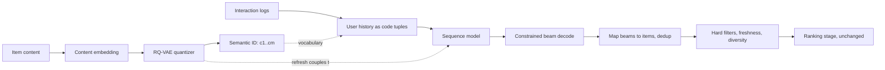

# Generative Recommendation

> **Style note.** Same teach-first shape as the rest of the book: a
> Candidate/Interviewer dialogue to scope the problem, a frame-data-model-evaluate-serve
> arc, one idea per figure, real production writeups, and an interview Q&A. This
> chapter is the one where the architectural argument is still live, so it is written
> to let you take either side of it with numbers.

An interviewer rarely says "explain generative retrieval." They say **"our recommender
is a four-stage cascade with thousands of hand-built features, and it takes a quarter
to launch a new surface. Should we replace it with one generative model, and what would
that actually cost?"**

The entry point is not the model. It is **how you represent an item**. Naming an item
with an atomic ID, with a tuple of content-derived codes, or with its metadata as text
decides whether retrieval is a lookup or a decode, whether a new item generalizes for
free, what the training data looks like, and what a request costs. Everything else in
this chapter follows from that one choice.

The cascade this would replace is built in
[Candidate Retrieval](../candidate-retrieval/), [Ranking](../ranking/) and
[Sequential Recommendation](../sequential-recommendation/). Read at least the last one
first: the sequence model here is the same model with a different vocabulary.

## Sections

1. [Clarifying the requirements](01-clarifying-requirements.md) - the dialogue that scopes the problem, including which of the three systems "generative" means today.
2. [Framing it as an ML task](02-frame-as-ml-task.md) - the item representation, the vocabulary collapse, and what the model is actually predicting.
3. [Data preparation](03-data-preparation.md) - content embeddings, the quantizer, code refresh and the drift nobody alerts on.
4. [Model development](04-model-development.md) - generative retrieval, generative ranking, the LLM in the loop, and what each gives up.
5. [Evaluation](05-evaluation.md) - why the standard metrics flatter these systems, and what to report instead.
6. [Serving and scaling](06-serving-and-scaling.md) - constrained decoding, beams, filters, and the cost against an ANN probe.
7. [How teams do it in production](07-how-teams-do-it-in-production.md) - Google, Meta, Kuaishou, Netflix, and what each of them was actually buying.
8. [Interview Q&A](08-interview-qa.md) - commonly asked, tricky, and commonly answered wrong.
9. [Summary](09-summary.md) - one-page recap, mermaid, test-yourself, further reading.
10. [Putting it together: the complete build](10-putting-it-together.md) - a default stack, the migration costed, the same system under two other constraint sets, and a runnable quantizer and constrained decoder you can execute with nothing but Python 3.

## The whole system on one page

Read the sections in order the first time. The dotted edge from the quantizer back to
the sequence model is the one most designs discover late, and section 3 is about it.

## Companion chapters

The sequence backbone is [Sequential Recommendation](../sequential-recommendation/);
the funnel this feeds is [Ranking](../ranking/); the cold-start problem this claims to
improve is [Cold Start and Exploration](../cold-start/); and the evaluation discipline
it needs is [Online Experimentation](../experimentation/). The dense counterpart to
this chapter is [topic 19](../../topics/19-generative-recommendation.md).
