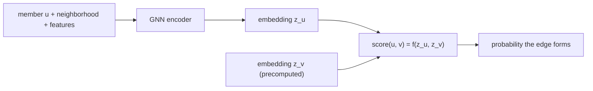

# 2. Framing it as an ML task

## Defining the ML objective

We want suggestions people accept. Translate that into an ML objective: **learn to
score a pair of members by the probability that an edge between them would form and
be accepted.** With that score, People You May Know is "for a member, find the
highest-scoring not-yet-connected members."

## Specifying the input and output

The input is a **member and the graph around them** (their neighbors, the neighbors
of neighbors, and node features like profile, company, school, geography). The
output is a **ranked list of candidate member IDs**. As in retrieval, the latency
budget forbids scoring all pairs online, so we factor the model: learn a **node
embedding** per member such that likely-connected members are close in the
embedding space, precompute all embeddings offline, and use an ANN index to fetch
candidates online.

## Choosing the right ML category

This is **link prediction**, a form of **representation / graph learning**. It is
not plain classification (the label lives on a pair, not a node) and not plain
retrieval over content (the signal is the graph topology). Framing it as "learn
node embeddings whose similarity predicts an edge, then retrieve and rank" is what
lets ANN do candidate generation and a pairwise head do precision.

**When to use which framing.**

| Reach for | When | Instead of |
|---|---|---|
| Link prediction on the graph (this chapter) | the signal is who-knows-whom plus node features, at hundreds of millions of nodes | content-only similarity, which ignores the network structure |
| Pure heuristic (common neighbors, Adamic-Adar) | a strong, cheap baseline or a warm-start member with a rich neighborhood | a GNN, when a heuristic already clears the bar and you want zero training |
| A single cross-feature pair model online | a small graph, or the final re-ranking of a few hundred candidates | scoring all pairs at scale, which the latency budget forbids |

The next section builds the graph and the training pairs that teach "likely edge."
