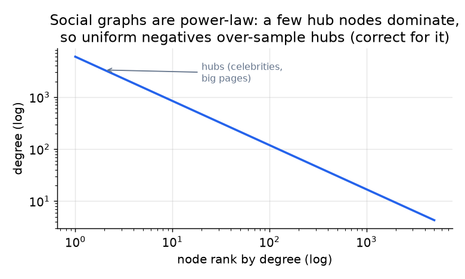

# 3. Data preparation

## Data engineering: building the graph and the training pairs

The raw material is the interaction log turned into a graph: nodes are members,
edges are accepted connections (and optionally weaker edges like profile views or
shared group membership, as a heterogeneous graph). A **positive example** is an
edge that formed and was accepted. A row of training data is a member pair with a
label.

| member u | member v | context | label |
|---|---|---|---|
| m_812 | m_5501 | same company, 8 shared connections | positive |
| m_812 | m_9020 | same school, 3 shared connections | positive |
| m_447 | m_1200 | 0 shared connections, far apart | negative (sampled) |

Two data traps decide whether the model learns anything real:

- **Temporal leakage.** Split by time: train on the graph as of date T, predict
  edges that form after T. A random edge split leaks the future (an edge's own
  endpoints already look connected) and inflates every metric.
- **Negatives are the whole game.** You only logged positives (edges that formed).
  Negatives are non-edges, and there are astronomically many, almost all trivially
  easy (two random members on opposite sides of the world). Train on those and the
  model learns "far apart equals no edge" and nothing useful.

## Feature engineering

- **Node features.** Profile (title, company, school, skills, geography), activity,
  and account age. These carry the cold-start signal for members with an empty
  neighborhood.
- **Structural features.** Degree, community/cluster ID, and the classic pairwise
  graph heuristics (shared connections, Adamic-Adar) used both as model inputs and
  as baselines.
- **Edge features (heterogeneous graph).** Different edge types (connected, viewed,
  messaged, same-group) carry different strengths and are modeled as typed edges.

## Negative sampling on graphs

The single most important data decision. Options, from cheap to careful:

- **Uniform random non-edges.** Cheap, but samples the power-law degree
  distribution, so hub nodes (celebrities, big pages) are over-represented as
  negatives, biasing the model against popular members.
- **Degree-corrected / popularity-aware negatives.** Downweight or correct for node
  degree so hubs are not unfairly penalized, the graph analogue of the logQ
  correction in retrieval.
- **Hard negatives.** Non-edges that look plausible: two hops away, same company,
  many shared connections, but no edge. These are where the model actually learns
  the boundary, and where invitation-reject cost is highest.

*A few hub nodes hold most of the edges, so uniform negative sampling
over-represents hubs. Correct for degree, or the model learns to avoid popular
members. Illustrative.*

**When to use which negative-sampling strategy.**

| Reach for | When | Instead of |
|---|---|---|
| Uniform non-edges | a first baseline, to get moving | as the final recipe, since it bakes in degree bias |
| Degree-corrected negatives | always at scale, where the graph is power-law | uniform negatives that penalize hub nodes |
| Hard negatives (2-hop, same community) | easy negatives stopped teaching and reject-cost matters | random negatives, which get trivially easy fast |
| In-batch negatives | training embeddings with a softmax over the batch | explicit per-pair negatives, which cost extra lookups |

**Provenance.** Sampling negatives from a smoothed frequency distribution rather than
uniformly (here, degree-correcting the power-law graph) is the negative-sampling idea
introduced by word2vec (Google, 2013), which drew negatives from the unigram
distribution raised to the 3/4 power to avoid over-representing the most frequent
tokens; the graph analogue reweights by node degree for the same reason.

With the graph, features, and negatives in hand, we can build the model.
