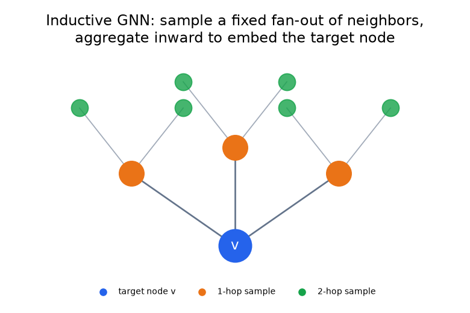
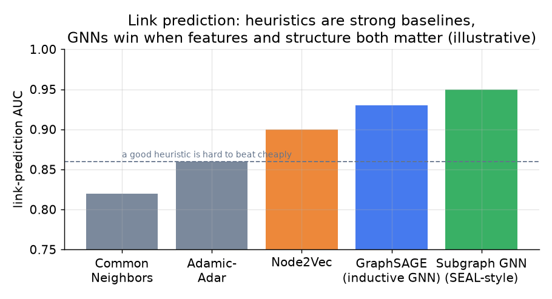

# 4. Model development

## The ladder: heuristics, then embeddings, then GNNs

Link prediction has a strong cheap baseline and a strong expensive ceiling. Climb
the ladder only as far as the bar requires.

**1. Graph heuristics.** Score a pair from shared structure alone, no training:

$$\text{CommonNeighbors}(u,v) = |N(u) \cap N(v)|, \qquad \text{Jaccard}(u,v) = \frac{|N(u) \cap N(v)|}{|N(u) \cup N(v)|}$$

$$\text{AdamicAdar}(u,v) = \sum_{w \in N(u) \cap N(v)} \frac{1}{\log |N(w)|}$$

Adamic-Adar is the workhorse: it counts shared connections but down-weights hubs (a
shared celebrity connection means little; a shared niche colleague means a lot).
These are hard to beat cheaply and are always the baseline to state first.

**2. Shallow embeddings.** node2vec / DeepWalk run random walks and learn a vector
per node with a skip-gram objective, so proximity in the walk implies closeness in
the embedding. Transductive: they only embed nodes seen at training time, so a
brand-new member has no vector.

**3. Inductive GNNs.** The production ceiling. A GNN like **GraphSAGE** (the basis
of Pinterest's PinSage) embeds a node by sampling a fixed fan-out of neighbors and
aggregating their features inward, layer by layer:

$$h_v^{(k)} = \sigma\!\left(W^{(k)} \cdot \text{concat}\left(h_v^{(k-1)},\ \text{AGG}\left(\lbrace h_u^{(k-1)} : u \in \mathcal{N}(v) \rbrace\right)\right)\right)$$

Because it aggregates **features**, it is **inductive**: it embeds a node it never
saw in training (a new member) from that node's features and neighbors. That is why
GraphSAGE-style models, not node2vec, run in production.

*The GNN embeds target node v by sampling a fixed fan-out of 1-hop and 2-hop
neighbors and aggregating their features inward. Sampling a fixed fan-out is what
keeps cost bounded on a billion-edge graph.*

## The link-prediction head and loss

Given node embeddings, score a pair with a dot product or a small MLP, and train
with a binary cross-entropy over positive edges and sampled negatives:

$$\hat{y}_{uv} = \sigma\!\left(z_u^{\top} z_v\right), \qquad \mathcal{L} = -\sum_{(u,v) \in E^{+}} \log \hat{y}_{uv} - \sum_{(u,v) \in E^{-}} \log\left(1 - \hat{y}_{uv}\right)$$

Two subtleties an interviewer probes:

- **Heterogeneous graphs.** Real networks have many node and edge types (member,
  company, school, group; connected, viewed, messaged). Production systems (LinkedIn
  LiGNN, Twitter TwHIN) model these as typed edges, which carries far more signal
  than a single homogeneous friend graph.
- **GNNs have a known blind spot for common-neighbor count.** Standard message
  passing with set-pooling cannot directly count shared neighbors, exactly the
  signal Adamic-Adar captures. Recent work (subgraph methods like SEAL, and adding
  the heuristic as an explicit feature) fixes this. The practical answer: **feed the
  heuristics in as features**, do not expect the GNN to rediscover them.

*Heuristics are strong and cheap; inductive GNNs win when node features and graph
structure both matter, especially for cold-start members. Illustrative.*

**When to use which model.**

| Reach for | When | Instead of |
|---|---|---|
| Adamic-Adar / common neighbors | a baseline, or a warm member with a rich neighborhood | a GNN, when a heuristic already clears the bar |
| node2vec / DeepWalk | a static graph and you want cheap embeddings | a GNN, when new nodes never need embedding |
| Inductive GNN (GraphSAGE / PinSage) | cold-start matters, features are rich, scale is large | transductive embeddings that cannot embed a new member |
| Heterogeneous GNN (LiGNN / TwHIN) | many node and edge types carry the signal | a homogeneous friend graph that throws away edge types |
| Heuristic as an explicit GNN feature | you need common-neighbor counts the GNN cannot learn | expecting message passing to rediscover Adamic-Adar |

**Provenance.** node2vec (Stanford, 2016) produces embeddings via biased random walks
on a static graph. The inductive GNN line runs from GraphSAGE (Stanford, 2017), which
learns aggregator functions so an unseen node can be embedded from its features and
neighborhood, through PinSage (Pinterest, 2018), which scaled GraphSAGE to a
web-scale recommendation graph. The heterogeneous, many-edge-type case is TwHIN
(Twitter, 2022); the underlying message-passing formulations are GCN (Kipf and
Welling, 2017) and GAT (2018).

> **Open the validated graph.** Trace a GraphSAGE-style recommendation graph at
> real dimensions in the live
> [Model Zoo](https://github.com/neurarch-ai/awesome-llm-model-zoo): see where
> neighbor sampling, aggregation, and the pairwise scoring head attach.
