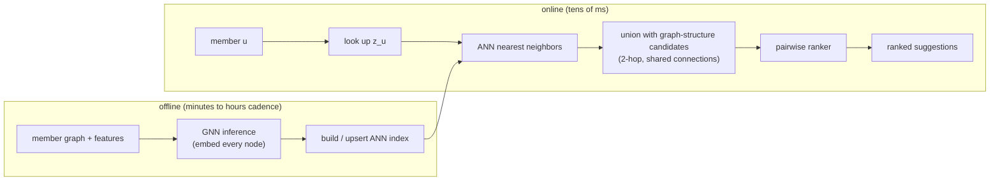

# 6. Serving and scaling

## The two paths: offline embedding, online candidate generation

Like retrieval, the design splits into a batch path that computes node embeddings
and an online path that answers a request in tens of milliseconds.



The key move: we do **not** run the GNN per request. We batch-infer embeddings for
every node offline and index them, then online we do an embedding lookup plus an
ANN query, unioned with cheap graph-structure candidates (two-hop neighbors, shared
connections), then rank the merged pool with a heavier pairwise model.

## Scaling a GNN to billions of edges

- **Neighbor sampling** (the GraphSAGE trick) bounds the cost: sample a fixed
  fan-out per node rather than reading the whole neighborhood, so cost does not
  blow up on hub nodes.

```python
import random
def sample_neighbors(neighbors, v, fan_out):
    # neighbors: dict node -> list of neighbor ids;  fan_out: max neighbors to keep
    nbrs = neighbors[v]
    if len(nbrs) <= fan_out:
        return list(nbrs)                 # small node: keep all its neighbors
    return random.sample(nbrs, fan_out)   # hub node: keep a fixed-size random subset
# a celebrity with millions of edges still yields only fan_out neighbors per hop,
# so per-node work stays bounded no matter the degree
```
- **Graph partitioning and distributed training.** Billion-node graphs do not fit
  on one machine; production frameworks (LinkedIn LiGNN, Snapchat GiGL) partition
  the graph and pipeline sampling with training.
- **Incremental freshness.** New edges and members must show up in minutes to
  hours, so embeddings are re-inferred incrementally for affected neighborhoods and
  upserted into the ANN index, not rebuilt nightly.

## Bottlenecks

| Bottleneck | First sign | Fix | Tradeoff |
|---|---|---|---|
| Scoring all pairs | infeasible online | two-stage: ANN candidates then rank | ANN recall ceiling on stage one |
| Hub-node blowup in sampling | training stalls on celebrities | fixed fan-out neighbor sampling | approximate neighborhood |
| Stale embeddings | new members get no good suggestions | incremental re-inference, minutes-to-hours upserts | more graph infra |
| Cold-start member | empty neighborhood, no signal | inductive GNN over profile features plus content | weaker than a warm member |
| Degree bias | only hubs suggested, coverage drops | degree-corrected negatives, diversity in ranking | slightly lower raw AUC |
| Filter bubble | suggestions collapse to one community | inject exploration and diverse sources | short-term acceptance dips |

Two details worth pinning down. First, the hub-node blowup is a fan-out explosion:
without a cap, a 2-hop neighborhood around a celebrity node with millions of edges
pulls most of the graph into a single training minibatch, and memory blows up
super-linearly with depth. The fixed fan-out neighbor sampling that fixes it is the
core scaling trick of GraphSAGE (Stanford, 2017), which samples a constant number of
neighbors per hop so per-node cost is bounded regardless of degree; the tradeoff is
that a high-degree node is now represented by a random subset of its neighbors.
Second, stale embeddings matter more here than in most systems because a new edge
changes not just the two endpoints but their k-hop neighborhoods; incremental
re-inference must therefore re-embed the affected subgraph and upsert those vectors
into the ANN index, not merely the two nodes that formed the edge.
