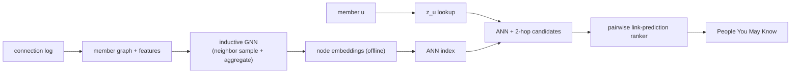

# 9. Summary

## One-page recap

- **People You May Know is link prediction on a graph.** Score whether an edge
  would form and be accepted; the signal is graph structure plus node features.
- **Two stage by necessity.** You cannot score all pairs, so precompute node
  embeddings offline, retrieve candidates with ANN plus graph structure, then rank
  the pool with a pairwise model.
- **Climb the ladder.** Heuristics (Adamic-Adar) are strong and cheap; node2vec is
  transductive; inductive GNNs (GraphSAGE / PinSage) are the production ceiling
  because they embed cold-start members from features.
- **GNNs have a common-neighbor blind spot.** Feed the heuristics in as features
  rather than expecting message passing to rediscover them.
- **Negatives and degree bias decide quality.** Correct for the power-law degree
  distribution and mine hard negatives; do not sample non-edges uniformly.
- **Evaluate with Hits@k on a time-based split**, then gate on online acceptance
  rate and coverage, never on invitations sent.
- **Serve from precomputed embeddings with minutes-to-hours freshness**, and scale
  the GNN with neighbor sampling and graph partitioning.

## The system on one page

## Test yourself

1. Why must the train/test split be by time, not random?
2. What makes GraphSAGE inductive, and why does that matter for cold-start members?
3. What structural signal can standard message-passing GNNs not learn, and how do
   you fix it?
4. Why does uniform negative sampling bias the model, and what is the correction?
5. Why optimize acceptance rate rather than invitations sent?
6. How do you serve suggestions in tens of milliseconds without running the GNN per
   request?

## Further reading

- Trace a graph recommendation model live in the [Model Zoo](https://github.com/neurarch-ai/awesome-llm-model-zoo).
- Related dense references: [Embeddings and representation learning](../../topics/07-embeddings-and-representation-learning.md) and [Candidate retrieval](../../topics/01-candidate-retrieval.md).
