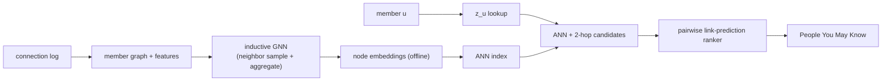

# 9. Summary

## One-page recap

- **People You May Know is link prediction on a graph.** Score whether an edge
  would form and be accepted; the signal is graph structure plus node features.
- **Two stage by necessity.** You cannot score all pairs, so precompute node
  embeddings offline, retrieve candidates with ANN plus graph structure, then rank
  the pool with a pairwise model.
- **Climb the ladder.** Heuristics (Adamic-Adar) are strong and cheap; node2vec is
  transductive; inductive GNNs (GraphSAGE / PinSage) are the production ceiling
  because they embed cold-start members from features.
- **GNNs have a common-neighbor blind spot.** Feed the heuristics in as features
  rather than expecting message passing to rediscover them.
- **Negatives and degree bias decide quality.** Correct for the power-law degree
  distribution and mine hard negatives; do not sample non-edges uniformly.
- **Evaluate with Hits@k on a time-based split**, then gate on online acceptance
  rate and coverage, never on invitations sent.
- **Serve from precomputed embeddings with minutes-to-hours freshness**, and scale
  the GNN with neighbor sampling and graph partitioning.

## The system on one page

```mermaid
flowchart LR
  LOG["connection log"] --> G["member graph + features"]
  G --> GNN["inductive GNN<br/>(neighbor sample + aggregate)"]
  GNN --> EMB["node embeddings (offline)"]
  EMB --> IDX["ANN index"]
  REQ["member u"] --> Q["z_u lookup"]
  Q --> ANN["ANN + 2-hop candidates"]
  IDX --> ANN
  ANN --> RANK["pairwise link-prediction ranker"]
  RANK --> OUT["People You May Know"]
```

**How it works.** The connection log is the raw material: it is assembled into a member graph of nodes, edges, and node features. An inductive GNN samples and aggregates each node's neighbors to produce node embeddings in a batch pass offline, and those embeddings are loaded into an ANN index. Online, a request for member u looks up z_u and queries the ANN index, unioned with cheap two-hop graph-structure candidates, to assemble a candidate pool. A heavier pairwise link-prediction ranker then scores that pool, and the top results are returned as People You May Know. The split between the offline embedding path and the online lookup-and-rank path is what keeps request latency low while still using a full GNN.

## Test yourself

Answers are collapsed. Attempt each question before opening one.

1. Why must the train/test split be by time, not random?

   

Answer

   Because a random edge split **leaks the future**: the held-out edge's own
   endpoints already look connected in the training graph. Concretely, the training
   graph retains edges that formed after the held-out edge, including triangles that
   only closed because that edge existed, so the model reads a neighborhood which is
   causally downstream of the very edge it is asked to predict. The correct protocol
   is to train on the graph as of date T and evaluate on edges that formed after T,
   with test edges removed before message passing (not merely excluded from the
   loss). The symptom of getting this wrong is diagnostic: AUC near the ceiling
   offline while live recall stays poor, which section
   [4](04-model-development.md) lists as the first thing to suspect in any
   suspiciously good link-prediction number. Sections
   [3](03-data-preparation.md) and [5](05-evaluation.md) both make the time split
   non-negotiable, and [10](10-putting-it-together.md) marks it as the row where
   "deviate when" reads "never".

   

2. What makes GraphSAGE inductive, and why does that matter for cold-start members?

   

Answer

   GraphSAGE is inductive because it learns **aggregator functions over node
   features** rather than one embedding vector per node ID:
   $h_v^{(k)} = \sigma(W^{(k)} \cdot \text{concat}(h_v^{(k-1)}, \text{AGG}(\lbrace h_u^{(k-1)} : u \in \mathcal{N}(v) \rbrace)))$.
   A function applies to any node you can describe by features and neighbors, so a
   member who did not exist at training time can still be embedded. Contrast
   node2vec and DeepWalk, which are **transductive**: the embedding is a free
   lookup-table row per node ID trained so random-walk co-occurrence implies
   closeness, and a node that was absent at training time simply has no row. That
   matters here because section [1](01-clarifying-requirements.md) established that
   cold-start members are exactly where People You May Know matters most, and their
   neighborhood is empty, so the day-one signal has to come from profile features
   (title, company, school, geography). Sections [4](04-model-development.md) and
   [8](08-interview-qa.md) state the consequence plainly: cold start is the whole
   reason production runs GraphSAGE-style models rather than node2vec.

   

3. What structural signal can standard message-passing GNNs not learn, and how do
   you fix it?

   

Answer

   **Common-neighbor count**, the shared-connection signal that Adamic-Adar captures:
   $\text{AdamicAdar}(u,v) = \sum_{w \in N(u) \cap N(v)} 1 / \log |N(w)|$. The
   mechanism is that a message-passing GNN embeds each node independently from its
   own rooted neighborhood, with expressive power bounded by the 1-dimensional
   Weisfeiler-Leman test, so it never sees the candidate pair jointly and has no way
   to represent "how many neighbors do u and v share", which is a property of the
   pair rather than of either node alone. Set-pooling aggregation cannot recover the
   intersection. The fix is to **feed the heuristics in as explicit pairwise
   features** (common neighbors, Jaccard, Adamic-Adar) alongside the learned
   embeddings, or to use a subgraph method such as SEAL that scores the pair's joint
   neighborhood directly. Do not expect message passing to rediscover a quantity it
   provably cannot compute. Sections [4](04-model-development.md) and
   [8](08-interview-qa.md) cover this, and it is why the committed build in
   [10](10-putting-it-together.md) pairs a 2-layer GraphSAGE with heuristic features
   rather than choosing between them.

   

4. Why does uniform negative sampling bias the model, and what is the correction?

   

Answer

   Because the social graph is **power-law**: a few hub nodes hold most of the
   edges, and a hub also has vastly more non-neighbors, so uniformly drawn non-edges
   over-represent hubs as negatives. Every such appearance pushes the hub's embedding
   away from the rest of the graph, and the learned score becomes entangled with
   degree instead of affinity, so the model effectively learns "avoid popular
   members". The correction is **degree-corrected (popularity-aware) negative
   sampling**, the graph analogue of the logQ correction in retrieval: subtract the
   log of each node's sampling probability from the score during training so the
   model learns "more connected than chance given this popularity". Section
   [3](03-data-preparation.md) traces the idea to word2vec's unigram-to-the-3/4-power
   negative distribution and adds the second half of the recipe, **hard negatives**
   (two hops away, same company, many shared connections, but no edge), which is
   where the boundary and the invitation-reject cost actually live. Keep hard
   negatives proportionate rather than exclusive: section
   [8](08-interview-qa.md) shows hard-only training lifting offline Hits@k while
   online acceptance falls, because "structurally close yet not connected" is not the
   same as "a good suggestion".

   

5. Why optimize acceptance rate rather than invitations sent?

   

Answer

   Because an invitation that is sent and rejected is a **cost, not a win**: it
   annoys the recipient and hurts the network, so sent-count rewards spammy
   over-suggesting. Sent-count is also controlled entirely by the suggester's
   willingness to click, which UI placement can inflate arbitrarily without any real
   match existing, whereas acceptance requires the recipient's independent judgment
   and is therefore the only signal in the loop that verifies the predicted edge was
   real rather than merely clickable. Section
   [1](01-clarifying-requirements.md) fixes this in the requirements dialogue: a
   suggestion is good only if both sides would accept. Section
   [5](05-evaluation.md) turns it into the launch gate, pairing acceptance rate with
   **coverage across the degree distribution**, because a model that only re-suggests
   popular hubs can win offline ranking while flooding people with unwanted invites.
   The guardrail to state out loud is that an offline Hits@k gain does not count
   until it survives an online A/B on acceptance and coverage.

   

6. How do you serve suggestions in tens of milliseconds without running the GNN per
   request?

   

Answer

   You **never run the GNN inside the request**; you split the system into an offline
   embedding path and an online lookup-and-rank path. Offline, on a minutes-to-hours
   cadence, batch-infer an embedding for every node and upsert them into an ANN
   index. Online, the steps are: look up z_u for the requesting member, query the ANN
   index for nearest neighbors, union that with cheap graph-structure candidates
   (two-hop neighbors, shared connections), then score the merged pool of a few
   hundred pairs with the heavier pairwise ranker. Section
   [10](10-putting-it-together.md) gives an illustrative budget that fits: about 1ms
   for the embedding lookup, 10ms for the sharded ANN query, 5ms for the two-hop
   candidates, and 10ms for the ranker, under roughly 30ms in total. The
   counterfactual is what justifies the whole offline path: an L-hop GNN needs the
   target's entire L-hop neighborhood, which grows roughly like average degree raised
   to the power L, and one hop through a celebrity hub pulls in millions of nodes, so
   a per-request forward pass would have to fetch an unbounded subgraph inside that
   budget. Freshness comes not from running full passes faster but from
   **incremental re-embedding** of the affected L-hop neighborhoods plus ANN upserts
   ([section 6](06-serving-and-scaling.md)).

   

## Further reading

- The capstone: [the complete build](10-putting-it-together.md), where every
  choice in this chapter is committed once for the scenario, costed, rebuilt
  under two other constraint sets, and compressed into a runnable one-file
  link predictor.
- Trace a graph recommendation model live in the [Model Zoo](https://github.com/neurarch-ai/awesome-llm-model-zoo).
- Related dense references: [Embeddings and representation learning](../../topics/07-embeddings-and-representation-learning.md) and [Candidate retrieval](../../topics/01-candidate-retrieval.md).
