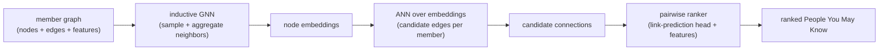

# Graph Recommendation and Link Prediction (People You May Know)

An interviewer poses this as **"design People You May Know"** (or "suggest
accounts to follow", "recommend groups"). Underneath, it is **link prediction on a
graph**: given the network of members and their connections, score which
not-yet-connected pairs are most likely to become an edge. This chapter builds it
end to end, from graph heuristics to the large inductive GNNs (LinkedIn LiGNN,
Pinterest PinSage, Twitter TwHIN, Snapchat GiGL) that power it in production today.

## Sections

1. [Clarifying the requirements](01-clarifying-requirements.md) - the dialogue that scopes People You May Know.
2. [Framing it as an ML task](02-frame-as-ml-task.md) - link prediction, the graph, input and output.
3. [Data preparation](03-data-preparation.md) - building the graph, features, and negative sampling on graphs.
4. [Model development](04-model-development.md) - heuristics, node2vec, and inductive GNNs (GraphSAGE / PinSage).
5. [Evaluation](05-evaluation.md) - AUC and Hits@k offline, invitation-accept rate online.
6. [Serving and scaling](06-serving-and-scaling.md) - precomputed node embeddings, ANN candidate generation, freshness.
7. [How teams do it in production](07-how-teams-do-it-in-production.md) - LiGNN, PinSage, TwHIN, GiGL, and where they diverge.
8. [Interview Q&A](08-interview-qa.md) - commonly asked, tricky, and commonly-answered-wrong.
9. [Summary](09-summary.md) - the one-page recap and self-test.

## The whole system on one page

Read the sections in order the first time; each opens with the question an
interviewer actually asks, then answers it.
