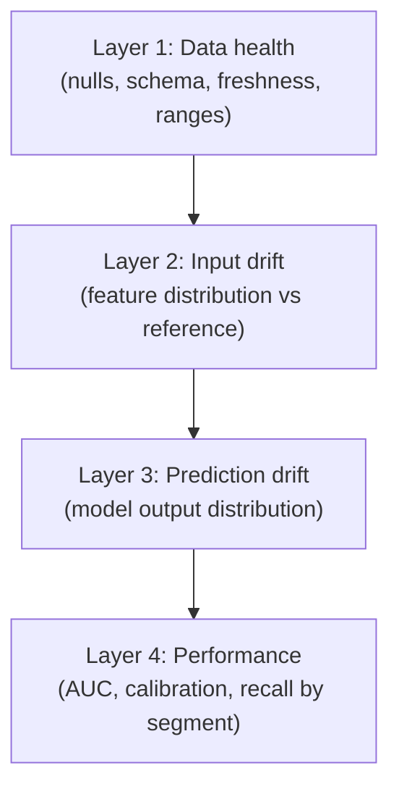
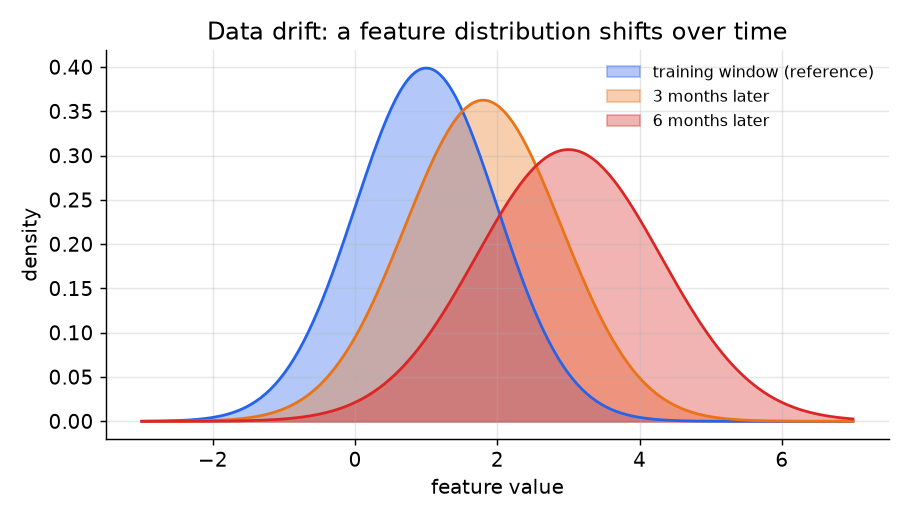

# 2. What to monitor

## The four-layer hierarchy

A model decays from the outside in. The outermost layer is the data it
consumes; the innermost is the business outcome it is trying to predict.
Monitoring in layers means you catch failures as close to the source as
possible, before they compound.

Work from the top down. A null-returning feature (layer 1) corrupts every
downstream signal; diagnosing "drift" before checking data health wastes time
and can lead to a retrain that bakes the bug in.

## Layer 1: Data health

Catch the most common and least glamorous failures first.

- **Null rate.** If a feature that was 0.2% null yesterday is now 12% null,
  something in the pipeline broke. This looks exactly like distribution drift
  if you skip the null check.
- **Schema change.** A new categorical value, a type change, or a renamed
  column. Catches upstream breakage before it reaches the model.
- **Feature freshness.** A feature that is supposed to refresh hourly but
  whose latest value is 18 hours old is a frozen feature: the model is
  silently scoring on stale data.
- **Out-of-range values.** A user-age feature suddenly containing negative
  values is a bug, not drift.

Google found that 60 of 96 production ML failures were not model-quality
problems but data and pipeline bugs. Data health is layer 1 for this reason.

## Layer 2: Input drift (covariate shift)

Has the feature distribution moved from the training reference?

*A feature that was centered at 1.0 at training time shifts to 3.0 over six
months. The model still runs; it is now scoring inputs unlike anything it
trained on. Illustrative.*

This is covariate shift:

$$P_{\text{cur}}(X) \neq P_{\text{ref}}(X), \quad P(y \mid X) \text{ unchanged}$$

The input-to-label mapping did not change, but the inputs themselves are
different. Retraining on fresh data cleanly repairs this.

## Layer 3: Prediction drift

Has the distribution of the model's own output scores shifted?

Prediction drift needs no labels. The model's score distribution is observable
immediately. A sudden change, such as the mean score dropping from 0.62 to
0.48, often precedes a measured performance drop by hours or days, because the
effect on labels takes time to accumulate. This makes it a useful early warning.

It also catches a common silent failure: the model began outputting near-uniform
scores, or collapsed onto a narrow score band, neither of which changes input
distributions but both of which indicate a broken serving path.

## Layer 4: Performance decay

The ground truth (the real outcomes the model is ultimately judged against). Once labels join back, compute the metrics the model
actually cares about: AUC, precision, recall, calibration, and the business
metric (CTR, revenue, engagement). Always slice by segment.

A concrete consequence of slicing: a global AUC of 0.81 can hide a new-user
cohort at 0.67. Aggregate monitoring would miss this for weeks. Sliced
monitoring catches it in the next evaluation window.

## Concept drift: the layer-2 miss

Concept drift is a different failure mode that layer-2 monitoring misses:

$$P(y \mid X) \text{ shifts}, \quad P(X) \text{ unchanged}$$

The inputs look the same but the right answer has changed. The Shopify example
is memorable: a mobile-transaction feature correlated strongly with fraud early
on, but once mobile became the primary way to shop the correlation reversed.
Feature distributions were stable; the label relationship flipped. A feature-
drift dashboard stayed green while model quality degraded. The fix here is
monitoring the feature-to-label relationship, not just the marginals.

## When to use which monitoring layer

| Reach for | When | Instead of |
|---|---|---|
| Data health (nulls, schema, freshness) | always, as the first check | drift tests on a broken feature, which waste a cycle |
| Input drift by feature (PSI, KS) | labels are delayed and you need a leading indicator | performance monitoring alone, which stalls until labels land |
| Prediction drift | a fast label-free early warning, or when only the score stream is accessible | input-level drift, which is richer but more expensive to compute |
| Performance by segment (AUC, calibration) | labels arrive quickly (clicks, transactions) or as the confirmation step | drift proxies, when truth is already available |
| Feature-to-label relationship monitoring | adversarial or concept-drift-prone domains (fraud, policy, user behavior) | feature-marginal drift alone, which misses a relationship flip |

**Provenance.** The input-drift layer rests on the Kolmogorov-Smirnov and PSI drift
tests (statistics), with the Population Stability Index originating in credit-risk
industry practice; the open-source Evidently packages these as the ready-made
input-and-prediction drift checks referenced here.

**Tools.** Data-health checks for nulls, schema, freshness, and ranges come from Great Expectations, pandera, or the deequ library. Input and prediction drift run on Evidently or whylogs over the prediction log. Segmented performance uses scikit-learn metrics grouped by cohort; feature-to-label relationship monitoring is a custom join of predictions to their delayed labels rather than an off-the-shelf detector.

**Worked example.** A search product monitors a click model from the outside in. It runs data-health checks first (Great Expectations), because a feature that jumped from almost no nulls to many nulls reads exactly like distribution drift if the null check is skipped. Only then does it test input drift per feature (Evidently) as a leading indicator while labels are still delayed. It watches prediction drift as a fast, label-free warning when only the score stream is accessible. Clicks arrive quickly, so it computes performance sliced by segment (scikit-learn) as the confirmation step, catching a new-user cohort that a global number would hide. For its fraud-adjacent signals it also monitors the feature-to-label relationship, not just the marginals, so a concept-drift flip does not pass while the drift dashboard stays green.
