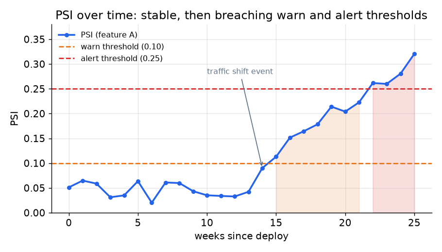

# 3. Detecting drift

You detect drift by comparing a current production window against a reference,
usually the training distribution or a recent healthy baseline. Three
statistics dominate in practice.

## Population Stability Index (PSI)

PSI is the workhorse for tabular features in industry. Given bin fractions
$p_i$ from the reference window and $q_i$ from the current window:

$$\text{PSI} = \sum_{i} (p_i - q_i) \ln \frac{p_i}{q_i}$$

```python
import numpy as np
def psi(p, q):
    # p: reference bin fractions, q: current bin fractions (each vector sums to 1)
    p, q = np.asarray(p, float), np.asarray(q, float)
    total = 0.0
    for pi, qi in zip(p, q):                 # walk the aligned reference/current bins
        total += (pi - qi) * np.log(pi / qi)  # (p_i - q_i) ln(p_i / q_i)
    return total
# psi([0.4, 0.3, 0.3], [0.2, 0.3, 0.5]) -> 0.2408 (moderate shift, in the 0.10-0.25 band)
```

The field rule for reading PSI:

| PSI range | Interpretation |
|---|---|
| below 0.10 | stable; no action |
| 0.10 to 0.25 | moderate shift; investigate |
| above 0.25 | material move; alert and act |

PSI is symmetric: it does not care which window you call the reference, because
it adds both directions of divergence. This makes it stable across window
choices, which is why it is the default in tools like Evidently AI.



*PSI stays below 0.10 for the first 13 weeks, breaches the warn threshold
after a traffic shift, and eventually exceeds the alert threshold. The two
dashed lines implement tiered alerting (warn vs page). Illustrative.*

## KL divergence

KL divergence is the directed parent of PSI:

$$D_{\text{KL}}(P \parallel Q) = \sum_{i} P_i \ln \frac{P_i}{Q_i}$$

```python
import numpy as np
def kl_divergence(p, q):
    # p, q: probability vectors over the same bins (each sums to 1)
    p, q = np.asarray(p, float), np.asarray(q, float)
    p, q = np.clip(p, 1e-12, None), np.clip(q, 1e-12, None)  # avoid log(0)
    return float(np.sum(p * np.log(p / q)))                  # directed: extra cost of coding P with Q
# kl_divergence([0.5, 0.5], [0.5, 0.5]) -> 0.0 (identical distributions)
```

PSI is just the symmetric version:

$$\text{PSI} = D_{\text{KL}}(P \parallel Q) + D_{\text{KL}}(Q \parallel P)$$

Use KL directly when you specifically need a directional measure, for example
when you want to ask "how much harder is it to encode current data using the
training reference?" rather than a symmetric distance. In most monitoring
contexts PSI is the right default because it is window-agnostic.

## Kolmogorov-Smirnov test

The KS test measures the maximum absolute difference between two empirical
cumulative distribution functions:

$$\text{KS} = \max_x \left| F_{\text{ref}}(x) - F_{\text{cur}}(x) \right|$$

```python
import numpy as np
def ks_statistic(ref, cur):
    # ref, cur: 1D samples; compare their empirical CDFs (step functions)
    ref, cur = np.sort(ref), np.sort(cur)
    grid = np.concatenate([ref, cur])                        # evaluate both CDFs at every observed point
    cdf_ref = np.searchsorted(ref, grid, side='right') / len(ref)
    cdf_cur = np.searchsorted(cur, grid, side='right') / len(cur)
    return float(np.max(np.abs(cdf_ref - cdf_cur)))          # largest vertical gap between the CDFs
# ks_statistic([0, 1, 2, 3], [0, 1, 2, 3]) -> 0.0 (identical) ; ks_statistic([0,0,0,0], [1,1,1,1]) -> 1.0 (disjoint)
```

It is non-parametric (it assumes no particular distribution shape): no assumption about the shape of either distribution.
It returns a p-value, so the decision threshold is statistical significance
rather than a field-rule number.

## Chi-square test

For categorical features, the chi-square test measures whether the observed
cell counts in the current window differ from those expected under the
reference distribution. PSI also applies to categorical features if you use
the categories as bins, but chi-square gives a proper statistical test.

Concretely, it sums the squared gap between observed and expected counts,
scaled by the expected count in each category:

```python
import numpy as np
def chi_square(observed, reference_probs):
    # observed: counts per category in the current window
    # reference_probs: expected share per category from the reference (sums to 1)
    observed = np.asarray(observed, float)
    expected = np.asarray(reference_probs, float) * observed.sum()  # expected counts under reference
    return float(np.sum((observed - expected) ** 2 / expected))     # Pearson chi-square statistic
# chi_square([30, 30, 40], [0.5, 0.3, 0.2]) -> 28.0 (expected [50, 30, 20]; the first category is short)
```

## When to use which

| Reach for | When | Instead of |
|---|---|---|
| PSI (0.10/0.25 thresholds) | you want a symmetric, window-agnostic drift check on a continuous or ordinal feature; industry default | directional KL, unless you specifically need asymmetry |
| KL divergence | you need a directional measure (e.g., encoding cost in one direction) | PSI, which is the symmetric default for monitoring |
| KS test | continuous features, no distributional assumption, want a p-value | PSI, when you prefer a threshold-based rule over statistical significance |
| Chi-square test | categorical features (counts per category) | KS, which requires a continuous CDF; one-size tests misfire on categorical data |
| MMD (Maximum Mean Discrepancy) | multivariate joint shift that per-feature tests miss; rare in practice | per-feature tests, when you can afford the computational cost of MMD |

**Provenance.** The Population Stability Index comes from credit-risk industry
practice, where it was standard for monitoring scorecard populations before ML
adopted it. The Kolmogorov-Smirnov and PSI drift tests are drawn from statistics. The
open-source Evidently packages PSI, KS, and chi-square as ready-made drift checks.

**Tools.** Evidently runs PSI, KS, and chi-square drift tests out of the box, and whylogs logs the feature profiles those statistics run over. Alibi Detect provides KS, chi-square, and MMD detectors, and scipy.stats gives KS and chi-square directly. PSI and KL are a short computation over binned histograms once the reference and current profiles exist.

**Worked example.** A marketplace monitors its ranking features against a healthy baseline. For an ordinal price feature it uses PSI with the field-rule thresholds (Evidently) because it wants a symmetric, window-agnostic check that does not depend on which window it calls the reference. When it specifically needs a directional read, how much harder current data is to encode under the training reference, it switches to KL. For a continuous feature where it would rather have a p-value than a fixed threshold it runs the KS test (scipy), and for a categorical placement feature it uses chi-square instead, since KS needs a continuous CDF. It reserves MMD (Alibi Detect) for the rare case where a joint multivariate shift slips past every per-feature test.

## What drift detection does not tell you

PSI and KS answer "did the distribution move?" They do not answer "does it
matter?" A feature can drift significantly without affecting model quality if
the model barely weights it. Before acting on a drift alert, check the feature's
importance and whether prediction drift or performance decay followed. Drift
without decay is often noise.

Similarly, data-health failures (a broken upstream join, a null-returning
feature) read as sharp distribution shifts. Running layer-1 data-health checks
before drift tests avoids the trap of retraining to "fix drift" that is actually
a broken pipeline.

## Setting thresholds from history

The PSI field rule (0.10/0.25) is a starting point, not a universal constant.
Set your thresholds from the observed historical variation in each feature. If
a feature naturally swings by PSI 0.15 every weekend, a threshold of 0.10 will
page on-call every Monday. Uber's D3 system uses a Prophet time-series model
to learn the expected range for each monitor so that seasonal swings do not
generate false alarms.

## Implementation and training pitfalls

Drift detection fails less on the statistic than on operating it: a broken pipeline
reads as a sharp shift, seasonal swings page on-call, and a store of feature tests
guarantees that something always looks drifted even when the model is fine.

| Problem | Symptom | Fix |
|---|---|---|
| Broken pipeline read as drift | sudden PSI spike, retraining does not help | run layer-1 data-health checks (nulls, schema, ranges) before drift tests |
| Binning artifacts | PSI unstable, empty bins produce infinities | fixed quantile bins from the reference, add an epsilon or floor the bin counts |
| Seasonal false alarms | on-call paged every weekend | learn the expected range per feature (Prophet-style), threshold on deviation not raw PSI |
| Multiple-testing alarm storm | hundreds of features, something always drifts | correct for the number of monitors, alert on prediction and label drift first |
| Stale reference window | everything looks drifted after an intended product change | refresh the baseline after intended shifts, compare against a recent healthy window |
| Small-sample noise | short windows swing the statistic wildly | enforce a minimum sample size per window before scoring drift |
| Drift without impact | an input moves but accuracy is flat | weight by feature importance, prioritize output and performance signals over every input |
| Label lag hides regression | metrics look fine because labels are not in yet | use proxy signals (confidence, agreement) while labels mature |

The through-line from the two sections above: a drift alert answers "did it move?",
not "does it matter?", so triage the pipeline and the feature's impact before
retraining to chase a number.

```mermaid
flowchart TD
  A["drift alert fires"] --> B{data-health checks pass?<br/>(nulls, schema, ranges)}
  B -- no --> C["broken pipeline:<br/>fix upstream, do not retrain"]
  B -- yes --> D{seasonal swing<br/>within learned range?}
  D -- yes --> E["expected variation:<br/>widen threshold, no action"]
  D -- no --> F{prediction or performance<br/>decay followed?}
  F -- no --> G["drift without impact:<br/>likely noise, watch"]
  F -- yes --> H["real shift:<br/>recalibrate or retrain"]
```
