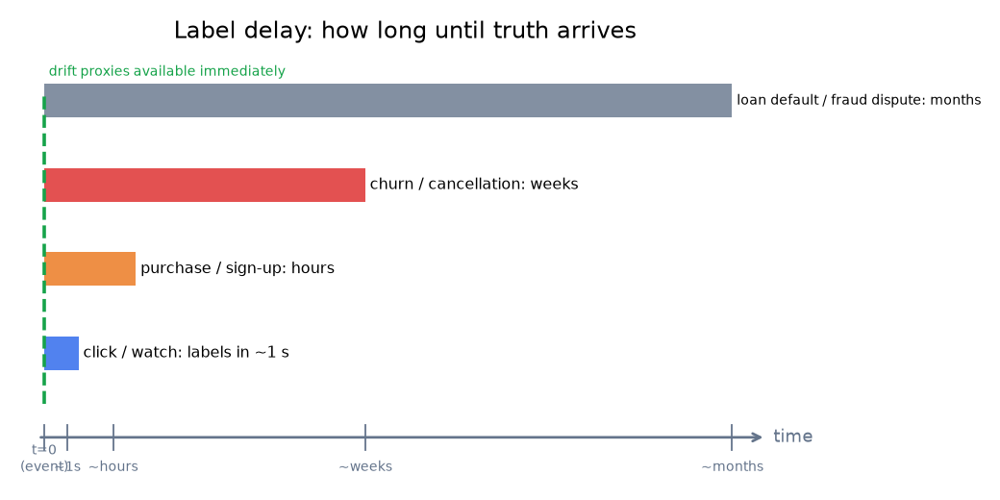
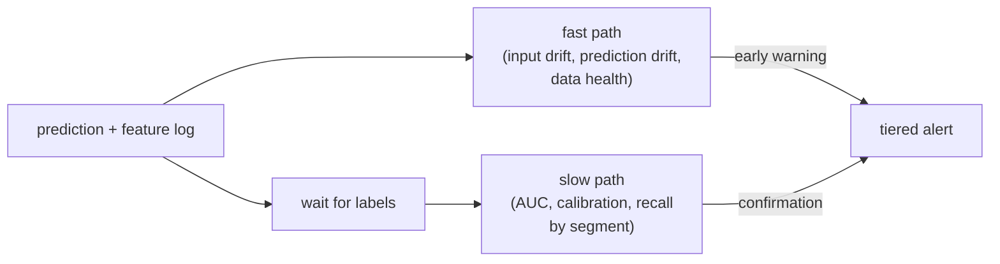

# 4. Monitoring without labels

## The label-delay problem

You cannot measure model accuracy until you know the truth. And the truth often
arrives much later than the prediction. This is the central constraint of ML
monitoring, and it is non-negotiable: you cannot shorten the label delay (the lag between
making a prediction and learning its true outcome) by
monitoring harder.



*Clicks arrive in seconds; purchases in hours; churn in weeks; loan defaults
in months. Drift proxies are available immediately at all horizons. Illustrative.*

For a recommendation click model, labels arrive in seconds, so you can measure
AUC almost live. For a fraud model, the dispute resolution takes weeks. For a
loan-default model, the ground truth arrives months later. During that entire
window, the only signals available are the ones that need no labels.

## Proxy metrics when labels are delayed

The strategy is to monitor what you can see now as a leading indicator of what
you cannot see yet.

**Input drift as a proxy** (a stand-in signal you can measure now for the true quality you cannot yet see). If the feature distribution has shifted materially
from the training reference, the model is scoring inputs unlike its training
data. Accuracy has probably moved. Input drift is not proof of quality decay,
but a sustained PSI breach is a warning to act before labels confirm it.

**Prediction drift as a proxy.** The distribution of the model's own output
scores is visible without any labels. A shift in the mean score, a sudden
widening of the score distribution, or a collapse onto a narrow range all
signal that the model's behavior has changed. Uber's deployment system monitors
score distribution, calibration, and entropy as label-free early warnings.

**Calibration drift as a proxy.** If the model outputs a probability, its
calibration (how well the predicted probabilities match observed frequencies)
can shift before raw accuracy moves. Entropy of the score distribution is
another proxy: a model that was confident and is now uncertain, or vice versa,
has probably encountered a changed world.

```python
import numpy as np
def entropy(probs):
    # probs: a score/class distribution (sums to 1); measures uncertainty in nats
    probs = np.clip(np.asarray(probs, float), 1e-12, None)  # avoid log(0)
    return float(-np.sum(probs * np.log(probs)))            # higher = more uncertain
# entropy([0.5, 0.5]) -> 0.6931471805599453 (ln 2, maximal spread over two outcomes)
```

**Business-metric proxies.** For a ranking model, coverage (fraction of the
catalog retrieved) and diversity (distribution over item clusters) are
observable downstream of serving without labels. A model that silently collapsed
onto head items shows up as lower coverage before click-rate decays.

## Premature labeling

A subtle trap: the label appears before the feedback window closes.

For a click-through model with a 30-minute engagement window, scoring an
impression as "negative" at the 5-minute mark counts clicks that arrive in
minutes 6 through 30 as negatives. The accuracy metric will be biased low
until you wait the full window. Always respect the feedback window before
computing performance metrics.

## When to use which proxy

| Reach for | When | Instead of |
|---|---|---|
| Input drift (PSI, KS) | labels are days to weeks out; you need a leading indicator now | performance monitoring, which stalls until labels land |
| Prediction drift (score distribution, entropy) | labels are delayed but the model's output stream is observable | input drift alone, when the serving layer is a black box |
| Calibration drift | the model outputs probabilities that feed downstream decisions | pure AUC, which hides miscalibration |
| Business proxies (coverage, diversity) | ranking or retrieval models where outcome-agnostic properties are measurable | waiting for engagement drops to surface naturally |
| Segmented performance (once labels land) | labels arrive fast (clicks) or as the final confirmation of a proxy-flagged incident | aggregate performance, which hides per-cohort regressions |
| Shadow traffic comparison | a new model candidate is live on a fraction of traffic | offline eval alone, which misses real-traffic distribution mismatch |

**Provenance.** The label-free input-drift proxies use the Kolmogorov-Smirnov and PSI
drift tests (statistics), PSI itself from credit-risk industry practice, surfaced
through the open-source Evidently on the prediction log.

**Tools.** Evidently and whylogs track input drift and prediction-score drift straight off the prediction log. Calibration drift is measured with scikit-learn reliability curves or netcal, while business proxies like coverage and diversity are custom aggregations over the serving log. Segmented performance uses scikit-learn metrics grouped by cohort; shadow-traffic comparison runs through the serving stack rather than a dedicated library.

**Worked example.** An ad network watches a conversion model whose labels land days later. Because performance monitoring stalls until those labels arrive, it leans on input drift (Evidently) as the leading indicator available now. It also watches prediction drift, the score distribution and its entropy, off the prediction log, which catches a broken serving path even when the input distribution looks stable. Since the model emits probabilities that feed bidding, it tracks calibration drift before raw accuracy can move. Coverage and diversity serve as business proxies for a silent collapse onto head items, and once labels finally join back it computes segmented performance to surface a per-cohort regression that an aggregate number would bury.

## The two-speed design

A well-structured monitoring system runs both speeds simultaneously. The fast
path fires immediately off the prediction log using proxy metrics; the slow path
fires once labels join back.



The fast path is the early warning. The slow path is the ground truth.
An incident that clears on the slow path but was flagged by the fast path is
probably benign drift in a feature the model does not weight heavily. An
incident confirmed on both paths is serious. Acting only on the slow path means
you are always reacting after users have already felt the decay.
