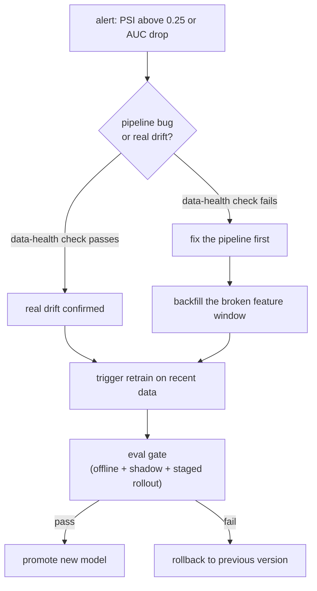

# 5. Alerting and response

## A monitor nobody trusts is worse than none

Alert fatigue is the failure mode of a monitoring system. If the team has
learned to mute alerts because they fire on noise, the system is providing
negative value: it creates work without creating safety. The goal is a monitor
with a precision high enough that every page means something.

Three principles keep false positives low:

**Alert on sustained breaches, not single noisy points.** A single PSI spike
of 0.11 on a volatile feature may be noise. PSI above 0.10 for three consecutive
windows is signal. Uber D3 uses a Prophet forecast model to set dynamic bounds
so that a single outlier outside conservative limits does not page, but a
persistent trend does.

**Set thresholds from observed history, not from defaults.** The PSI field rule
(0.10 warn, 0.25 alert) is a starting point. Calibrate each feature's threshold
from its historical variation. A feature that naturally swings by 0.12 over
weekends needs a higher threshold to avoid Monday-morning pages.

**Make every alert diagnosable.** An alert must name the feature, the segment,
and the direction of movement. "AUC dropped 2% in the new-user cohort, driven
by feature X which shifted PSI 0.31 this week" gets acted on in minutes.
"Something degraded" gets muted and then escalates into an incident two weeks
later.

## Tiered severity

Different models have different stakes. A tiered severity system matches the
response to the cost of failure:

| Tier | Example model | Signal | Response |
|---|---|---|---|
| P0 (page immediately) | fraud classifier, pricing model | any AUC drop or PSI breach above threshold | wake the on-call; rollback option available |
| P1 (page during hours) | ad CTR ranker | sustained drift or AUC drop for 2+ windows | team review within the business day |
| P2 (dashboard note) | feed recommendation model | moderate drift; no confirmed AUC drop | visible on dashboard; review at next standup |
| P3 (logging only) | internal scoring model | minor movement within historical range | no action; baseline for future reference |

## Retraining triggers

Monitoring is only valuable if it drives a response. Three response patterns:

**Scheduled retraining.** Run on a fixed cadence (daily, weekly) on fresh data.
This handles slow steady drift as a baseline. It does not require any breach
signal; the schedule assumes the world moves. The cost is that you retrain even
when the model is still healthy.

**Triggered retraining.** A monitor breach kicks off a retrain on recent data.
The retrain goes through the same evaluation gate as any model change (offline
metrics, shadow traffic comparison, staged rollout) before promotion. This
catches irregular events that a fixed schedule would miss. The cost is pipeline
complexity: the trigger must not fire on a pipeline bug, or you retrain on
corrupt data.

**Rollback.** If a freshly promoted model is the cause of the degradation, the
fastest response is to revert to the previous version. Rollback should be a
one-step operation, not a multi-hour emergency procedure. Uber's deployment
system auto-rolls back when error rate, latency, or utilization breach a
threshold during gradual rollout.

## The retrain gate

A triggered retrain that skips the evaluation gate defeats the purpose. The
gate should require:

1. Offline metrics (AUC, calibration) meet or exceed the outgoing model.
2. Shadow traffic comparison shows no regression on live inputs.
3. Staged rollout with auto-rollback if operational metrics breach.

Running a retrain through the gate takes a day at most; skipping it can push
a model trained on a broken feature window straight to production.

## Closing the loop

The most common mistake is to skip the triage step and retrain immediately.
A null-returning feature looks exactly like distribution drift; retraining on
corrupted data bakes the bug into the next model.
