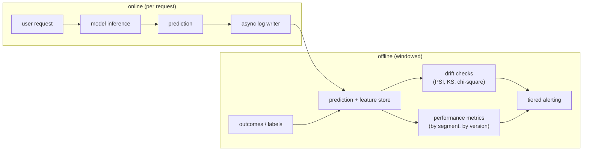

# 6. Serving and scaling

## The cost structure of monitoring

Monitoring adds a second workload that runs alongside serving. Every prediction
generates a log record; every log record is a potential input to a drift check.
At a system serving millions of requests per minute, logging everything and
checking everything is not free. The design must decide what to log, how much
of it, and how often to evaluate.

## What must be logged

The minimum viable log for a useful monitoring system is:
- The prediction (score or decision output).
- The exact features as they were served (not as they were in training). Without
  the served features, you cannot distinguish a feature pipeline bug from
  distribution drift.
- A request timestamp and model version.
- The outcome, joined back when it arrives.

The features-as-served requirement is the expensive one. A wide feature set
(hundreds of sparse or dense features) generates large log records. The options
are: log everything and pay the storage cost, log only the features the model
actually weights heavily, or log a random sample.

## Sampling strategies

Full logging is the safest choice and the most expensive. Sampling is the
lever:

**Random sampling.** Log a fixed percentage of predictions (1%, 10%). Drift
statistics computed on a sample are nearly as good as on the full population
for large systems, because the sample is still large enough. The tradeoff is
that rare-segment failures (a small user cohort, a new device type) are
underrepresented.

**Stratified sampling.** Sample at a higher rate within known high-value
segments (new users, high-value accounts) and at a lower rate in the bulk.
This keeps the monitoring cost down while preserving coverage of the segments
that matter most.

**Triggered logging.** Log the full record only when a feature value is out of
expected range. This concentrates storage on the anomalies. The risk is missing
a systematic shift that looks individually normal but is collectively large.

## Aggregate windows

Drift statistics require enough samples to be stable. The window length is a
real design parameter:

- **Short windows** (hourly) detect fast changes but fire on noise. A naturally
  variable feature generates false alarms.
- **Long windows** (weekly) are stable but slow to detect. A model that started
  degrading Monday might only show up in Friday's window.
- **Sliding windows** (rolling 24 hours) are a compromise. Chip Huyen's framing
  is that the window length is a tuning knob: tune it per-feature based on its
  historical variability.

## Bottlenecks

| Bottleneck | First sign | Fix | Tradeoff |
|---|---|---|---|
| Log volume | storage cost spikes or pipeline latency rises | stratified sampling; log only high-weight features | coverage of rare segments reduced |
| Label delay | cannot confirm quality decay for days or weeks | lead with fast proxy signals (drift, prediction distribution) | indirect; proxy can miss concept drift |
| Alert fatigue | real alerts get ignored | thresholds from history, sustained-breach rule, severity tiers | slower to fire on genuine emergencies |
| Aggregate blind spots | a cohort regresses but is averaged away | slice every metric by segment | more dashboards and more monitoring cost |
| Distinguishing bug from drift | chasing "drift" that is a broken feature | data-health checks before drift tests | extra checks; slightly slower triage |
| Slow loop closure | drift caught but model stays stale | triggered retraining plus one-step rollback | pipeline complexity |
| Reference staleness | normal seasonal variation flagged as drift | periodically re-anchor the reference window | reference must be deliberately refreshed |

Two details worth pinning down. First, reference staleness interacts badly with the
PSI drift test (Population Stability Index, from credit-risk practice): PSI freezes
its bin edges on the reference window, so if that reference predates a seasonal shift,
every in-season window scores as high drift even though nothing is broken. Re-anchoring
the reference to a recent healthy period, or comparing against the same period last
year, removes the false alarm without loosening the threshold. Second, the label-delay
bottleneck is why the fast proxy path exists at all: PSI and KS (statistics) run on
inputs and predictions that are available immediately, so they can fire days before
any labeled performance metric can confirm decay, at the cost of not distinguishing a
harmless covariate shift from a genuine concept drift until the labels land.

## The serving architecture

**How it works.** A user request enters the online path, the model runs inference, and the prediction returns to the caller while an async log writer records the request off the critical path. Those log records flow into the offline prediction and feature store, where outcomes and labels join them as they arrive. The store then feeds two windowed jobs: drift checks (PSI, KS, chi-square) over the feature and score distributions, and performance metrics computed by segment and by model version once labels are present. Both jobs push their results into a single tiered alerting stage. Splitting online serving from offline analytics keeps the heavier batch computation off the latency-sensitive request path, so monitoring cost never lands on the user-facing prediction.

The async log writer is the key structural choice. Logging must not be on the
critical path of the serving request; a slow log write must not add latency to
the user-facing prediction. Write to a queue (Kafka, Pub/Sub) and let a
downstream consumer drain it into the feature store.
