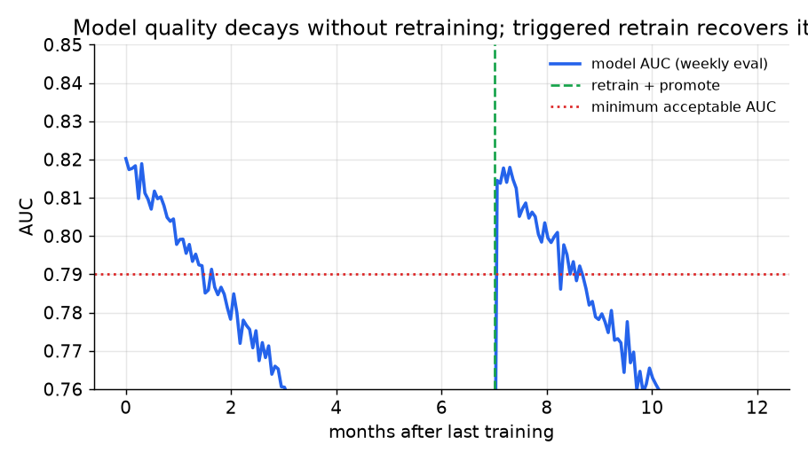
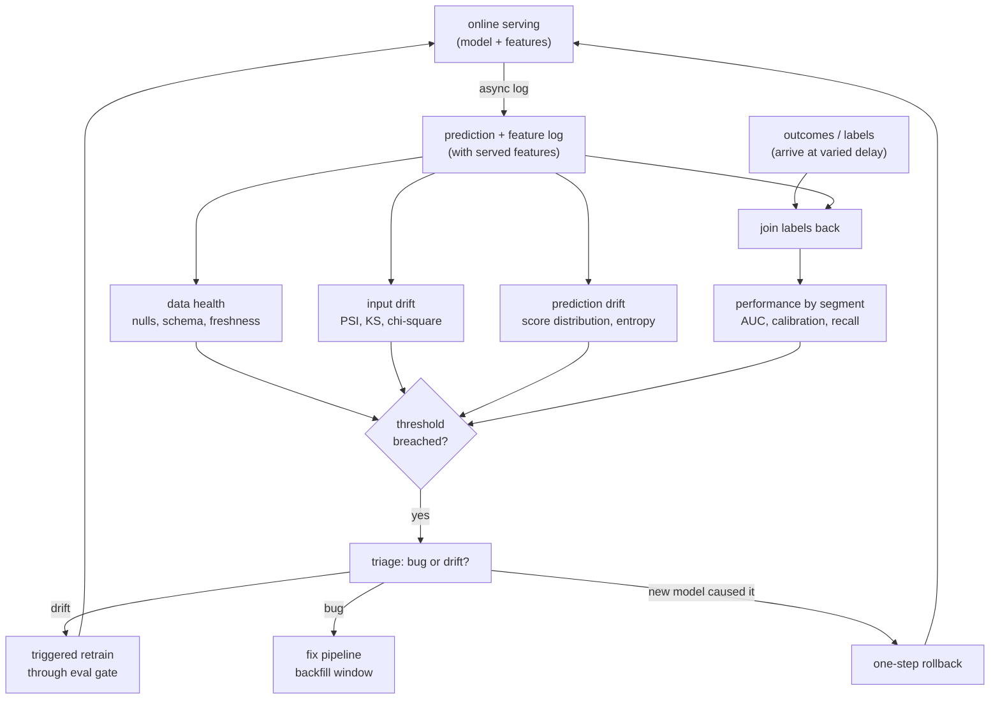

# 9. Summary

## One-page recap

- **Service monitoring is not ML monitoring.** Latency and error rate tell you
  the process is up; they cannot detect silent model decay. ML monitoring watches
  the data and the outcomes.

- **Monitor in four layers, outside in.** Data health first (nulls, schema,
  freshness), then input drift, then prediction drift, then performance by
  segment. Work outside in: a layer-1 bug poisons every downstream signal.

- **There are three causes of decay.** Data drift (inputs move), concept drift
  (the input-to-label mapping moves while inputs stay flat), and pipeline bugs
  (the most common real cause). Naming all three and running data-health checks
  before drift tests is the senior framing.

- **Label delay is the whole game.** If truth arrives in seconds, watch
  accuracy live. If it takes weeks, lead with input and prediction drift as
  proxies and confirm on labels later. Monitoring without labels is not a
  fallback; it is the primary tool for slow-label systems.

- **Drift without decay and decay without drift are both real.** A feature can
  drift hard yet not matter (check importance before acting). Concept drift can
  move quality while marginals stay flat (a green drift dashboard is not proof
  of health).

- **Alert fatigue kills a monitor.** Sustained breaches, not single points.
  Thresholds from history, not defaults. Tiered severity. Diagnosable alerts
  that name the feature and segment that moved.

- **Monitoring is only worth it if it drives a response.** Scheduled retraining
  as baseline, triggered retraining on breach through the eval gate, one-step
  rollback for a bad promote.

*AUC decays continuously after the training cutoff. A triggered retrain restores
quality; without the monitor, the decay would have been invisible until users
complained. Illustrative.*

## The monitoring loop on one page

## Test yourself

1. A model has been in production for four months. Engagement is slightly down.
   The drift dashboard is green. What are two explanations, and how do you
   confirm each?

2. You detect a PSI of 0.31 on a feature. Walk through the steps before
   deciding to retrain.

3. Your label delay is six weeks (fraud disputes). List three proxy metrics you
   can monitor in the meantime, and their limitations.

4. An engineer proposes setting all drift thresholds to PSI 0.10 across the
   board. What is wrong with this, and how do you fix it?

5. After a triggered retrain, the new model's AUC on the evaluation set is
   lower than the outgoing model's. What happened, and what do you do?

6. Why is it wrong to apply the PSI threshold as a hard constant independent
   of the feature's historical variability?

## Further reading

- Dense reference (math, all case studies, comparison quadrant): [topics/11-ml-monitoring-and-drift.md](../../topics/11-ml-monitoring-and-drift.md).
- Per-company teardowns (Evidently, Uber D3, Uber MES, Uber deploy-safety, Lyft, Netflix, Shopify): [tools/teardowns/11.md](../../tools/teardowns/11.md).
- Side-by-side comparison (choices table, mermaid decision tree): [tools/comparisons/11.md](../../tools/comparisons/11.md).
