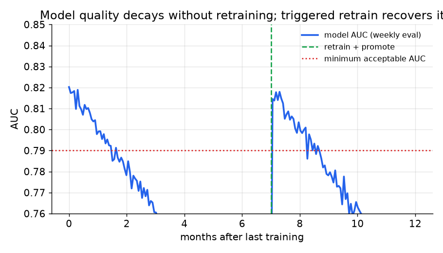
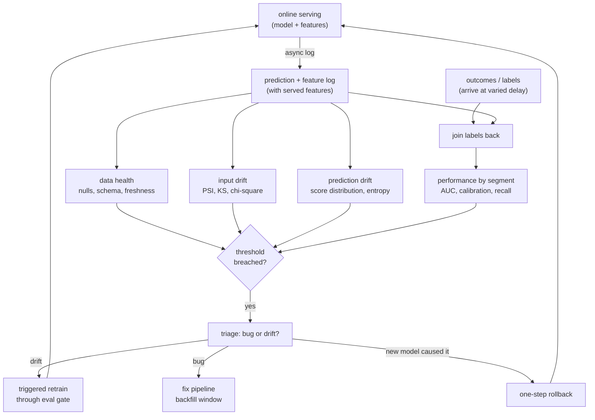

# 9. Summary

## One-page recap

- **Service monitoring is not ML monitoring.** Latency and error rate tell you
  the process is up; they cannot detect silent model decay. ML monitoring watches
  the data and the outcomes.

- **Monitor in four layers, outside in.** Data health first (nulls, schema,
  freshness), then input drift, then prediction drift, then performance by
  segment. Work outside in: a layer-1 bug poisons every downstream signal.

- **There are three causes of decay.** Data drift (inputs move), concept drift
  (the input-to-label mapping moves while inputs stay flat), and pipeline bugs
  (the most common real cause). Naming all three and running data-health checks
  before drift tests is the senior framing.

- **Label delay is the whole game.** If truth arrives in seconds, watch
  accuracy live. If it takes weeks, lead with input and prediction drift as
  proxies and confirm on labels later. Monitoring without labels is not a
  fallback; it is the primary tool for slow-label systems.

- **Drift without decay and decay without drift are both real.** A feature can
  drift hard yet not matter (check importance before acting). Concept drift can
  move quality while marginals stay flat (a green drift dashboard is not proof
  of health).

- **Alert fatigue kills a monitor.** Sustained breaches, not single points.
  Thresholds from history, not defaults. Tiered severity. Diagnosable alerts
  that name the feature and segment that moved.

- **Monitoring is only worth it if it drives a response.** Scheduled retraining
  as baseline, triggered retraining on breach through the eval gate, one-step
  rollback for a bad promote.

*AUC decays continuously after the training cutoff. A triggered retrain restores
quality; without the monitor, the decay would have been invisible until users
complained. Illustrative.*

## The monitoring loop on one page

```mermaid
flowchart TD
  SERVE["online serving<br/>(model + features)"] -->|"async log"| LOG["prediction + feature log<br/>(with served features)"]
  LOG --> DH["data health<br/>nulls, schema, freshness"]
  LOG --> ID["input drift<br/>PSI, KS, chi-square"]
  LOG --> PD["prediction drift<br/>score distribution, entropy"]
  OUT["outcomes / labels<br/>(arrive at varied delay)"] --> JOIN["join labels back"]
  LOG --> JOIN
  JOIN --> PERF["performance by segment<br/>AUC, calibration, recall"]
  DH --> ALERT{"threshold<br/>breached?"}
  ID --> ALERT
  PD --> ALERT
  PERF --> ALERT
  ALERT -->|"yes"| TRIAGE["triage: bug or drift?"]
  TRIAGE -->|"drift"| RETRAIN["triggered retrain<br/>through eval gate"]
  TRIAGE -->|"bug"| FIX["fix pipeline<br/>backfill window"]
  TRIAGE -->|"new model caused it"| ROLLBACK["one-step rollback"]
  RETRAIN --> SERVE
  ROLLBACK --> SERVE
```

## Test yourself

Answers are collapsed. Attempt each question before opening one.

1. A model has been in production for four months. Engagement is slightly down.
   The drift dashboard is green. What are two explanations, and how do you
   confirm each?

   

Answer

   **Concept drift** and an **aggregate blind spot** are the two that matter, and
   a green input-drift dashboard rules out neither. Concept drift moves
   $P(y \mid X)$ while $P(X)$ stays flat, so every feature histogram can look
   identical while the right answer has changed; the Shopify case in section
   [2](02-what-to-monitor.md) is the canonical one, where a mobile-transaction
   feature's correlation with fraud reversed without its distribution moving.
   Confirm it by monitoring the feature-to-label relationship rather than the
   marginals, or by watching layer-4 performance once labels join back. The second
   explanation is that the decay is real but buried in a cohort: a global AUC of
   0.81 can hide a new-user segment at 0.67, and section
   [2](02-what-to-monitor.md) makes slicing the fix. Confirm it by recomputing
   every metric by segment and checking whether the engagement drop is
   concentrated where the model regressed. Section
   [8](08-interview-qa.md) adds two more candidates worth naming in an interview:
   a feedback loop in which the model's own predictions narrow the data it is now
   judged on, and a business metric whose definition changed underneath you.

   

2. You detect a PSI of 0.31 on a feature. Walk through the steps before
   deciding to retrain.

   

Answer

   Do not retrain yet; 0.31 is above the 0.25 "material move" band from section
   [3](03-detecting-drift.md), but PSI answers "did it move?", never "does it
   matter?". Run the steps in this order. **One, layer-1 data health**: null rate,
   schema, freshness, and ranges on that feature, because a null-returning join or
   a frozen feature reads as a sharp distribution shift and retraining on the
   corrupted window bakes the bug in. **Two, check the measurement itself**:
   binning artifacts and empty bins, a window below the minimum sample size, and a
   stale reference that predates an intended product change. **Three, ask whether
   this is seasonal variation** inside the feature's learned expected range, the
   Prophet-style band Uber D3 fits per monitor. **Four, require a sustained
   breach**, three consecutive windows rather than one spike (section
   [5](05-alerting-and-response.md)). **Five, weight by feature importance and
   look for a downstream signal**: if prediction drift or performance decay did not
   follow, this is drift without impact. Only when data health passes, the breach
   persists, and the model actually weights the feature do you trigger a retrain,
   and it still goes through the eval gate rather than straight to production.

   

3. Your label delay is six weeks (fraud disputes). List three proxy metrics you
   can monitor in the meantime, and their limitations.

   

Answer

   Three label-free proxies from section [4](04-monitoring-without-labels.md).
   **Input drift** (PSI, KS per feature against the training reference): available
   immediately, but it is not proof of decay, since a feature the model barely
   weights can move without changing a single prediction. **Prediction drift** (the
   score distribution's mean, spread, and entropy): it catches a broken serving
   path that leaves inputs untouched, such as a collapse onto a narrow score band,
   and a mean-score slide often precedes a measured performance drop by hours or
   days; its limitation is that it tells you behavior changed, not whether the new
   behavior is wrong. **Calibration drift**: predicted probabilities can decouple
   from observed frequencies before raw accuracy visibly moves, but you still need
   some outcome signal to compute it, so on a six-week delay it lags. Coverage and
   diversity are a fourth, business-side proxy for a silent collapse onto head
   items. The limitation that binds all of them in fraud specifically: input-side
   statistics are structurally blind to concept drift, which is exactly the
   dominant risk in an adversarial domain (section
   [10](10-putting-it-together.md)), so the fraud build spends on feature-to-label
   relationship monitoring rather than more input tests.

   

4. An engineer proposes setting all drift thresholds to PSI 0.10 across the
   board. What is wrong with this, and how do you fix it?

   

Answer

   The 0.10/0.25 field rule is a **starting point, not a universal constant**, and
   applying it flat is the fastest way to manufacture alert fatigue. A feature that
   naturally swings by PSI 0.15 every weekend pages on-call every Monday, and once
   the team learns to mute the monitor it provides negative value: work without
   safety (section [5](05-alerting-and-response.md)). The problem compounds with
   monitor count. The build in section [10](10-putting-it-together.md) reaches
   roughly 900 series from about 120 features across seven slices, and in that
   multiple-testing regime something is always above any fixed line. Fix it in
   three moves: calibrate each feature's threshold from its own historical
   variation, or replace the constant with a learned expected range (the
   Prophet-style bands Uber D3 fits per monitor); require a sustained breach over
   three consecutive windows instead of a single point; and tier severity so the
   page condition sits on prediction drift and performance, with per-feature PSI
   demoted to ranking the diagnosis rather than driving the page.

   

5. After a triggered retrain, the new model's AUC on the evaluation set is
   lower than the outgoing model's. What happened, and what do you do?

   

Answer

   The most likely cause is that **the drift was a pipeline bug, not a real
   distribution shift**, so the retrain window contained corrupted records and the
   new model learned the bug. A null-returning feature or a schema change reads
   exactly like a distribution shift, which is why section
   [5](05-alerting-and-response.md) puts a bug-vs-drift triage step ahead of the
   retrain trigger. What you do first is nothing: the eval gate just did its job.
   Requirement one of the gate is that offline metrics meet or exceed the outgoing
   model, so this candidate does not get promoted and the incumbent keeps serving.
   Then go back to layer-1 data health, find and backfill the broken feature
   window, and retrain on the repaired data before re-entering the gate. If data
   health is clean, the second candidate explanation is concept drift handled
   badly: padding the training set with pre-shift data outvotes the fresh examples
   that encode the new mapping, so the fix is recency weighting or a sliding window
   rather than more volume (section [8](08-interview-qa.md)).

   

6. Why is it wrong to apply the PSI threshold as a hard constant independent
   of the feature's historical variability?

   

Answer

   Because PSI is a **divergence magnitude, not a measure of harm**, and its
   baseline level differs per feature. The statistic sums
   $\sum_i (p_i - q_i) \ln \frac{p_i}{q_i}$ over bin edges frozen on the reference
   window, so its scale depends on how many bins the feature has and how lumpy its
   distribution is. A smooth unimodal feature sits near zero week to week, while a
   multimodal or bursty feature accumulates a substantial PSI from nothing but its
   normal churn, so one global line is quiet for the first and a hair-trigger for
   the second (section [8](08-interview-qa.md)). Reference staleness pushes the
   same way: frozen bin edges that predate a seasonal shift or an intended product
   change score every in-season window as high drift even though nothing is broken.
   The correct form of the rule is to threshold on **deviation from that feature's
   learned expected range**, not on raw PSI, and to re-anchor the reference to a
   recent healthy window after intended shifts (sections
   [3](03-detecting-drift.md) and [6](06-serving-and-scaling.md)). Keep 0.10/0.25
   as the day-one default when you have no history yet, then replace it feature by
   feature as history accumulates.

   

## Further reading

- The capstone: [the complete build](10-putting-it-together.md), where every
  choice in this chapter is committed once for the scenario, sized, rebuilt
  under two other constraint sets, and compressed into a runnable one-file
  drift monitor.
- Dense reference (math, all case studies, comparison quadrant): [topics/11-ml-monitoring-and-drift.md](../../topics/11-ml-monitoring-and-drift.md).
- Per-company teardowns (Evidently, Uber D3, Uber MES, Uber deploy-safety, Lyft, Netflix, Shopify): [tools/teardowns/11.md](../../tools/teardowns/11.md).
- Side-by-side comparison (choices table, mermaid decision tree): [tools/comparisons/11.md](../../tools/comparisons/11.md).
