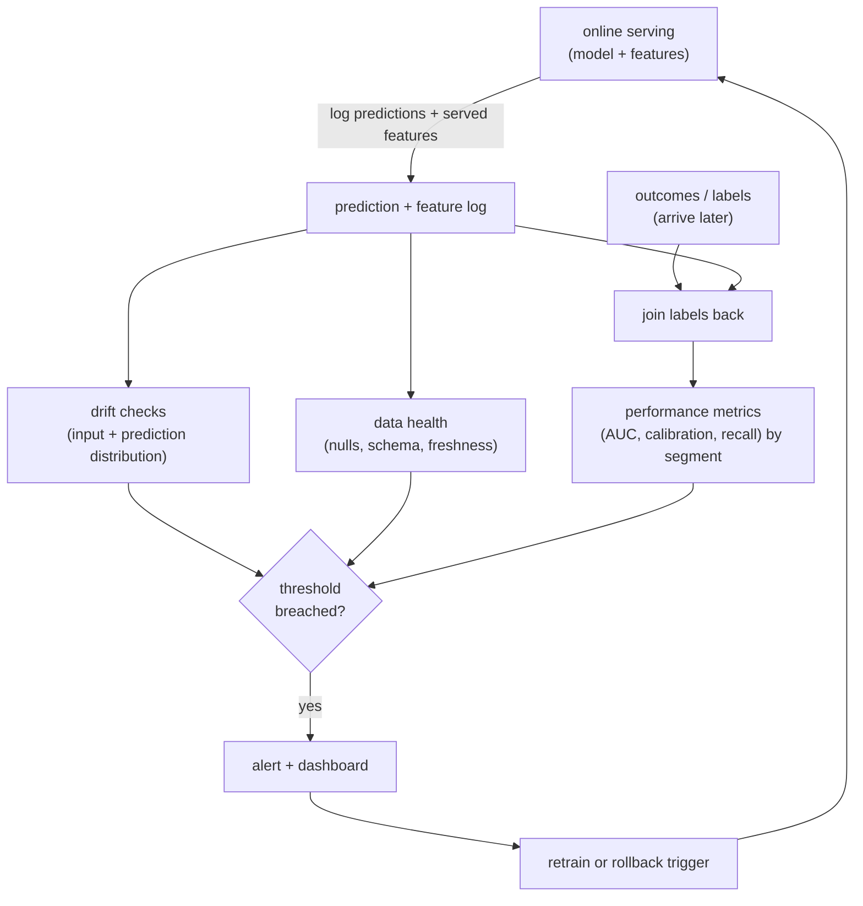

# ML Monitoring and Drift

> **Chapter style.** This chapter is a teach-first, book-like treatment of
> ML monitoring. It borrows the *thinking* of a Candidate/Interviewer dialogue
> to gather requirements, then a consistent arc from what to monitor through
> detection methods, proxy signals, alerting, serving cost, and production
> case studies. On top of that it keeps what this repo adds: real production
> references, "when to use which" tables per decision group, worked figures
> (mermaid and matplotlib), and an interview Q&A. Split into one file per
> section so no single file gets long.

An interviewer rarely says "design a monitoring system." They say **"a model
you launched six months ago was great at launch; engagement has been quietly
sliding ever since. Design the monitoring that would have caught this before
users did, and the loop that keeps the model healthy."** That is ML monitoring:
observing a model's inputs, outputs, and outcomes over time, detecting when the
world has moved, and closing the loop back to retraining. This chapter builds
it end to end, and shows how Uber, Lyft, Netflix, Shopify, and Evidently AI
actually do it.

## Sections

1. [Clarifying the requirements](01-clarifying-requirements.md) - the dialogue that scopes the problem.
2. [What to monitor](02-what-to-monitor.md) - the four layers: data health, input drift, prediction drift, and performance.
3. [Detecting drift](03-detecting-drift.md) - PSI, KL divergence, KS test, chi-square, and when to use each.
4. [Monitoring without labels](04-monitoring-without-labels.md) - proxy metrics when ground truth is delayed.
5. [Alerting and response](05-alerting-and-response.md) - thresholds, tiering, and retraining triggers.
6. [Serving and scaling](06-serving-and-scaling.md) - logging cost, sampling, and the bottlenecks table.
7. [How teams do it in production](07-how-teams-do-it-in-production.md) - divergence table, named companies, and first-party links.
8. [Interview Q&A](08-interview-qa.md) - commonly asked, tricky, and commonly-answered-wrong, with clear answers.
9. [Summary](09-summary.md) - the one-page recap, mermaid, and self-test.

## The whole loop on one page

Read the sections in order the first time; they build on each other. Each opens
with the question an interviewer actually asks, then answers it.
