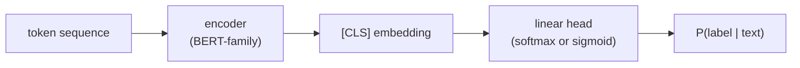
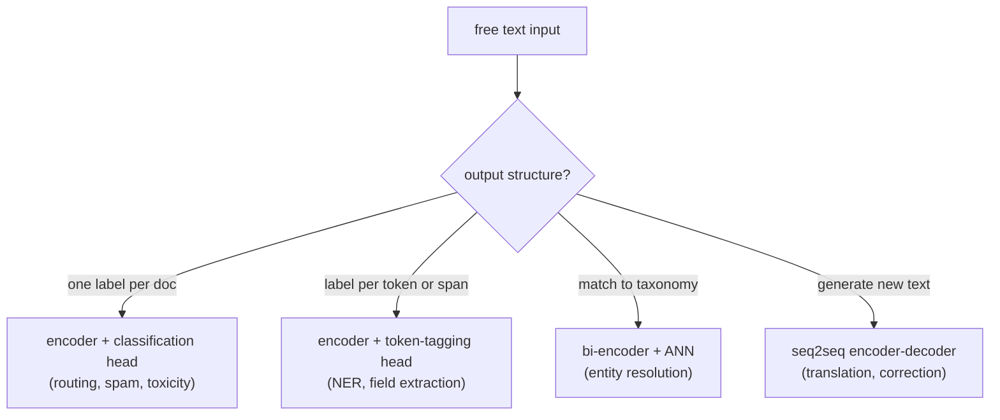

# 2. Framing it as an ML task

## Name the task before naming the model

The single most important move at this stage is to refuse the generic framing
"design an NLP system" and instead name each sub-problem as a distinct ML task.
Each has a different input/output structure, and the architecture follows directly
from that structure.

### Text classification

**Task:** assign one label (or a small fixed set of labels) per document.

**Examples:** route a ticket to the "billing" queue, classify a message as
toxic or not, detect spam.

**Input:** a token sequence (the text). **Output:** a probability distribution
over a fixed label set.

**Architecture:** a pre-trained encoder (BERT-family) computes a contextualized
representation for the whole text (usually the `[CLS]` token output), and a
linear softmax (or sigmoid for multi-label) head converts it to label
probabilities. The encoder is fine-tuned end-to-end on labeled examples.

### Named entity recognition and field extraction

**Task:** assign a label to each token (or span) in the text, identifying fields
such as a product name, a date, or a location.

**Examples:** extract amenity mentions from a listing description, pull a product
name and order date out of a support ticket.

**Input:** a token sequence. **Output:** a label per token (using the BIO tagging
scheme: B = beginning of entity, I = inside, O = outside).

**Architecture:** the same encoder, but instead of pooling to a single
`[CLS]` vector, each token's contextual representation feeds into a tagging head
(a linear layer over the full sequence). The encoder is again fine-tuned on
labeled spans.

### Entity resolution and record matching

**Task:** map a messy free-text string to a canonical entry in a taxonomy.

**Examples:** "2br nr Union Sq" to a standardized location entity, a dozen surface
variants of "lockbox" to one canonical amenity attribute.

**Input:** a query string (the user-generated variant). **Output:** the nearest
matching entity from the taxonomy, or "no match."

**Architecture:** a bi-encoder (one encoder for the query, one for the catalog
entity) maps both into the same embedding space; an ANN lookup finds the nearest
canonical entity. This is the same two-tower pattern as candidate retrieval, but
applied to text strings rather than user-item pairs.

### Machine translation

**Task:** given a source-language sentence, produce a semantically equivalent
target-language sentence.

**Input:** a source token sequence. **Output:** a target token sequence of (likely)
different length.

**Architecture:** a seq2seq encoder-decoder. The encoder reads the full source;
the decoder generates the target word by word, attending over the encoder's
output states. Classification heads do not work here because the output is
open-ended generated text, not a fixed label.

### The fork: what structure is the output?

The central design question is whether the output is a fixed decision or generated
text. That single question decides the architecture class.

## When to use which framing

| Reach for | When | Instead of |
|---|---|---|
| Encoder plus classification head | one or a few labels per document, firehose scale, latency under 50 ms | an LLM on the inline path when a fixed label set is known |
| Encoder plus token-tagging head | need spans or fields inside the text, not one label for the whole document | a classification head on a concatenated feature string |
| Bi-encoder plus ANN match | resolving messy user strings to a canonical taxonomy entry | a classifier with one output class per entity (does not scale as the taxonomy grows) |
| Seq2seq encoder-decoder | the output is new generated text: translation, grammatical correction, summarization | a classification or tagging head when the output length is variable and open-ended |
| LLM zero-shot | no labeled data yet and you need a baseline immediately | a fine-tuned encoder when you have even a few thousand labels (the encoder will match or beat it at a fraction of the cost) |

**Tools.** Hugging Face Transformers provides the encoder classification and token-classification heads along with the T5 and BART seq2seq models, and spaCy offers a ready token-level NER pipeline. The bi-encoder for entity resolution comes from sentence-transformers, matched through an approximate-nearest-neighbor index such as FAISS (Meta). The zero-shot baseline is one LLM prompt run offline while labels accumulate.

**Worked example.** A news platform names each NLP sub-task before choosing an architecture. To route each article into one topic it uses an encoder plus a classification head. To extract the people and places mentioned inside the article it uses a token-tagging head (spaCy or Transformers), not a single label for the whole document. To resolve messy source-name variants onto a canonical organization list it uses a bi-encoder (sentence-transformers) plus a FAISS lookup rather than a class per organization, which would not scale as the list grows. To produce a headline translation it needs open-ended generated text, so it reaches for a seq2seq encoder-decoder. Before any labels exist it stands up an LLM zero-shot baseline, then replaces it with a fine-tuned encoder once a few thousand labels accumulate.

The next section builds the training data for each of these.
