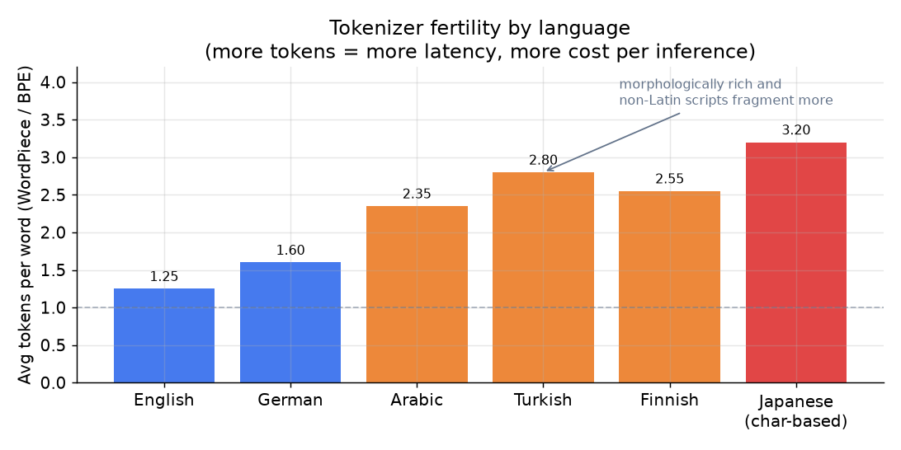

# 3. Data preparation

## Tokenization: the interface between text and model

Every NLP model consumes numbers, not characters. Tokenization (splitting text
into the units a model reads) converts raw text into a sequence of integer IDs
the model can embed (map each ID to a learned vector of numbers).

Modern systems use **subword tokenization** (WordPiece for BERT, BPE for GPT-family,
SentencePiece for multilingual models). Subword tokenization handles
out-of-vocabulary words by splitting them into pieces: "tokenization" becomes
["token", "##ization"] in WordPiece. This keeps the vocabulary at a manageable
size (30K to 128K tokens) while covering any input string.

Three things to know before treating tokenization as infrastructure:

1. **Token counts vary sharply by language.** A morphologically rich language
   (Turkish, Finnish) or a non-Latin script (Arabic, Japanese) fragments into
   many more subword tokens than English for the same semantic content. More tokens
   means more compute, more latency, and higher cost per inference. A multilingual
   system that looks fast in English can blow its latency budget in Turkish. The
   figure below makes this concrete.

   

   *Average tokens per word for a WordPiece/BPE vocabulary. English is near 1.25;
   Turkish and Japanese can reach 2.8 to 3.2. Slice latency and cost per language
   from day one. Illustrative rates.*

2. **Normalization is a safety control, not just tidiness.** Unicode normalization,
   casing, and script canonicalization all change tokenization. Spam and toxicity
   adversaries exploit this on purpose: homoglyphs (Cyrillic "а" for Latin "a"),
   zero-width joiners, l33tspeak, and mixed-script encoding can route around a
   classifier trained on clean text. Run normalization before tokenization, and
   treat it as part of the security perimeter.

3. **Language ID before anything else.** A misdetected language silently poisons
   everything downstream: wrong tokenizer path, wrong annotator pool, wrong model.
   Run a lightweight language-ID classifier (fastText langdetect runs in under a
   millisecond) as the very first step, and route each text to the right path.

## Labeling and weak supervision

Models are cheap; labels are the bottleneck. How you get labels is often the
design.

**For routing classification (thin but non-zero data):** use the existing labeled
tickets as a fine-tuning set. Expand with active learning: route uncertain
predictions to a human review queue, and fold those decisions back into training.
Every review decision is a fresh label at zero marginal cost.

**For abuse detection (almost no labels):** the positive class is rare and
expensive to label. Three techniques work here:

- **Weak supervision.** Write labeling functions: keyword lists, regex patterns
  for known slurs, an existing simpler model's output, an LLM prompt. Each
  function votes noisily; a label model (Snorkel-style) combines the votes into
  probabilistic soft labels. This bootstraps a training set without paying
  annotators to hand-label millions of messages.

  A minimal label model just averages the votes that fired (a real one weights
  each function by its estimated accuracy, but the idea is the same):

```python
def soft_label(votes):                # one vote per labeling function: 1, 0, or None (abstain)
    fired = [v for v in votes if v is not None]   # drop abstentions
    if not fired: return 0.5                       # no signal -> maximally uncertain
    return sum(fired) / len(fired)                 # fraction voting positive
# soft_label([1, 1, None, 0]) -> 2/3 = 0.6666666666666666
```

- **LLM as annotator.** Prompt a large model to classify a sample of messages.
  Treat its output as a noisy label source and distill it into the small encoder.
  You pay the LLM once per training example at label time, not once per inference
  at serving time. At firehose scale, that difference is orders of magnitude.

- **Active learning.** Spend scarce human annotation budget where the model is
  least certain (low-confidence predictions) or where errors are most costly
  (near the safety-threshold band). Do not label randomly.

  "Least certain" has a simple score: one minus the top predicted probability.
  Send the highest-scoring (least confident) examples to human review first:

```python
def uncertainty(probs):               # predicted class probabilities for one example
    return 1.0 - max(probs)           # higher -> less certain -> label this one first
# uncertainty([0.55, 0.45]) -> 0.44999999999999996
```

**For field extraction (no labels):** weak supervision is again the bootstrap.
Write heuristics or regexes that fire on known patterns (dates, order numbers),
label those spans automatically, and use the resulting noisy-labeled corpus to
train a token-tagging model. Then close the loop: run the model in production,
surface low-confidence spans for human review, and fold corrections back in.

## Class imbalance for abuse and spam

Toxicity, spam, and fraud share a defining property: the positive class is rare
(often well under one percent of traffic) and adversarial. Two rules follow from
this.

**Accuracy is meaningless; use per-class F1.** A model that predicts "not spam"
for every message is over 99% accurate on a corpus where spam is 0.5% of traffic.
It catches zero spam. Reporting accuracy here is not just uninformative; it
actively hides the failure. Always report per-class precision, recall, and F1,
plus a precision-recall curve for the minority class.

**Resample, reweight, or mine hard negatives.** Three tools:

- **Oversampling / undersampling.** Oversample the positive class or downsample
  easy negatives so the model sees a more balanced distribution during training.
- **Class-weighted loss.** Weight the positive-class loss by the inverse class
  frequency, so each positive example contributes more to the gradient than each
  negative.
- **Hard-negative mining.** After the model learns easy negatives well, replace
  random negatives with the hardest confusable ones. This is where the model is
  still learning; random negatives stop teaching once the boundary is rough-in.

**When to use which labeling or imbalance strategy.**

| Reach for | When | Instead of |
|---|---|---|
| Weak supervision (labeling functions) | almost no labeled data; rules or heuristics exist for at least some cases | waiting months for hand-labeled positives on a rare-class task |
| LLM as annotator (distill) | bootstrapping a new task quickly; you pay per training example, not per inference | running the LLM on the inline path at millions/day scale |
| Active learning | human labeling budget is fixed; you want it to go furthest | random sampling for annotation |
| Class-weighted cross-entropy | positive class is rare but the boundary is clear | uniform loss that the majority class dominates |
| Hard-negative mining | easy negatives are no longer teaching the model | random negatives once the model can already separate obvious cases |
| Per-class F1 and PR curves | any imbalanced classification task | accuracy, which a trivial majority-class predictor maximizes |
