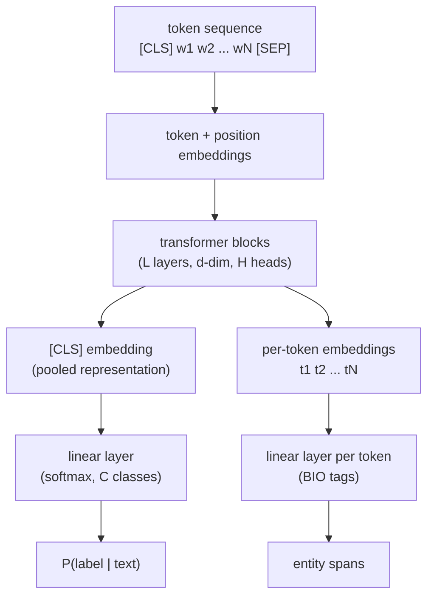
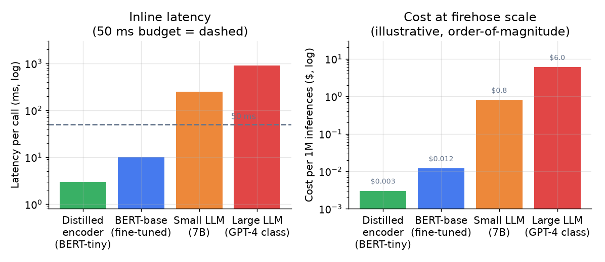
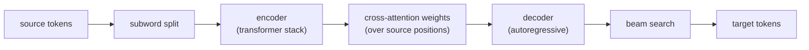

# 4. Model development

## The inline path: encoder plus task head

For classification and NER, the production workhorse is a **pre-trained
BERT-family encoder with a thin task head**, fine-tuned end-to-end.

The encoder is a stack of transformer blocks that produce one contextualized
embedding per input token. For classification, the `[CLS]` token's final
representation pools the whole sequence into a single vector; a linear layer
converts it to label logits. For NER, each token's final representation feeds a
linear tagging layer independently.



**Why pre-training matters.** A randomly initialized encoder trained only on your
few thousand labeled examples would overfit and underperform. Pre-training on a
large text corpus gives the encoder general language understanding for free; fine-
tuning on your task adjusts the last layers to your label space. The whole encoder
trains end-to-end, but the pre-trained weights provide a much better starting
point than random.

**Why not a larger model?** A full BERT-base (110M parameters) classifies in about
10 ms. DistilBERT (66M, 40% smaller) cuts latency to about 6 ms with roughly 97%
of BERT-base accuracy on most classification tasks. BERT-tiny and MiniLM go
further (tens of millions of parameters, 2-4 ms) at some accuracy cost. For an
inline path under 50 ms budget on high QPS, a distilled encoder is usually the
right call, especially after you have confirmed the full model works.



*Distilled encoders classify in single-digit milliseconds at a tiny fraction of
the cost of a large decoder LLM. At firehose scale, the difference is not a
rounding error. Illustrative order-of-magnitude values.*

> **Open the validated graph.** Trace the encoder stack to where the classification
> head or NER head attaches in the live
> [Model Zoo](https://github.com/neurarch-ai/awesome-llm-model-zoo):
>
> - **BERT base (classification and NER):**
>   [open it live](https://www.neurarch.com/?import=https://raw.githubusercontent.com/neurarch-ai/awesome-llm-model-zoo/main/architectures/bert-base/model.json)
> - **ModernBERT base (long-context encoder):**
>   [open it live](https://www.neurarch.com/?import=https://raw.githubusercontent.com/neurarch-ai/awesome-llm-model-zoo/main/architectures/modernbert-base/model.json)
> - **all-MiniLM-L6 (sentence embeddings for entity resolution):**
>   [open it live](https://www.neurarch.com/?import=https://raw.githubusercontent.com/neurarch-ai/awesome-llm-model-zoo/main/architectures/all-minilm-l6/model.json)

## Seq2seq for generation tasks

When the output is new text (translation, grammatical correction, extractive
summarization as generation), an encoder-decoder architecture is needed. The
encoder reads the full source; the decoder generates the target token by token,
attending over the encoder's states at each step.



**T5 and BART** are the modern pre-trained seq2seq backbones. They support fine-
tuning on any text-to-text task by framing the output as a generated string.

> **Trace T5 small live:**
> [open it in the Model Zoo](https://www.neurarch.com/?import=https://raw.githubusercontent.com/neurarch-ai/awesome-llm-model-zoo/main/architectures/t5-small/model.json)

**Grammarly's GECToR** is an instructive exception: grammatical error correction
reformulated as token-level edit tagging (assign an edit transformation per token)
rather than seq2seq generation, running 10 times faster than the naive seq2seq
approach. If the edit set is fixed and local, a tagging head beats a decoder.

## The loss functions

**For classification:**

$$\mathcal{L} = -\frac{1}{N}\sum_{i=1}^{N} \sum_{c=1}^{C} y_{i,c} \log p_{\theta}(c \mid x_i)$$

where $y_{i,c} \in \{0, 1\}$ is the gold label and $p_{\theta}(c \mid x_i)$ is the
model's predicted probability.

**Under class imbalance,** weight the positive class by the inverse class frequency:

$$\mathcal{L}_{w} = -\frac{1}{N}\sum_{i=1}^{N} w_{y_i} \log p_{\theta}(y_i \mid x_i), \quad w_c \propto \frac{1}{\text{freq}(c)}$$

This makes each positive example count proportionally more in the gradient, so the
model does not simply minimize loss by predicting the majority class.

**The F-beta tradeoff for correction tasks.** When false corrections annoy users
more than missed corrections (Grammarly's case), optimize for precision over recall
using $F_{\beta}$ with $\beta \lt 1$:

$$F_{\beta} = (1 + \beta^2) \cdot \frac{P \cdot R}{\beta^2 P + R}$$

At $\beta = 0.5$, precision counts four times more than recall in the harmonic
mean. For toxicity detection where missing abuse is more costly than over-blocking,
use $\beta \gt 1$.

```python
def f_beta(p, r, beta):                   # beta>1 weights recall, beta<1 precision
    b2 = beta * beta
    return (1 + b2) * p * r / (b2 * p + r) # generalizes F1 (which is beta=1)
# f_beta(p=0.6, r=0.9, beta=2) -> 5*0.6*0.9/(4*0.6+0.9) = 2.7/3.3 = 0.8181818181818182
```

**For seq2seq translation,** the loss is token-level cross-entropy over the target
sequence, conditioned on the source and all previously decoded target tokens:

$$\mathcal{L}_{\text{seq2seq}} = -\frac{1}{T}\sum_{t=1}^{T} \log p_{\theta}(y_t \mid y_{\lt t}, x)$$

## The LLM as label factory, not as the model

Where does the LLM fit in this design? Offline, in three roles:

1. **Bootstrapping labels** where none exist: prompt the LLM to classify a sample
   of messages, then distill its outputs into the small encoder (distillation:
   training a small model to imitate a larger one's outputs). Pay the LLM once
   per training example, not once per inference.
2. **Handling the long tail** of hard cases the cheap model abstains on: route
   low-confidence predictions to an LLM fallback or a human queue.
3. **Zero-shot baseline** while labeled data is accumulating: compare the LLM's
   zero-shot accuracy to the random baseline before spending annotation budget.

The mistake is putting the LLM on the inline path to avoid the labeling work. At
millions of calls per day, the cost and latency are not justifiable for any task
with a fixed label set and even a few thousand examples.

## When to use which model

| Reach for | When | Instead of |
|---|---|---|
| Distilled encoder plus classification head (DistilBERT, MiniLM) | fixed-label decision, latency under 10 ms, high QPS (Uber Maps, Meta hate speech) | zero-shot LLM inline for any task that runs millions of times per day |
| Full BERT-base plus classification head | fixed-label decision, latency up to 50 ms, accuracy matters more than throughput | distilled encoder only when accuracy loss from distillation is measurable |
| Token-tagging NER head on the encoder | need entity spans or field boundaries in the text (Airbnb LAEP, Grammarly GECToR) | one label per document when the output is a structured field, not a class |
| Bi-encoder plus ANN match | resolving messy strings to a canonical taxonomy entry (LinkedIn Knowledge Graph) | a classifier with one class per entity, which cannot scale as taxonomy grows |
| Seq2seq encoder-decoder (T5, BART) | output is generated text: translation (Google GNMT, Meta NMT) or correction as generation | classification head when the label set is fixed and finite |
| Class-weighted cross-entropy | positive class is well under one percent (abuse, spam, fraud) | uniform cross-entropy that the majority class dominates |
| LLM offline as label factory | bootstrapping a new task with no labeled data, or generating weak labels at label time | LLM inline at inference time on a fixed-label task at scale |

**Provenance.** The encoder-plus-head workhorse descends from BERT (Google, 2018),
the masked-language-model encoder that the distilled variants (DistilBERT, MiniLM) and
BERT-base fine-tunes all build on. The token-tagging NER head is the neural successor
to the classical sequence-labeling approach, CRF (Lafferty et al., 2001), which framed
tagging as a joint label-sequence prediction rather than independent per-token calls.

**Tools.** Hugging Face Transformers ships DistilBERT, MiniLM, BERT-base, and the T5 and BART seq2seq backbones with classification and token-classification heads ready to fine-tune. The bi-encoder for entity resolution comes from sentence-transformers, and its output is matched through an approximate-nearest-neighbor index such as FAISS (Meta). Class-weighted cross-entropy is a loss argument in PyTorch (Meta); the LLM label factory runs offline, prompting a large model once per training example and distilling into the small encoder.

**Worked example.** A support platform routes tickets at high QPS under a tight latency budget, so it fine-tunes a distilled encoder (DistilBERT via Transformers) rather than calling an LLM inline millions of times a day. To pull the product name and order date out of each ticket, it adds a token-tagging NER head on the same encoder instead of one label per document. To map free-text product mentions onto its canonical catalog it uses a bi-encoder (sentence-transformers) plus a FAISS lookup, which scales as the taxonomy grows where a class-per-product classifier would not. Because spam is well under one percent of traffic, it weights the positive class in cross-entropy so the majority class does not dominate the gradient. And when a brand-new label has no data yet, it prompts an LLM offline to bootstrap weak labels and distills them into the encoder rather than serving the LLM on the inline path.

## Implementation and training pitfalls

NLP fine-tuning fails less on the architecture than on text plumbing and small-data
discipline: a tokenizer mismatch, a truncated label span, duplicated text leaking
across the split, or noisy labels quietly cap accuracy long before the model does.

| Problem | Symptom | Fix |
|---|---|---|
| Train/serve tokenizer mismatch | offline strong, online predictions are garbage | pin the exact tokenizer and vocab with the model, verify identical preprocessing on both paths |
| Sequence truncation | long documents lose the label-bearing span | truncate from the less informative end or chunk-and-pool, raise max length where the budget allows |
| Duplicate and near-duplicate leakage | eval inflated, the same text appears in train and test | dedup across splits, split by document or author rather than random rows |
| Label noise | validation accuracy plateaus below expectation | audit a sample, use confident-learning to surface mislabels, clean or down-weight them |
| Fine-tuning overfit on small data | train loss near zero, validation loss rising fast | freeze lower layers, low LR with warmup, early stopping, fewer epochs |
| Class imbalance | a rare class (abuse, spam) is never predicted | class-weighted cross-entropy, tune the threshold per class |
| Domain and vocabulary shift | accuracy drops on new slang or product names | continue pre-training on in-domain text, refresh the training data |
| Miscalibrated softmax | confident but wrong probabilities | temperature scaling on a held-out set before thresholding |

The through-line: when a fine-tuned encoder scores far above the baseline, suspect
duplicate leakage or a tokenizer that differs from serving before believing the
model got that much better.
