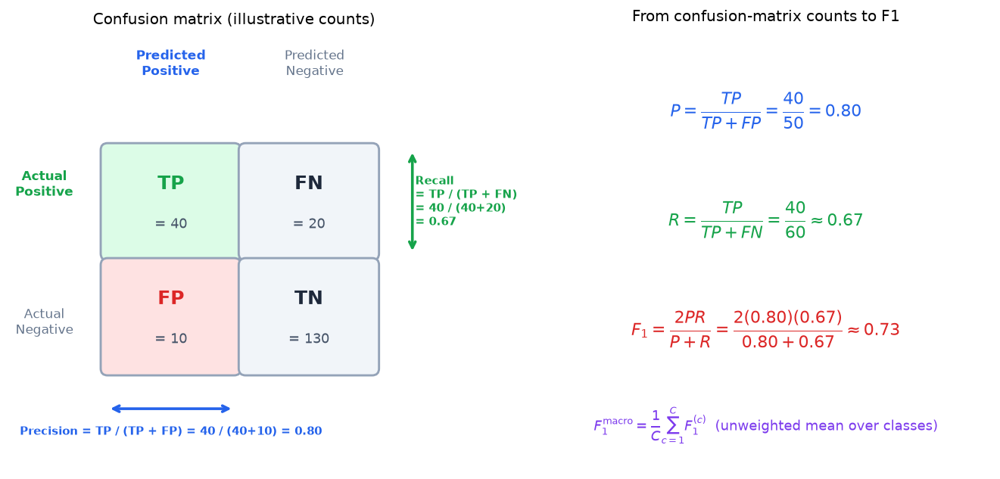
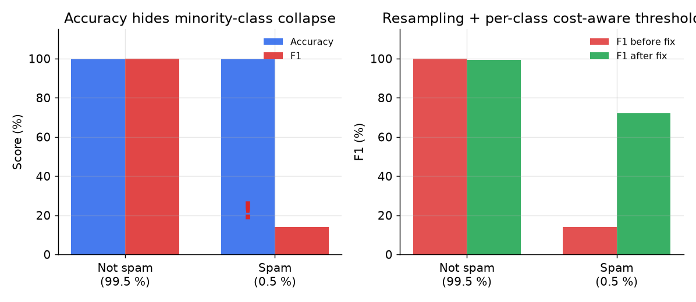
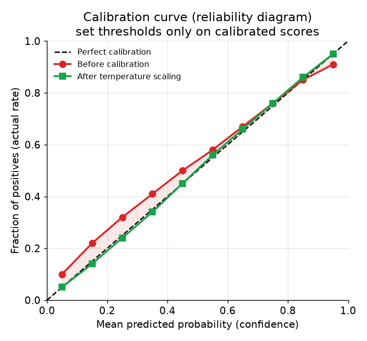

# 5. Evaluation

## Per-class F1, not accuracy

Reporting aggregate accuracy on an NLP classification task is almost always wrong,
and on a safety or spam task it is actively dangerous. Consider: a model that
predicts "not spam" for every message achieves 99.5% accuracy when spam is 0.5%
of traffic. It catches zero spam. Aggregate **accuracy** (the fraction of correctly labeled examples over the
total, a number in [0, 1]) optimizes toward "predict the majority class," which
is exactly the failure mode that makes safety systems worthless.

The correct metric family for classification is **precision, recall, and F1 per
class**, especially the rare class. The model assigns a predicted label to each
text input; each metric scores one class at a time against the ground-truth
labels and returns a number in [0, 1]:

$$P^{(c)} = \frac{TP^{(c)}}{TP^{(c)} + FP^{(c)}}, \qquad R^{(c)} = \frac{TP^{(c)}}{TP^{(c)} + FN^{(c)}}$$

$$F_1^{(c)} = \frac{2 \cdot P^{(c)} \cdot R^{(c)}}{P^{(c)} + R^{(c)}}$$

```python
def f1_score(y_true, y_pred, c):
    tp = sum(1 for t, p in zip(y_true, y_pred) if p == c and t == c)   # predicted c, and truly c
    fp = sum(1 for t, p in zip(y_true, y_pred) if p == c and t != c)   # predicted c, but not c
    fn = sum(1 for t, p in zip(y_true, y_pred) if p != c and t == c)   # missed a real c
    prec = tp / (tp + fp) if tp + fp else 0.0                          # P = TP / (TP + FP)
    rec = tp / (tp + fn) if tp + fn else 0.0                           # R = TP / (TP + FN)
    if prec + rec == 0: return 0.0
    return 2 * prec * rec / (prec + rec)                               # F1 = harmonic mean of P and R
# f1_score([1,0,1,1,0], [1,0,0,1,1], 1) -> 0.6666666666666666
```



*Left: a 2x2 confusion matrix with illustrative counts; precision uses the predicted-positive column (TP divided by TP plus FP), recall uses the actual-positive row (TP divided by TP plus FN). Right: the three formulas with numbers substituted, yielding F1 as their harmonic mean. Illustrative.*

Across $C$ classes, **macro-averaged F1** is the unweighted mean of the
per-class F1 scores; it gives every class equal influence on the final number
regardless of class frequency, which is exactly right for the minority class
that accuracy ignores, and returns a number in [0, 1]:

$$F_1^{\text{macro}} = \frac{1}{C}\sum_{c=1}^{C} F_1^{(c)}$$



*Left panel: accuracy looks nearly identical across both classes but F1 on the
minority class (spam) collapses to 14%. Right panel: resampling plus a cost-aware
threshold recovers minority-class F1 to 72% with negligible regression on the
majority. Accuracy alone would have hidden the failure. Illustrative.*

Report the confusion matrix in addition to per-class F1. It shows which classes
bleed into which, and that pattern usually tells you whether the problem is
labeling noise, class overlap, or a feature gap.

## Task-appropriate metrics

Different NLP tasks call for different metrics. Using the wrong one is a classic
interview mistake.

**NER and extraction:** span-level F1, not token-level accuracy. The model
produces a set of (start, end, entity-type) spans from text; the metric scores
that set against the gold span set $S^{\ast}$ and returns a number in [0, 1]. Let
$\hat{S}$ be the predicted spans:

$$P_{\text{span}} = \frac{|\hat{S} \cap S^{\ast}|}{|\hat{S}|}, \quad R_{\text{span}} = \frac{|\hat{S} \cap S^{\ast}|}{|S^{\ast}|}, \quad F_1^{\text{span}} = \frac{2\,P_{\text{span}}\,R_{\text{span}}}{P_{\text{span}} + R_{\text{span}}}$$

A predicted span counts as a true positive only if both its boundary and its
entity type match a gold span exactly (strict match). Partial-match F1 (boundary
correct, type wrong) is reported separately to diagnose taxonomy confusion vs
boundary errors. Token accuracy on a BIO-tagged sequence can look high simply
because O tags dominate.

**Translation:** BLEU or COMET for automatic tracking, plus human adequacy and
fluency ratings. **BLEU** measures n-gram overlap between a model-produced token
sequence (the hypothesis) and one or more reference translations, outputting a
number in [0, 1]. It is the brevity penalty times the geometric mean of clipped
n-gram precisions:

$$\text{BLEU} = \text{BP} \cdot \left(\prod_{n=1}^{N} p_n\right)^{1/N}$$

where $\text{BP} = \min(1,\, e^{1 - r/c})$ penalizes hypotheses shorter than
the reference ($c$ is hypothesis length in words, $r$ is reference length) and
$p_n$ is the fraction of hypothesis n-grams that appear in the reference, clipped
to the reference count. BLEU is fast and cheap to compute, but it misses meaning:
a correct paraphrase with different word choice scores poorly. **COMET** measures
translation quality using a cross-lingual neural model (typically an XLM-R
backbone) fine-tuned on human adequacy and fluency ratings; it takes the source
sentence, the model hypothesis, and a reference as input and returns a scalar
score (higher is better; near-perfect translations score close to 1.0 on
normalized variants). COMET correlates better with human quality ratings than
BLEU does. The release gate for production translation systems is human ratings,
not BLEU alone. Google GNMT used a 0-6 human rater scale as the final quality bar.

**Grammatical error correction:** $F_{0.5}$ rather than $F_1$. The model
proposes edits to a sentence; the metric scores those edits against a gold
correction set and returns a number in [0, 1]. False corrections (editing good
text) annoy users more than misses (leaving an error in), so precision counts
four times as much as recall:

$$F_{0.5} = \frac{(1 + 0.5^2)\,P \cdot R}{0.5^2 \cdot P + R} = \frac{1.25\,P \cdot R}{0.25\,P + R}$$

Grammarly's GECToR reports $F_{0.5}$ on CoNLL-2014 and BEA-2019 benchmarks for
this reason.

**Entity resolution:** pairwise precision and recall. The model produces a set
$\hat{E}$ of predicted synonym pairs; the metric scores it against a gold set
$E^{\ast}$ of known-synonym pairs on a held-out test split, returning numbers in
[0, 1]:

$$P_{\text{pair}} = \frac{|\hat{E} \cap E^{\ast}|}{|\hat{E}|}, \qquad R_{\text{pair}} = \frac{|\hat{E} \cap E^{\ast}|}{|E^{\ast}|}$$

## Calibration: turning a score into a probability

A raw model logit is not a probability you can threshold on. After fine-tuning, a
classifier is often over-confident on high scores and under-confident near the
boundary, which means the raw score does not behave like a true probability.
**Temperature scaling** fits a single scalar $T \gt 0$ to the logits on a held-out
calibration set:

$$p_{\theta}(c \mid x) = \text{softmax}\!\left(\frac{z_c}{T}\right)$$

When $T \gt 1$, the distribution softens (less confident); when $T \lt 1$, it
sharpens. Temperature scaling is cheap (one hyperparameter) and rarely hurts
accuracy. Platt scaling (logistic regression on the logit) and isotonic regression
are heavier alternatives when the calibration error is large.

Why does calibration matter operationally? It makes "0.9 means roughly 90% of
such cases are positive" hold, which is what makes the confidence-gated routing
decision principled: auto-act above 0.95, route to review between 0.5 and 0.95,
auto-allow below 0.3. Without calibration those thresholds are magic constants
that drift every time the model retrains.



*A reliability diagram for a fine-tuned classifier before and after temperature
scaling. The red line (before) overshoots near perfect confidence; the green line
(after) tracks the diagonal closely. Set the confidence threshold only after
calibrating. Illustrative.*

**Recalibrate after every retrain.** A new model can shift the score distribution,
making old thresholds over- or under-act. Recalibration is a one-step fix; missing
it is one of the most common silent production failures.

## Slicing by language and segment

A global metric number hides broken subgroups. For a multilingual system:

- **Slice eval per language.** A model that is 91% F1 in English and 52% F1 in
  Turkish shows 89% F1 globally and looks fine. Per-language reporting is not
  optional for multilingual deployments; it is the primary quality control.
- **Slice by cohort.** New users, short messages, messages in a particular product
  area. A model that fails silently on one cohort can cause outsized harm.
- **Track false block rate as a first-class metric for safety tasks.** Over-
  aggressive thresholds silence innocent users. The false block rate on a random
  sample of auto-blocked messages is a first-class release gate, tracked as
  carefully as the miss rate.

## When to use which evaluation metric

| Reach for | When | Instead of |
|---|---|---|
| Per-class F1 and PR curves, sliced per language | any classification with imbalanced classes or a safety task | aggregate accuracy, which a majority-class predictor maximizes |
| Span-level strict F1 for NER | extraction where both boundary and type must match | token-level accuracy dominated by O-tag majority |
| $F_{0.5}$ | correction tasks where false edits annoy users more than misses | plain F1 that weights precision and recall equally |
| BLEU or COMET plus human adequacy ratings | translation quality | BLEU alone (misses meaning) or human ratings alone (too slow and expensive for CI) |
| Pairwise precision/recall on matched pairs | entity resolution against a known-synonym test set | classifier accuracy on a fixed-class label set |
| Temperature or isotonic calibration before thresholding | any model whose raw score feeds a confidence gate | acting on raw logits with a fixed threshold that was set at training time |
| Time-based eval split | any offline classification or extraction eval | random split, which may leak future labels into training |
| Human review sample for safety | toxicity and abuse where offline metrics are necessary but not sufficient | purely automated eval for a task where false blocks harm real users |

**Tools.** scikit-learn computes per-class precision, recall, F1, and PR curves, and seqeval scores span-level strict NER F1 (both boundary and type must match). Translation uses sacrebleu for BLEU and unbabel-comet for COMET, with human adequacy ratings as the final gate. Calibration before thresholding comes from temperature or isotonic scaling in scikit-learn or netcal; the time-based split and the safety human-review sample are eval disciplines, not libraries.

**Worked example.** A multilingual moderation platform chooses eval numbers around an imbalanced, safety-critical classifier. It reports per-class F1 and PR curves sliced per language (scikit-learn) rather than aggregate accuracy, which a majority-class predictor maximizes and which hides a weak language. For entity extraction it uses span-level strict F1 (seqeval), since token accuracy is inflated by the dominant O tags. For a grammar-correction feature where a false edit annoys users more than a miss, it optimizes F0.5 rather than plain F1. For translation it tracks BLEU or COMET (sacrebleu, unbabel-comet) plus human ratings, because BLEU alone misses meaning and human ratings alone are too slow for CI. Before its confidence-gated router acts on any score, it temperature-scales the logits and evaluates on a time-based split so future labels do not leak into training.
