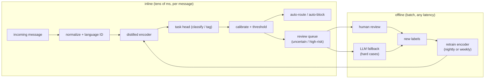

# 6. Serving and scaling

## The inline/offline split

The architecture divides into two paths based on latency requirements:

- **The inline path** runs synchronously on every incoming message, within a
  tens-of-milliseconds budget. The model here must be small and fast. For
  classification and NER, this is a distilled encoder (DistilBERT, MiniLM, or
  BERT-base at most) with a linear head, served on commodity hardware.
- **The offline path** runs asynchronously, in batch, at any latency. This is
  where the LLM lives: generating training labels, handling hard-tail abstentions,
  retraining on fresh data, and auditing production decisions.

The loop closes on the right: every human review decision and every LLM fallback
verdict returns as a labeled training example. The encoder retrains periodically
(nightly or weekly depending on drift rate), and the calibration step reruns each
time.

## Shared encoder, multiple heads

A single fine-tuned encoder backbone can serve multiple task heads, which matters
for cost and latency. Text comes in, is tokenized once, and the same forward pass
feeds a classification head for routing, a token-tagging head for extraction, and
a calibrated output for abuse scoring. The heads are thin linear layers; the cost
is dominated by the encoder stack.

One caveat: a shared encoder fine-tuned for one task can drift from the
representation another task needs. When task-specific accuracy diverges, decouple
the heads with separate fine-tuning passes, or use task-adaptive pretraining
(continued pretraining on each task's domain text before head fine-tuning).

## The human review loop

The confidence gate is not a fallback; it is a designed component. The band
between auto-act and auto-allow is the leverage point: widen it to route more
items to review, narrow it to increase automation. For safety tasks, the band
should be wide (high recall of uncertain cases) even if it increases review volume.
Review capacity is then a staffing and tooling constraint, not a modeling one.

Every message the review queue receives is a labeling opportunity. A well-designed
review interface captures the reviewer's decision and feeds it directly back to
training data. At steady state, the inline model should push the confident band
outward over time as it sees more labels, narrowing the review queue and reducing
cost.

## Bottlenecks

| Bottleneck | First sign | Fix | Tradeoff |
|---|---|---|---|
| LLM on the inline path | latency and cost blow the budget | distilled encoder for inline tasks; LLM offline for labels and tail | more models to train and maintain |
| Label scarcity at launch | model stalls; tail classes are weak; F1 on rare class near zero | weak supervision, LLM annotation, active learning from review queue | noisy labels require cleanup and a gold-set audit |
| Class imbalance | high accuracy, near-zero recall on the positive class | class-weighted loss, resampling, hard-negative mining, per-class threshold | precision/recall must be traded via the threshold |
| Adversarial drift in abuse | abuse recall decays weekly; new evasion patterns appear | continuous fresh labels from the review queue, frequent retrain cadence | ongoing labeling and retrain infrastructure cost |
| Multilingual coverage | one language is much worse; global metric hides it | multilingual encoder (mBERT, XLM-R) with per-language eval and annotator pools | capacity diluted per language vs monolingual model |
| Calibration drift after retrain | thresholds over-act or under-act after model update | recalibrate on a held-out calibration split every time a new model promotes | one extra eval step per retrain |
| Review queue saturation | reviewers cannot keep up; latency rises | tighten the auto-act band (higher confidence threshold), prioritize queue by risk score | fewer items handled automatically |
| False blocks on safety tasks | innocent-user complaint rate rises | widen the review band, audit false-block rate on sampled auto-blocked messages | more review volume |
