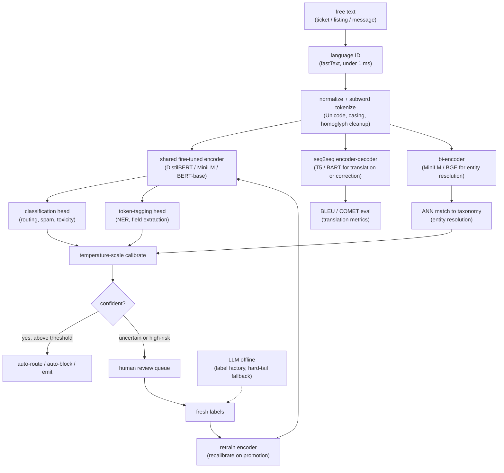

# 9. Summary

## One-page recap

- **"NLP system" is five different problems.** Text classification, NER and
  extraction, entity resolution, translation, and abuse detection each need a
  different model, label format, loss, and metric. Separating them before picking
  a model is the first signal the interviewer is looking for.

- **Volume and latency rule out a large LLM on the hot path.** A distilled encoder
  classifies in single-digit milliseconds on commodity hardware; a large decoder
  LLM is 100x slower and orders of magnitude more expensive. The LLM's role is
  offline: generating weak labels, handling the hard-tail abstentions, and serving
  as a zero-shot baseline before annotations exist. Never on the inline firehose.

- **Labels are the bottleneck, not the model.** Bootstrap with weak supervision
  (labeling functions, regex heuristics, an LLM prompt), close the loop via active
  learning from the human review queue, and annotate where the model is most
  uncertain or errors are most costly.

- **Class imbalance on safety tasks is the hardest operational problem.** Accuracy
  is meaningless; a 99.5% accurate spam detector can catch zero spam. Use class-
  weighted loss, resampling, per-class cost-aware thresholds, and per-class F1 and
  PR curves. Track the false block rate on innocent users as a first-class release
  gate.

- **Calibration is mandatory before thresholding.** A raw model score is not a
  probability. Temperature scale the logits on a held-out calibration set, then set
  the confidence band (auto-act, review, auto-allow). Recalibrate on every retrain,
  since a new model shifts the score distribution and stale thresholds over- or
  under-act.

- **Multilingual: shared encoder, per-language eval.** A multilingual encoder (XLM-R,
  mBERT) buys cross-lingual transfer but dilutes per-language capacity and
  fragments morphologically rich scripts into more tokens. Slice every metric by
  language; global numbers hide broken subgroups.

- **The human review loop is a designed component, not a fallback.** Every review
  decision is a training label. The confidence band is the product leverage point:
  auto-act on the confident tail, route the uncertain middle, fold verdicts back
  into training. The loop must close.

## The full pipeline on one page

## Test yourself

1. The prompt says "design an NLP system to handle support tickets." What is the
   first question you ask, and why does the answer change everything?

2. A fine-tuned BERT-base achieves 89% F1 on routing classification. An LLM
   achieves 91% F1 zero-shot. Which one goes to production on the inline path, and
   under what conditions would that answer change?

3. The spam class is 0.4% of traffic. Your model reports 99.7% accuracy. Is it
   working? What metric should you look at instead, and what is likely wrong?

4. Your abuse model was promoted overnight. By morning, recall fell from 78% to
   61%. The new model scored higher on offline validation. What is the most likely
   cause, and what is the fix?

5. You are launching a multilingual version of the classifier in twelve languages.
   What slice of the eval report is the most important one to add, and what would
   a single global number miss?

6. Describe the role of the LLM in a production NLP system. Where does it appear
   in the pipeline, and where must it not appear?

## Further reading

- Full reference with production case studies, math, and divergence diagrams:
  [topics/13-natural-language-processing.md](../../topics/13-natural-language-processing.md)
- Comparison of all eleven production systems:
  [tools/comparisons/13.md](../../tools/comparisons/13.md)
- Per-company teardowns (Uber, Airbnb, Meta, Google, LinkedIn, Pinterest, Grammarly):
  [tools/teardowns/13.md](../../tools/teardowns/13.md)
- Trace the backbone architectures live in the
  [Model Zoo](https://github.com/neurarch-ai/awesome-llm-model-zoo):
  BERT base, ModernBERT base, T5 small, all-MiniLM-L6, BGE base.
