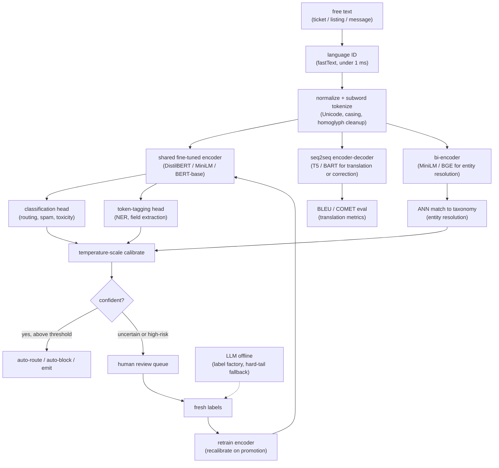

# 9. Summary

## One-page recap

- **"NLP system" is five different problems.** Text classification, NER and
  extraction, entity resolution, translation, and abuse detection each need a
  different model, label format, loss, and metric. Separating them before picking
  a model is the first signal the interviewer is looking for.

- **Volume and latency rule out a large LLM on the hot path.** A distilled encoder
  classifies in single-digit milliseconds on commodity hardware; a large decoder
  LLM is 100x slower and orders of magnitude more expensive. The LLM's role is
  offline: generating weak labels, handling the hard-tail abstentions, and serving
  as a zero-shot baseline before annotations exist. Never on the inline firehose.

- **Labels are the bottleneck, not the model.** Bootstrap with weak supervision
  (labeling functions, regex heuristics, an LLM prompt), close the loop via active
  learning from the human review queue, and annotate where the model is most
  uncertain or errors are most costly.

- **Class imbalance on safety tasks is the hardest operational problem.** Accuracy
  is meaningless; a 99.5% accurate spam detector can catch zero spam. Use class-
  weighted loss, resampling, per-class cost-aware thresholds, and per-class F1 and
  PR curves. Track the false block rate on innocent users as a first-class release
  gate.

- **Calibration is mandatory before thresholding.** A raw model score is not a
  probability. Temperature scale the logits on a held-out calibration set, then set
  the confidence band (auto-act, review, auto-allow). Recalibrate on every retrain,
  since a new model shifts the score distribution and stale thresholds over- or
  under-act.

- **Multilingual: shared encoder, per-language eval.** A multilingual encoder (XLM-R,
  mBERT) buys cross-lingual transfer but dilutes per-language capacity and
  fragments morphologically rich scripts into more tokens. Slice every metric by
  language; global numbers hide broken subgroups.

- **The human review loop is a designed component, not a fallback.** Every review
  decision is a training label. The confidence band is the product leverage point:
  auto-act on the confident tail, route the uncertain middle, fold verdicts back
  into training. The loop must close.

## The full pipeline on one page

```mermaid
flowchart TD
  IN["free text<br/>(ticket / listing / message)"] --> LID["language ID<br/>(fastText, under 1 ms)"]
  LID --> NORM["normalize + subword tokenize<br/>(Unicode, casing, homoglyph cleanup)"]
  NORM --> ENC["shared fine-tuned encoder<br/>(DistilBERT / MiniLM / BERT-base)"]
  NORM --> S2S["seq2seq encoder-decoder<br/>(T5 / BART for translation or correction)"]
  NORM --> BENC["bi-encoder<br/>(MiniLM / BGE for entity resolution)"]
  ENC --> CLS["classification head<br/>(routing, spam, toxicity)"]
  ENC --> NER["token-tagging head<br/>(NER, field extraction)"]
  BENC --> ANN["ANN match to taxonomy<br/>(entity resolution)"]
  CLS --> CAL["temperature-scale calibrate"]
  NER --> CAL
  ANN --> CAL
  S2S --> BLEU["BLEU / COMET eval<br/>(translation metrics)"]
  CAL --> GATE{"confident?"}
  GATE -->|"yes, above threshold"| ACT["auto-route / auto-block / emit"]
  GATE -->|"uncertain or high-risk"| HUM["human review queue"]
  HUM --> LBL["fresh labels"]
  LBL --> RETRAIN["retrain encoder<br/>(recalibrate on promotion)"]
  RETRAIN --> ENC
  LLM_OFF["LLM offline<br/>(label factory, hard-tail fallback)"] -.-> LBL
```

**How it works.** Free text enters at the top, gets a language tag from a sub-millisecond fastText classifier, then is normalized and subword-tokenized so downstream models see clean, consistent input. From that shared normalized text the pipeline fans out to three model families depending on the task: a shared fine-tuned encoder (feeding a classification head for routing or spam and a token-tagging head for NER), a seq2seq encoder-decoder for translation or correction, and a bi-encoder plus ANN lookup for entity resolution. The classification, tagging, and match outputs converge on a temperature-scaling step that turns raw scores into calibrated probabilities, which a confidence gate then splits: confident predictions are auto-acted on, while uncertain or high-risk ones go to a human review queue. Reviewer decisions (augmented offline by an LLM acting as a label factory and hard-tail fallback) become fresh labels that retrain the encoder and trigger recalibration on promotion, closing the loop so the system improves from its own hard cases.

## Test yourself

Answers are collapsed. Attempt each question before opening one.

1. The prompt says "design an NLP system to handle support tickets." What is the
   first question you ask, and why does the answer change everything?

   

Answer

   Ask **"can you name the specific tasks?"** Routing, field extraction, abuse
   detection, entity resolution, and translation are all "NLP," but each needs a
   different model, label format, loss, and metric, so the answer decides the
   entire architecture rather than one parameter of it. Section
   [1](01-clarifying-requirements.md) shows the dialogue: the interviewer's reply
   splits the prompt into text classification (routing), named-entity extraction
   (fields), and toxicity classification (moderation), which section
   [2](02-frame-as-ml-task.md) then maps onto an encoder plus classification head,
   an encoder plus token-tagging head, and a bi-encoder plus ANN respectively. The
   three follow-ups that matter almost as much are the latency budget and daily
   volume (tens of milliseconds inline at a few million messages per day, which
   rules a large LLM off the hot path), the label supply per task (a few thousand
   routing tickets, under five hundred abuse positives, zero extraction labels),
   and the cost of each error type (a misroute is recoverable, a missed abusive
   message or a false block is not). Naming the separation before naming a model
   is the first large interview signal; proposing one model for everything
   over-designs the easy tasks and under-designs the safety task.

   

2. A fine-tuned BERT-base achieves 89% F1 on routing classification. An LLM
   achieves 91% F1 zero-shot. Which one goes to production on the inline path, and
   under what conditions would that answer change?

   

Answer

   **BERT-base goes inline**, and the two points of F1 do not come close to paying
   for the alternative. BERT-base classifies in about 10 ms (a distilled encoder in
   about 6 ms) while a large decoder LLM is 100 to 300 times slower, so the LLM
   blows a tens-of-milliseconds budget by two orders of magnitude
   ([4](04-model-development.md), [8](08-interview-qa.md)). The cost gap is the
   same shape: section [10](10-putting-it-together.md) prices the shared encoder at
   an illustrative \$0.002 per thousand calls, roughly \$6 per day for the whole 3M
   per day inline portfolio, against \$0.50 per thousand for a decoder LLM, roughly
   \$1,500 per day per task, or 250x. Third and least obvious, the LLM returns text
   you must parse and emits no calibrated probability, so there is nothing to
   temperature-scale and nothing to threshold into the auto-act / review /
   auto-allow band that section [5](05-evaluation.md) builds the whole operating
   model on. The answer flips on **volume**: the prohibition is an arithmetic
   argument, not a principle, and the startup-helpdesk column in section
   [10](10-putting-it-together.md) runs a zero-shot LLM inline at hundreds of
   tickets per day (about 0.005 QPS) where per-call price is irrelevant. It also
   flips when the taxonomy churns weekly, since a prompt edit redeploys in minutes
   while an encoder needs fresh labels and a retrain.

   

3. The spam class is 0.4% of traffic. Your model reports 99.7% accuracy. Is it
   working? What metric should you look at instead, and what is likely wrong?

   

Answer

   You cannot tell from that number, and the number itself is suspicious: a model
   that predicts "not spam" for every message is 99.6% accurate at 0.4% prevalence,
   so 99.7% is roughly the trivial majority-class predictor and is consistent with
   catching almost no spam. **Accuracy is the wrong metric family here**, and
   section [5](05-evaluation.md) is blunt that it does not merely fail to inform,
   it actively hides the failure. Report **per-class precision, recall, and F1 on
   the spam class**, the precision-recall curve for that minority class, and the
   confusion matrix, which shows which classes bleed into which. The likely cause
   is that uniform cross-entropy is dominated by the majority class, so the
   cheapest way to minimize loss is to never predict spam. The fixes from section
   [3](03-data-preparation.md) are class-weighted cross-entropy with weights
   proportional to inverse class frequency, oversampling the positive class or
   downsampling easy negatives, hard-negative mining once easy negatives stop
   teaching, and a per-class cost-aware threshold rather than one global cutoff.
   Then track the false block rate on a sample of auto-blocked messages as a
   release gate, because pushing spam recall up is exactly what starts silencing
   innocent users.

   

4. Your abuse model was promoted overnight. By morning, recall fell from 78% to
   61%. The new model scored higher on offline validation. What is the most likely
   cause, and what is the fix?

   

Answer

   This is **calibration and threshold drift, not a model quality regression**. A
   retrain shifts the score distribution: F1 depends only on the ranking of
   examples at the chosen operating point, while the absolute logit scale depends
   on loss weighting, label mix, regularization, and even the random seed, so two
   models can rank messages nearly identically and still map the same message to
   different raw scores ([8](08-interview-qa.md)). If the old gate fired at 0.8 and
   the new model's scores sit uniformly lower, that same threshold now cuts off far
   too much, which is exactly the shape of a recall drop with no offline warning.
   The fix is the recalibrate-on-promotion rule from section
   [5](05-evaluation.md): fit temperature scaling on a held-out calibration split
   every time a model is promoted, then re-tune the threshold band on the
   recalibrated scores. Section [6](06-serving-and-scaling.md) lists this as a
   named bottleneck whose only cost is one extra eval step per retrain, and section
   [10](10-putting-it-together.md) puts post-promotion abuse recall first among the
   three signals to wire before launch, precisely because it fails silently. A
   fixed threshold is a promise about the score scale, and the score scale is what
   a retrain does not preserve.

   

5. You are launching a multilingual version of the classifier in twelve languages.
   What slice of the eval report is the most important one to add, and what would
   a single global number miss?

   

Answer

   Add **per-language slices of every metric**, specifically per-class F1 and PR
   curves broken out by language, and for the safety task the per-language false
   block rate as well. A single global number is a traffic-weighted average, so it
   hides broken subgroups by construction: section [5](05-evaluation.md) gives the
   worked case of 91% F1 in English and 52% F1 in Turkish reporting as 89%
   globally, and section [6](06-serving-and-scaling.md) adds the sharper version,
   that a language carrying 2 percent of volume can collapse to near-zero recall
   while the headline barely moves. The mechanism behind the weakness is shared
   capacity: a multilingual encoder (mBERT, XLM-R) buys cross-lingual transfer
   through one shared subword vocabulary, but a dominant language crowds out a rare
   one, so a dedicated monolingual model still wins on any single high-resource
   language ([8](08-interview-qa.md)). Slice latency and cost per language too,
   because tokenizer fertility varies sharply: section
   [3](03-data-preparation.md) puts English near 1.25 tokens per word against 2.8
   to 3.2 for Turkish and Japanese, so a system that looks fast in English can blow
   its latency budget elsewhere. Run language ID first (fastText, under 1 ms) so
   every text is attributed to the right slice and the right path in the first
   place.

   

6. Describe the role of the LLM in a production NLP system. Where does it appear
   in the pipeline, and where must it not appear?

   

Answer

   The LLM lives **offline only**, and it must never sit on the inline firehose.
   Section [4](04-model-development.md) gives it exactly three jobs: bootstrapping
   labels where none exist, by prompting it to classify a sample and distilling its
   outputs into the small encoder; handling the long tail of hard cases the cheap
   model abstains on, reached through the review queue in section
   [6](06-serving-and-scaling.md); and serving as a zero-shot baseline while
   labeled data accumulates. The economic rule underneath all three is one line:
   **pay the LLM once per training example, never once per inference.** Section
   [10](10-putting-it-together.md) makes it concrete, an illustrative \$25 once to
   label a 50k-example bootstrap set against \$1,500 per day to serve the same
   model inline at 3M messages per day. What must not happen is reaching for the
   LLM on the hot path to avoid the labeling work, which section
   [8](08-interview-qa.md) calls confusing the bootstrapping phase with the final
   design. The one honest caveat is that this is a volume argument: at hundreds of
   calls per day the zero-shot LLM inline is the correct production system, and the
   fine-tuned encoder is what would be premature.

   

## Further reading

- The capstone: [the complete build](10-putting-it-together.md), where every
  choice in this chapter is committed once for the scenario, costed, rebuilt
  under two other constraint sets, and compressed into a runnable one-file
  text classifier.
- Full reference with production case studies, math, and divergence diagrams:
  [topics/13-natural-language-processing.md](../../topics/13-natural-language-processing.md)
- Comparison of all eleven production systems:
  [tools/comparisons/13.md](../../tools/comparisons/13.md)
- Per-company teardowns (Uber, Airbnb, Meta, Google, LinkedIn, Pinterest, Grammarly):
  [tools/teardowns/13.md](../../tools/teardowns/13.md)
- Trace the backbone architectures live in the
  [Model Zoo](https://github.com/neurarch-ai/awesome-llm-model-zoo):
  BERT base, ModernBERT base, T5 small, all-MiniLM-L6, BGE base.
