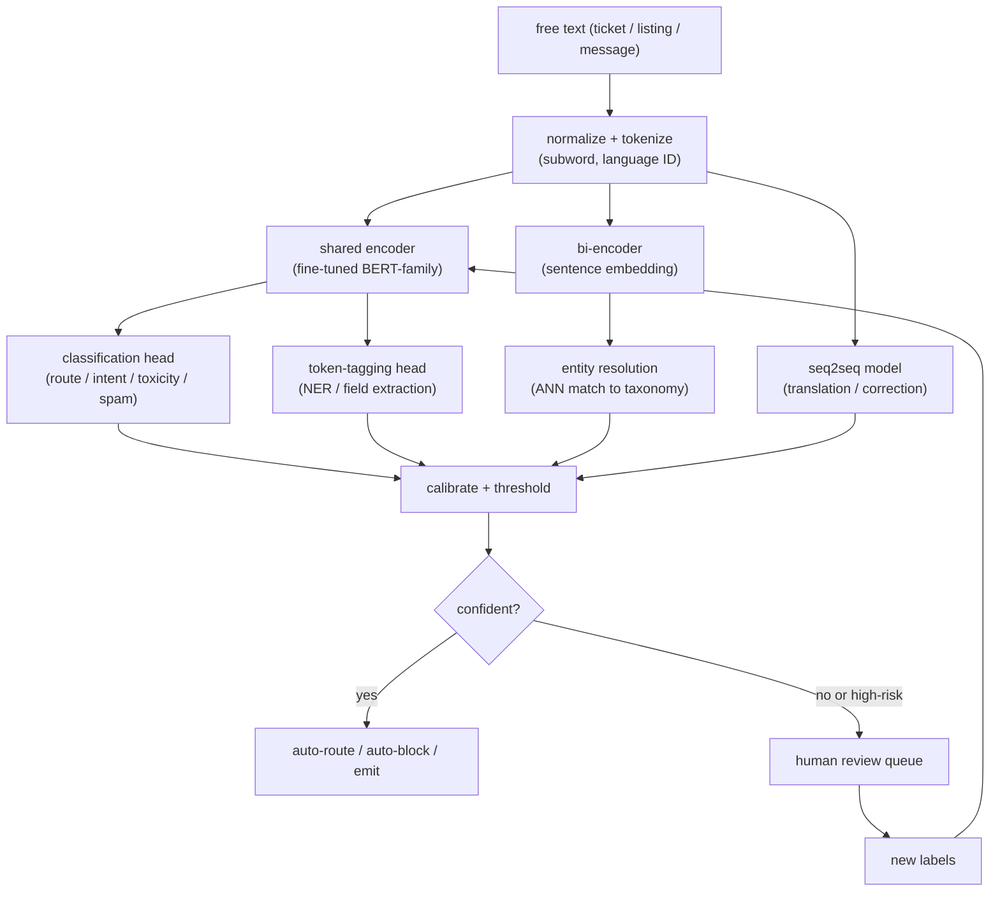

# Natural Language Processing: Task-Specific Text Models

> **Style note.** This chapter follows the same teach-first, book-like arc as the
> rest of the series: a candidate-interviewer dialogue pins the requirements, then
> a consistent frame-data-model-evaluate-serve arc builds the system, one idea at
> a time. What it adds on top: real production case studies, a "when to use which"
> table per method group, live architecture graphs in the Model Zoo, worked
> matplotlib figures, and an interview Q&A. One file per section.

An interviewer rarely says "design an NLP system." They say **"we get millions of
support tickets a day, all free text; route them, extract the key fields, and hold
back the abusive ones before a human sees them."** That prompt collapses five
distinct ML problems into one sentence, and the first signal is recognizing them.
This chapter builds each one from scratch, explains when a fine-tuned encoder
decisively beats a large LLM, and shows how Uber, Airbnb, Meta, Google, LinkedIn,
Pinterest, and Grammarly actually ship these systems.

## The central tension

Every NLP system at production scale faces the same tradeoff:

- A large language model (LLM) can do almost anything with a prompt. It requires
  no labeled data and handles edge cases naturally.
- A fine-tuned encoder (BERT-family) classifies in single-digit milliseconds, costs
  a fraction of a cent per thousand calls, emits a calibratable probability, and
  matches or beats a zero-shot LLM on any fixed-label task with even a few thousand
  labels.

At millions of calls per day the math is not close. The mature answer is a
portfolio of small, specialized models on the inline path and an LLM offline as a
label factory and long-tail fallback. This chapter makes that argument concrete.

## Sections

1. [Clarifying the requirements](01-clarifying-requirements.md): the dialogue that separates five tasks from one prompt.
2. [Framing it as an ML task](02-frame-as-ml-task.md): naming the task before designing the model, input and output for each.
3. [Data preparation](03-data-preparation.md): tokenization, weak supervision, class imbalance for abuse and spam.
4. [Model development](04-model-development.md): encoder plus head vs seq2seq vs LLM; the loss functions; a "when to use which" table.
5. [Evaluation](05-evaluation.md): per-class F1 not accuracy, calibration, slicing by language.
6. [Serving and scaling](06-serving-and-scaling.md): the inline/offline split, bottlenecks, the human review loop.
7. [How teams do it in production](07-how-teams-do-it-in-production.md): where eleven real systems diverge, with first-party links.
8. [Interview Q&A](08-interview-qa.md): commonly asked, tricky, and commonly-answered-wrong, with clear answers.
9. [Summary](09-summary.md): the one-page recap, a full-pipeline mermaid, and self-test questions.

## The whole system on one page

The structural point: one tokenization step and (often) one encoder backbone
serves many task heads. The LLM, if it appears at all, sits offline generating
training labels or handling the hard tail, not in the inline firehose.

Read the sections in order the first time; each opens with the question an
interviewer actually asks, then answers it.
