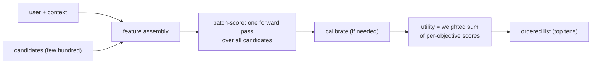
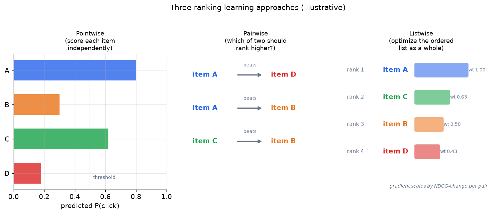

# 2. Framing it as an ML task

## Defining the ML objective

Users want the most relevant items at the top of the list. We translate that
into an ML objective: **learn a scoring function over (user, context, item)
triples such that more-relevant items receive higher scores than less-relevant
ones.** If the score also feeds an auction or a threshold, we need the predicted
probability to be calibrated, not just rank-ordered.

## Specifying the input and output

The ranker takes a **batch of candidates** (a few hundred) plus the **user and
their context** (shared across all candidates in one request) and returns a
**list of calibrated scores**, one per candidate, sorted in descending order.
The key efficiency insight: user and context features are fetched once and
broadcast across all candidates. Only item features and user-item cross features
vary per candidate.

## Choosing the right ML category

There are three ways to frame learning to rank, and the choice matters because
it decides what the loss function penalizes.

**Pointwise.** Predict a score or label for each item independently, using binary
cross-entropy or regression. Simple and fast. The model never sees two items
together, so it cannot directly optimize that item A ranks above item B; it just
tries to get each item's score right. Most large-scale rankers start here because
it scales to billions of training examples.

**Pairwise.** For each pair of items from the same query or user, predict which
one should rank higher. The LambdaRank and LambdaMART family falls here: the
gradient for each pair is weighted by how much swapping the pair would change
NDCG, so pairs that matter for the metric get the strongest gradient signal.

**Listwise.** Treat the whole ranked list as the output and optimize a
list-level metric such as NDCG directly (SoftNDCG, ListNet). Highest potential
accuracy, but harder to scale to billions of rows.

*Pointwise scores each item independently. Pairwise learns from which of two
items should rank higher. Listwise optimizes the order of the whole list; the
LambdaMART gradient is proportional to how much a swap would move NDCG.
Illustrative.*

**When to use which framing.**

| Reach for | When | Instead of |
|---|---|---|
| Pointwise log-loss (binary cross-entropy) | Billions of training rows, straightforward scale, single engagement objective | Listwise objectives that need full-list supervision signals at scale |
| Pairwise LambdaMART (NDCG-weighted) | You want to optimize the ranking metric directly and can define meaningful (winner, loser) pairs from click or booking data | Per-item log-loss that penalizes score magnitude rather than relative order |
| Listwise SoftNDCG / ListNet | Small enough corpus that full-list training examples are available | Pointwise objectives when position and order carry strong business meaning |
| Multi-task heads with per-objective binary cross-entropy | Several engagement signals (click, save, long-dwell) to blend into one utility | One collapsed binary label that loses signal by merging distinct behaviors |
