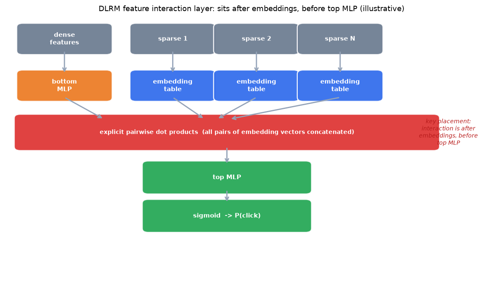

# 4. Model development

## The two families: trees and deep networks

**GBDT rankers** (XGBoost, LambdaMART) work well on tabular, hand-engineered
features, fit quickly, are interpretable, and give an ordering within a tight
latency budget. They are the right starting baseline and a strong production
choice when the feature set is compact. Their weakness: they do not natively
learn from raw sparse ids and embedding tables. Airbnb, Pinterest, and Yelp all
launched with GBDT and later migrated to neural rankers when richer embedding-
table features made the migration worthwhile.

**Deep rankers** (Wide-and-Deep, DLRM, DCN-v2) learn directly from sparse ids
through embedding tables and then run a neural network to combine the result with
dense features. They handle hundreds of sparse features that would be impractical
to hand-cross in a tree. Their weakness: they need more data, careful feature
normalization, and thoughtful architecture choices for the interaction step.

## Wide-and-Deep: memorization plus generalization

A **Wide-and-Deep** model trains two paths jointly against the same loss:

- The **wide path** is a linear model over raw and crossed categorical features.
  It memorizes specific, high-frequency user-item rules ("users in this segment
  click this exact item category"). It generalizes poorly to unseen feature
  combinations.
- The **deep path** embeds sparse ids and runs them through an MLP. It
  generalizes to combinations never seen in training but misses reliable
  specific rules.

Joining both at the output logit so both share the same gradient is the key move.
The wide side needs hand-engineered cross features; that manual work is the cost
of its memorization power. Google shipped this for Google Play app ranking.

## DLRM: explicit pairwise feature interactions

A **DLRM** model makes second-order feature interactions explicit and structured:

1. Each sparse categorical feature indexes its own **embedding table** and returns
   one vector.
2. Dense features pass through a **bottom MLP** that outputs a vector of the same
   width as the embeddings.
3. The model takes **explicit pairwise dot products** between every pair of these
   vectors. This models second-order feature crosses directly instead of hoping an
   MLP learns them.
4. The interaction terms concatenate with the dense vector and feed a **top MLP**
   that outputs the score.

$$z = \text{concat}\!\Big( x_{\text{dense}},\ \lbrace\, \langle e_i,\, e_j \rangle : i \lt j \,\rbrace \Big)$$

The placement of the interaction is what diagrams routinely get wrong: it sits
**after** the embedding tables and bottom MLP, **before** the top MLP. The bottom
MLP output width must equal the embedding dimension or the dot products are
undefined. The embedding tables, not the MLPs, carry almost all parameters.

*Sparse features pass through embedding tables; dense features pass through a
bottom MLP to the same width. Explicit pairwise dot products follow, before
the top MLP. This placement is the whole model. Illustrative.*

> **Open the validated graph.** Trace DLRM at real dimensions (embedding tables,
> pairwise dot-product layer, top MLP) in the live
> [Model Zoo](https://github.com/neurarch-ai/awesome-llm-model-zoo). Confirm the
> interaction layer sits after the embeddings. The
> [Wide-and-Deep graph](https://github.com/neurarch-ai/awesome-llm-model-zoo)
> is there too: trace the two parallel paths and see where they join.

## DCN-v2: bounded cross blocks

**Deep and Cross Network v2 (DCN-v2)** replaces hand-crafted wide-side features
with learned bounded-order cross blocks. Each cross layer computes:

$$x_{l+1} = x_0 \odot (W_l x_l + b_l) + x_l$$

where $x_0$ is the original input and $\odot$ is element-wise multiplication.
This gives explicit cross terms up to order $l+1$ without manually listing which
feature pairs to cross. Spotify and Snap both use DCN-v2 inside their expert
networks. It is the right choice when you want cross structure without the
maintenance cost of the wide side's manually specified feature pairs.

## Multi-task ranking

When the product cares about multiple engagement signals (click, save, long
dwell), a **multi-task ranker** shares a lower body and branches into per-task
heads, each predicting one outcome.

$$L = \sum_{k=1}^{K} w_k \left( -\frac{1}{N} \sum_{i=1}^{N} \left[ y_{ik} \log \hat{p}_{ik} + (1 - y_{ik}) \log (1 - \hat{p}_{ik}) \right] \right)$$

Benefits: shared representation lowers serving cost versus separate models, and
each head can be calibrated and combined into a single utility score with tunable
weights. Critically, keep the utility weights **outside the loss** (post-hoc
combination), so the business can retune how much a save is worth versus a click
without retraining the model. Pinterest built its multi-head ranker precisely for
this: changing the weights reorders the feed within hours.

When tasks are negatively correlated (for example: saves and close-ups), a
shared body can let one task hurt another. Use **Mixture-of-Experts (MMoE or
PLE)** gating: the shared expert pool is mixed differently per task, softening
conflict. Spotify and Snap both use MMoE with DCN-v2 inside each expert.

$$g^k(x) = \text{softmax}(W_k x), \qquad y_k = h_k\!\Big( \sum_{i=1}^{n} g^k(x)_i\, f_i(x) \Big)$$

## LambdaMART: pairwise loss scaled by NDCG change

LambdaMART trains a GBDT to directly move NDCG. For each pair of items where
$i$ is more relevant and $j$ is less relevant, the gradient is:

$$\lambda_{ij} = \frac{-\sigma}{1 + \exp\!\big(\sigma (s_i - s_j)\big)} \cdot \big| \Delta\text{NDCG}_{ij} \big|$$

Pairs that would most improve NDCG if swapped receive the largest gradient.
This is what makes LambdaMART better than a pointwise ranker at the actual
ranking metric when you optimize NDCG directly.

## When to use which model family

| Reach for | When | Instead of |
|---|---|---|
| GBDT / LambdaMART (XGBoost, LightGBM) | Tabular features, tight latency early in the funnel, or a strong baseline before going neural | Neural networks when the feature set is small and tabular and iteration speed matters |
| Wide-and-Deep (Google, Instacart) | Dense data where frequent user-item rules reward memorization and the deep side covers the tail | DCN-v2, whose learned crosses remove the manual wide-side feature engineering cost |
| DLRM (Meta) | Many sparse ids where second-order crosses dominate and you want them modeled structurally | Concatenated embeddings into a top MLP that may not reliably learn the crosses |
| DCN-v2 cross blocks (Spotify, Snap) | Cross structure is needed but manually listing feature pairs is impractical | Wide-and-Deep, which needs hand-crafted wide-side features that go stale |
| Shared-bottom multi-task heads (Pinterest, LinkedIn) | Several correlated engagement objectives to blend into one utility | Separate models per objective, which multiply serving and calibration cost |
| MMoE or PLE gating (Spotify, Snap) | Negatively correlated tasks conflict under one shared body | A flat shared-bottom network that lets one task drown another |
| Post-hoc calibration: Platt / isotonic (Pinterest, Spotify, Snap, Wayfair) | Score feeds an auction, a bid, a threshold, or a cross-task utility blend | Raw ranker scores used as probabilities when they are not |
