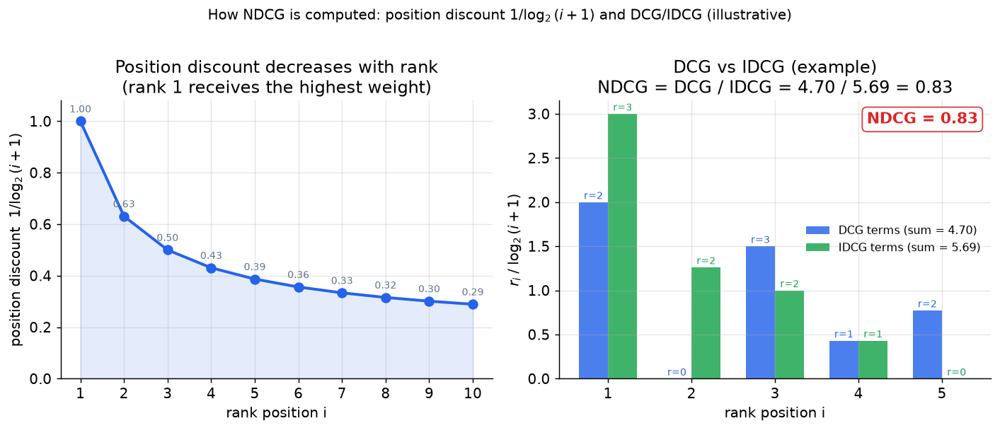
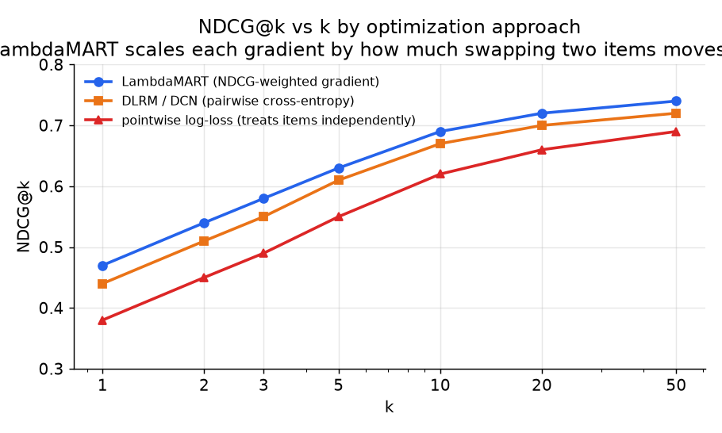
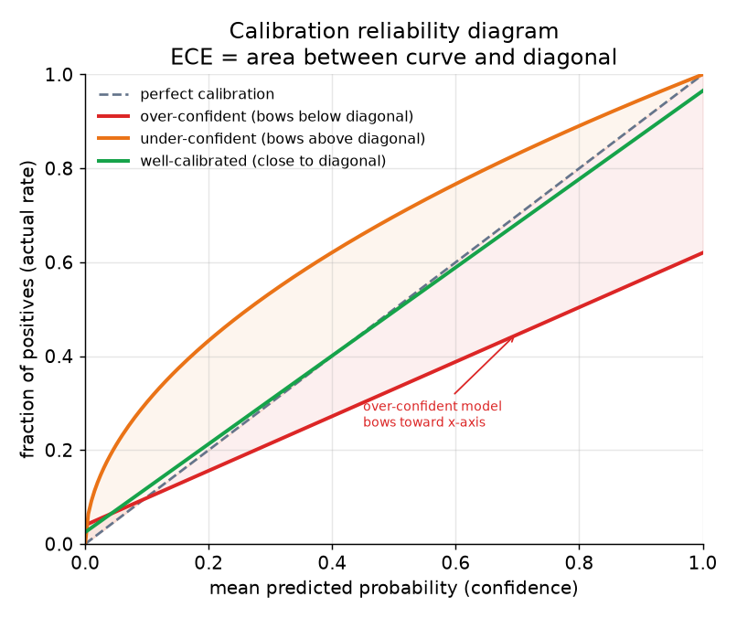

# 5. Evaluation

Ranking is judged by different metrics for different purposes. Using the wrong
one is a classic mistake, and being able to explain which metric earns its place
when is a strong interview signal.

## NDCG: quality of the ordered list

**NDCG@k** (Normalized Discounted Cumulative Gain) measures how well the top-k
returned items match the ground-truth relevance, weighted by position. Hits near
the top count more than hits further down.

- **Input / output.** The metric takes a ranked list of k items, each assigned a
  graded relevance label $r_i \ge 0$, and returns a scalar in $[0, 1]$; 1.0 means
  the returned order is identical to the ideal.
- **How it is computed.** Sum relevance gains discounted by log position, then
  normalize by the ideal achievable score:

$$\text{DCG@k} = \sum_{i=1}^{k} \frac{r_i}{\log_2(i+1)}, \qquad \text{NDCG@k} = \frac{\text{DCG@k}}{\text{IDCG@k}}$$

where IDCG@k is the DCG of the perfect re-ordering of those same items (all items
sorted by decreasing $r_i$). NDCG rewards relevant items appearing near the top
and discounts lower positions. Yelp and Airbnb use NDCG as the offline signal for
their learning-to-rank models because NDCG directly rewards putting the most
relevant item at rank 1.

In code it is two short functions: score the actual order, divide by the score of
the ideal order.

```python
import numpy as np
def dcg(rels):                       # rels: relevance grades in predicted-rank order
    return sum(r / np.log2(i + 2) for i, r in enumerate(rels))  # i=0 -> log2(2)=1
def ndcg_at_k(rels, k):
    idcg = dcg(sorted(rels, reverse=True)[:k])   # ideal ordering: grades sorted desc
    return dcg(rels[:k]) / idcg if idcg else 0.0
# ndcg_at_k([3, 2, 3, 0, 1], k=5)  ->  DCG / IDCG, always in [0, 1]
```



*Left: the position discount $1/\log_2(i+1)$ falls steeply from 1.0 at rank 1 to 0.29 at rank 10, so misplacing a relevant item costs far more near the top of the list than near the bottom. Right: an illustrative five-item list; the blue bars show the discounted gain $r_i/\log_2(i+1)$ for the actual ordering (DCG), the green bars show the same terms for the ideal ordering (IDCG), and NDCG is their ratio capped at 1. Illustrative.*



*LambdaMART (blue) scales each training gradient by how much swapping two items
would move NDCG, so it directly optimizes the metric. Pointwise log-loss (red)
treats items independently and lags behind. Illustrative values.*

## AUC: ranking quality of a binary objective

**AUC** (area under the ROC curve) measures whether the model ranks positive
examples above negative examples across all thresholds.

- **Input / output.** Takes model scores paired with binary labels (clicked /
  not clicked) and returns a scalar in $[0, 1]$: 0.5 is random, 1.0 is perfect
  rank-order separation.
- **How it is computed.** AUC equals the probability that a randomly drawn
  positive example is scored higher than a randomly drawn negative:

$$\text{AUC} = \Pr\!\left(\hat{p}(x^+) \gt \hat{p}(x^-)\right)$$

In code it is the fraction of positive/negative pairs the model orders correctly:

```python
def auc(scores, labels):
    pos = [s for s, y in zip(scores, labels) if y == 1]   # scored positives
    neg = [s for s, y in zip(scores, labels) if y == 0]   # scored negatives
    wins = sum(sp > sn for sp in pos for sn in neg)        # correctly ordered pairs
    return wins / (len(pos) * len(neg))                    # fraction over all +/- pairs
# auc([0.9, 0.5, 0.4, 0.3], [1, 0, 1, 0])  ->  0.75
```

It is threshold-free and easy to compute over billions of rows, which makes it
the standard offline metric for binary classification objectives (click vs.
no-click) at scale. AUC does not require balanced classes, which matters when
the click rate is 1-2%. The typical failure mode: AUC can improve while
calibration worsens, so never use AUC alone when scores feed an auction.

## Logloss: sharpness of the probability estimate

**Logloss** (binary cross-entropy) penalizes confident wrong predictions harder
than uncertain ones. It is complementary to AUC: AUC captures ranking quality,
logloss captures sharpness of the probability estimates.

- **Input / output.** Takes predicted probabilities $\hat{p}_i$ and binary labels
  $y_i \in \{0, 1\}$; returns a positive scalar where lower is better, minimized
  only by a perfectly calibrated predictor.
- **How it is computed.**

$$\mathcal{L} = -\frac{1}{N} \sum_{i=1}^{N} \left[ y_i \log \hat{p}_i + (1 - y_i) \log (1 - \hat{p}_i) \right]$$

```python
import numpy as np
def logloss(p, y):
    p = np.clip(p, 1e-15, 1 - 1e-15)                      # avoid log(0)
    return -np.mean(y * np.log(p) + (1 - y) * np.log(1 - p))
# logloss(np.array([0.9, 0.2, 0.7]), np.array([1, 0, 1]))  ->  0.2284
```

A model can gain AUC while its logloss worsens if it is shifting confident
scores in the right direction but over- or under-estimating magnitudes.

For engagement and ads models specifically, the metric teams track day to day is
usually **Normalized Entropy (NE)**, this logloss divided by the entropy of the
background rate, so it is comparable across surfaces with different base rates and
reads as a direct proxy for online movement. It is defined and implemented in the
[ads-ranking evaluation chapter](../ads-ctr/05-evaluation.md).

## Calibration: does 0.1 mean 10%?

When ranking scores feed a downstream auction, a bid, a threshold, or a utility
blend, **the predicted probability must mean what it says**. A calibration
reliability diagram plots mean predicted confidence on the x-axis against actual
fraction of positives on the y-axis. The diagonal is perfect calibration.

**ECE (Expected Calibration Error)** is a scalar summary of the reliability curve:

- **Input / output.** Takes predicted probabilities bucketed into $M$ bins,
  paired with binary labels; returns a positive scalar in $[0, 1]$ where 0 is
  perfect calibration.
- **How it is computed.**

$$\text{ECE} = \sum_{b=1}^{M} \frac{n_b}{N} \left| \text{acc}(b) - \text{conf}(b) \right|$$

where $n_b$ is the count in bin $b$, $\text{acc}(b)$ is the fraction of actual
positives in that bin, and $\text{conf}(b)$ is the mean predicted probability.
ECE summarizes the area between the reliability curve and the diagonal.

```python
import numpy as np
def ece(p, y, M=10):
    p, y = np.asarray(p), np.asarray(y)
    edges = np.linspace(0, 1, M + 1)                 # M equal-width probability bins
    total = 0.0
    for lo, hi in zip(edges[:-1], edges[1:]):
        m = (p > lo) & (p <= hi)                      # predictions falling in this bin
        if m.sum():                                  # weight gap by bin's share of data
            total += m.sum() / len(p) * abs(y[m].mean() - p[m].mean())
    return total
# ece([0.2, 0.3, 0.8, 0.9], [0, 1, 1, 1])  ->  0.3
```

Training on downsampled negatives and stratified samples distorts calibration,
so apply a post-hoc step (Platt scaling or isotonic regression) and monitor ECE
as a first-class metric. Spotify monitors ECE live because it directly drives
auction pricing: a 10% over-confident prediction means a 10% over-bid.



*An over-confident model bows toward the x-axis (red): it predicts 0.8 but only
30% of those actually click. An under-confident model bows above the diagonal
(orange). A well-calibrated model tracks the diagonal (green). Illustrative.*

## Offline-online gap

An offline metric gain (AUC, NDCG, logloss) does not guarantee an online
engagement win. The most common reasons for the gap:

- **Training-serving skew.** A feature computed one way in the training pipeline
  and another way in the serving code means the model operates on a distribution
  it never trained on. This is the single most common silent failure in deployed
  rankers.
- **Label leakage.** A feature that encodes the outcome (for example an item
  engagement rate including the current impression) inflates offline metrics and
  collapses online.
- **Position bias not corrected.** The offline labels carry position signal not
  present at serving, so the offline metric is flattering.

The guardrail to state out loud: a positive offline metric is a pre-gate, not a
ship decision. The ship decision is an online A/B test on the business metric.

## When to use which metric

| Reach for | When | Instead of |
|---|---|---|
| AUC | Binary engagement objective, billions of training rows, no calibration requirement | NDCG when order and position matter more than binary discrimination |
| NDCG@k | The order of the top-k items matters (search, LTR); you want to reward the best item at rank 1 | AUC when you only care about binary separation, not ranked position |
| Logloss | You need to track sharpness of probability estimates alongside AUC | AUC alone when downstream uses need calibrated probabilities |
| ECE + calibration plot | Score feeds an auction, a bid, a threshold, or a cross-task blend | Shipping raw scores as probabilities before checking calibration |
| Online A/B on business metric | The final ship decision | Offline metric alone, which misses the training-serving seam |

**Provenance.** NDCG is the graded-relevance ranking measure whose per-rank discount is what learning-to-rank methods such as LambdaMART (Microsoft, 2010) optimize directly. The calibration side draws on Platt scaling (Platt, 1999) and isotonic regression when downsampled-negative training bows the reliability curve off the diagonal.

**Tools.** AUC and logloss are one call each in scikit-learn (roc_auc_score, log_loss); TorchMetrics provides RetrievalNormalizedDCG for NDCG@k, and TensorFlow Ranking (Google) implements NDCG-driven learning-to-rank end to end. Calibration reliability curves come from scikit-learn (calibration_curve); ECE and other calibration summaries are packaged in netcal. The final online A/B ship decision leans on a stats library such as statsmodels or SciPy for significance testing.

**Worked example.** A streaming service tuning its click model tracks AUC as the cheap threshold-free offline signal over billions of impressions, since click rate is a low single-digit percentage and AUC does not need balanced classes. Because those scores feed an ad auction, it does not stop at AUC: it watches logloss for probability sharpness and monitors ECE with a reliability diagram, applying isotonic regression when downsampled-negative training bows the curve off the diagonal. NDCG@k is reserved for its search surface, where the position of the top result matters more than binary separation. None of these offline wins is treated as a ship decision; the model only launches after an online A/B on the engagement metric clears, guarding against a training-serving skew the offline numbers cannot see.
