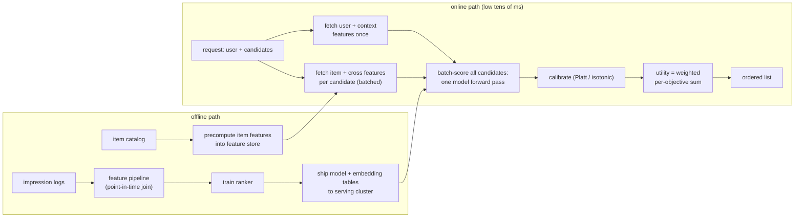

# 6. Serving and scaling

## The latency budget, made concrete

Ranking gets a slice of the overall request. The arithmetic is simple and worth
stating out loud: 500 candidates, a 20 ms p99 ranking budget, so roughly 0.04 ms
per candidate end to end. That rules out anything that runs a full model pass per
candidate independently, and pushes you toward four decisions:

- **Batch the forward pass.** Score all candidates in one batched call to the
  model instead of 500 separate calls. Memory layout and GPU/CPU utilization
  improve dramatically.
- **Fetch shared features once.** User features and context are identical across
  all candidates in one request. Fetch them once and broadcast. Only item features
  and user-item cross features vary per candidate.
- **Precompute where possible.** Push as much computation as possible to the
  offline feature pipeline. Online work should be assembly and one model call,
  not computation from scratch.
- **Keep the per-candidate cost flat.** As you add candidates (say from 200 to
  500), the total serving time should grow linearly and predictably, not super-
  linearly. Design the model so the bottleneck is the batched linear algebra, not
  a fan-out of individual calls.

## The offline/online data flow

## Feature stores

A feature store is the infrastructure layer that makes online feature assembly
possible at ranking latency. It serves two purposes:

- **Online read path.** Serves pre-computed features (user history aggregates,
  item statistics, cross signals) at low latency (single-digit milliseconds) per
  lookup. Redis, Cassandra, and specialized stores like Feast are common choices.
- **Offline write path.** Materializes feature values in batch, keyed by entity
  id (user id, item id, (user, item) cross key). The training pipeline reads from
  the same store's historical snapshots to avoid training-serving skew.

The critical invariant: the feature value used in training and the feature value
served at inference must be computed by the **same logic**. Skew here is the
single most common cause of an offline metric gain that disappears online.

## Snap's user-tower reuse pattern

For rankers that use a user tower (like Snap's ads ranker), the user-side
representation can be **computed once per request and shared** across all
candidate items. Only the item tower and the cross-interaction head run per
candidate. This is the Snap architecture choice: the expensive user-side
computation is amortized over the full candidate batch.

## Bottlenecks

| Bottleneck | First sign | Fix | Tradeoff |
|---|---|---|---|
| Per-candidate latency over budget | Ranking p99 exceeds allocation | Batch the forward pass; shrink top MLP; profile which op dominates | Accuracy vs. per-candidate cost |
| Embedding table memory | Model server OOM; evictions hurt latency | Hash collisions to compress rare ids; lower embedding dimension; prune vocab | Slight quality loss for infrequent ids |
| Feature fetch fan-out | Most of the 20 ms spent before the model | Fetch user context once; batch item lookups; push cross feature computation offline | Cache staleness for computed cross signals |
| Embedding lookup memory bandwidth | CPU decode bound at scale | Quantize embedding tables to int8; co-locate hot ids in memory | Quality hit to measure |
| Calibration drift | Downstream auction mis-prices | Periodic recalibration on fresh data; monitor ECE as a live metric | Extra pipeline step per model version |
| Training behind distribution drift | Online metric decays week-over-week | Increase retrain frequency; incremental checkpoint warm-start | Compute and infra cost |
| Lightweight ranker needed early in funnel | Full ranker too expensive on raw retrieval output | Insert an XGBoost lightweight stage between retrieval and full ranker | Funnel adds a stage; lightweight stage needs its own labels |
