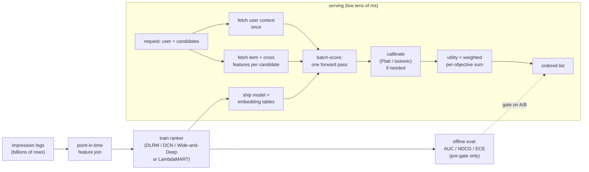

# 9. Summary

## One-page recap

- **Ranking is a precision problem inside a latency budget.** Retrieval handed
  you a few hundred survivors already filtered for recall. Ranking's job is to
  get the order right, expensively. But scoring hundreds of candidates per request
  at p99 keeps the per-candidate budget under a fraction of a millisecond, which
  constrains architecture as much as accuracy does.
- **Cross features are the biggest accuracy lever.** User features plus item
  features in isolation leave the most informative signal on the table. "How many
  times has this user engaged with this item's category in the last 7 days" cannot
  be recovered from either feature alone.
- **The interaction model is the key architectural choice.** Explicit pairwise
  dot products (DLRM) when sparse ids dominate and second-order crosses carry the
  signal. Bounded cross blocks (DCN-v2) when you want cross structure without
  maintaining a hand-crafted wide side. Wide-and-Deep when memorization of
  frequent rules matters alongside generalization. LambdaMART when you want to
  optimize NDCG directly.
- **Multi-task ranking needs calibration and tunable utility weights.** Train
  per-objective heads. Calibrate each head separately with a post-hoc step because
  downsampling distorts the base rate. Keep utility weights outside the loss so
  the business can retune what a save is worth versus a click without retraining.
  For negatively correlated tasks, use MMoE or PLE gating.
- **Calibrate only when the score leaves pure sorting.** If you are only ordering
  a list, raw order is enough. The moment a score feeds an auction bid, a
  threshold, or a weighted utility blend, it must be a calibrated probability.
  Monitor ECE live when calibration drives pricing.
- **The training-serving seam is the most common silent failure.** A feature
  computed one way offline and another way online means the model operates on a
  distribution it never trained on. Use point-in-time joins. Compute features once
  and share between training and serving.
- **The offline metric is a pre-gate, not a ship decision.** AUC or NDCG
  improvements can disappear online due to skew, leakage, or position bias not
  corrected. The ship decision is an online A/B on the business metric.

## The system on one page

## Test yourself

1. Why do cross features between user and item improve ranking more than separate
   user features and item features, and where do they fit in the DLRM architecture?
2. Where exactly in DLRM does the interaction step sit, and what constraint does
   it place on the bottom MLP output width?
3. When does calibration earn its place in a ranking pipeline, and what distorts
   calibration in the first place?
4. Your offline NDCG improved but online engagement fell. What is the most
   likely cause and how do you diagnose it?
5. When would you choose LambdaMART over a pointwise cross-entropy ranker, and
   when would you choose DCN-v2 over Wide-and-Deep?
6. Why is it important to keep utility weights outside the multi-task loss, and
   how does that design choice change the operational workflow for the product team?

## Further reading

- Dense reference (comparison table, math, all case studies): [topics/02-ranking-model.md](../../topics/02-ranking-model.md).
- Company teardowns with Q&A and gotchas: [tools/teardowns/02.md](../../tools/teardowns/02.md).
- System comparison diagram and decision tree: [tools/comparisons/02.md](../../tools/comparisons/02.md).
- Trace DLRM and Wide-and-Deep live in the [Model Zoo](https://github.com/neurarch-ai/awesome-llm-model-zoo): find where the embedding tables end and the interaction layer begins, count where parameters actually live, and change the embedding dimension to watch the parameter count move.
