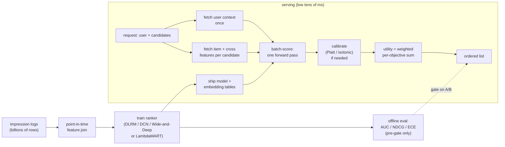

# 9. Summary

## One-page recap

- **Ranking is a precision problem inside a latency budget.** Retrieval handed
  you a few hundred survivors already filtered for recall. Ranking's job is to
  get the order right, expensively. But scoring hundreds of candidates per request
  at p99 keeps the per-candidate budget under a fraction of a millisecond, which
  constrains architecture as much as accuracy does.
- **Cross features are the biggest accuracy lever.** User features plus item
  features in isolation leave the most informative signal on the table. "How many
  times has this user engaged with this item's category in the last 7 days" cannot
  be recovered from either feature alone.
- **The interaction model is the key architectural choice.** Explicit pairwise
  dot products (DLRM) when sparse ids dominate and second-order crosses carry the
  signal. Bounded cross blocks (DCN-v2) when you want cross structure without
  maintaining a hand-crafted wide side. Wide-and-Deep when memorization of
  frequent rules matters alongside generalization. LambdaMART when you want to
  optimize NDCG directly.
- **Multi-task ranking needs calibration and tunable utility weights.** Train
  per-objective heads. Calibrate each head separately with a post-hoc step because
  downsampling distorts the base rate. Keep utility weights outside the loss so
  the business can retune what a save is worth versus a click without retraining.
  For negatively correlated tasks, use MMoE or PLE gating.
- **Calibrate only when the score leaves pure sorting.** If you are only ordering
  a list, raw order is enough. The moment a score feeds an auction bid, a
  threshold, or a weighted utility blend, it must be a calibrated probability.
  Monitor ECE live when calibration drives pricing.
- **The training-serving seam is the most common silent failure.** A feature
  computed one way offline and another way online means the model operates on a
  distribution it never trained on. Use point-in-time joins. Compute features once
  and share between training and serving.
- **The offline metric is a pre-gate, not a ship decision.** AUC or NDCG
  improvements can disappear online due to skew, leakage, or position bias not
  corrected. The ship decision is an online A/B on the business metric.

## The system on one page

```mermaid
flowchart LR
  LOG["impression logs<br/>(billions of rows)"] --> PITJOIN["point-in-time<br/>feature join"]
  PITJOIN --> TRAIN["train ranker<br/>(DLRM / DCN / Wide-and-Deep<br/>or LambdaMART)"]
  TRAIN --> MODEL["ship model +<br/>embedding tables"]
  TRAIN --> EVAL["offline eval:<br/>AUC / NDCG / ECE<br/>(pre-gate only)"]
  subgraph Serving["serving (low tens of ms)"]
    REQ["request: user + candidates"] --> UF["fetch user context<br/>once"]
    REQ --> IF["fetch item + cross<br/>features per candidate"]
    UF --> BATCH["batch-score:<br/>one forward pass"]
    IF --> BATCH
    MODEL --> BATCH
    BATCH --> CAL["calibrate<br/>(Platt / isotonic)<br/>if needed"]
    CAL --> UTIL["utility = weighted<br/>per-objective sum"]
    UTIL --> OUT["ordered list"]
  end
  EVAL -.->|"gate on A/B"| OUT
```

**How it works.** Billions of impression-log rows first pass through a point-in-time
feature join so each label sees only features that existed at request time, then
train the ranker (a DLRM, DCN, Wide-and-Deep, or LambdaMART model). Training
produces two outputs: the shipped model plus embedding tables, and an offline
evaluation (AUC, NDCG, ECE) used only as a pre-launch gate. In serving, a request
carrying a user and its candidates fetches user context once and item plus cross
features per candidate, then batch-scores them all in one forward pass using the
shipped model. The raw scores are calibrated if needed and folded into a utility
that is a weighted per-objective sum, giving the ordered list. The offline
evaluation does not feed serving directly; it gates the model on an A/B test before
that ordered list is trusted in production.

## Test yourself

Answers are collapsed. Attempt each question before opening one.

1. Why do cross features between user and item improve ranking more than separate
   user features and item features, and where do they fit in the DLRM architecture?

   

Answer

   Because a **cross feature** is a user-times-item signal that simply is not
   present in either side alone: "how many times has this user engaged with this
   item's category in the last 7 days" cannot be reconstructed from the user's
   global history plus the item's global stats, so a model that sees only the two
   families in isolation leaves the most informative signal on the table. Section
   [3](03-data-preparation.md) names cross features as typically the single biggest
   accuracy lever in ranking, and forgetting to mention them is the most common gap
   in a ranking answer. In DLRM they are not only an input: the architecture
   *manufactures* second-order crosses internally as **explicit pairwise dot
   products** between the embedding vectors and the bottom-MLP output, which is the
   structural alternative to hoping a top MLP learns the interactions
   ([4](04-model-development.md)). Ranking can afford this where retrieval cannot,
   since any user-item crossing destroys the two-tower offline precompute
   ([8](08-interview-qa.md)). The tradeoff is latency: the cross feature must be
   computable inside the request, so slow cross signals are materialized offline
   and served from a feature store, at the cost of cache staleness
   ([6](06-serving-and-scaling.md)).

   

2. Where exactly in DLRM does the interaction step sit, and what constraint does
   it place on the bottom MLP output width?

   

Answer

   It sits **after the embedding tables and the bottom MLP, and before the top
   MLP**. Sparse categorical features index their embedding tables and return one
   vector each; dense features pass through the bottom MLP; the model then takes
   explicit pairwise dot products over every pair of those vectors, and
   $z = \text{concat}(x_{\text{dense}}, \lbrace \langle e_i, e_j \rangle : i \lt j \rbrace)$
   feeds the top MLP. The constraint follows directly: the **bottom MLP output
   width must equal the embedding dimension**, because a dot product between
   vectors of different widths is undefined. The placement is what diagrams
   routinely get wrong, and it is not cosmetic: putting the interaction after the
   top MLP, or feeding concatenated embeddings straight into a top MLP, throws away
   the structured second-order signal and describes a different, less powerful model
   ([4](04-model-development.md), [8](08-interview-qa.md)). One more fact worth
   stating in the same breath: the embedding tables, not the MLPs, carry almost all
   of the parameters.

   

3. When does calibration earn its place in a ranking pipeline, and what distorts
   calibration in the first place?

   

Answer

   **Calibration earns its place the moment a score leaves pure sorting.** If you
   are only ordering a list and nothing downstream reads the magnitudes, raw order
   is enough and a calibration pipeline is cost for nothing (Airbnb and Yelp sit
   here). The moment the score feeds an auction bid (bid = value times predicted
   probability), a threshold, or a weighted utility blend across heads, a predicted
   0.1 has to really mean a 10% chance. What distorts it is the training data
   itself: **negative downsampling** and stratified sampling change the base rate,
   so if you keep 1 in k negatives the model sees k times more positives per
   negative than the world contains. Apply the correction
   $\hat{p}_{\text{corrected}} = \hat{p} / (\hat{p} + (1 - \hat{p}) / w)$ for a
   negative downsampling rate $w$, then a post-hoc **Platt or isotonic** step, and
   monitor **ECE** as a live metric (Spotify does, because a 10% over-confident
   prediction is a 10% over-bid). The subtlety to state out loud: those maps are
   monotone, so calibration never changes AUC or NDCG within one head, but it
   absolutely reorders a blend across heads, which is exactly why it matters only
   once scores stop being sort keys ([5](05-evaluation.md),
   [8](08-interview-qa.md)).

   

4. Your offline NDCG improved but online engagement fell. What is the most
   likely cause and how do you diagnose it?

   

Answer

   Suspect the **training-serving seam** before the model: a feature computed one
   way in the training pipeline and another way in the serving code puts the model
   in silent extrapolation on a distribution it never trained on, and it is the
   single most common cause of an offline gain that vanishes online. Offline
   evaluation cannot catch it by construction, because the eval set is produced by
   the same training pipeline, so the seam between the two codepaths is invisible
   until live traffic crosses it. Diagnose by logging the features the server
   actually used and diffing them against the training pipeline's values, then walk
   section [4](04-model-development.md)'s triage tree in order: features not
   identical online and offline means skew, rank used as a feature means position
   bias (debias or fix rank at serve), tail items never appearing in the logs means
   selection bias (add exploration traffic plus IPS weighting), and if all three
   check out, look at calibration and delayed labels. The other two usual suspects
   are **label leakage** from a join that was not point-in-time and position bias
   left uncorrected in the labels ([5](05-evaluation.md)). The
   guardrail underneath all of this: an offline metric is a pre-gate, not a ship
   decision, and the ship decision is an online A/B on the business metric.

   

5. When would you choose LambdaMART over a pointwise cross-entropy ranker, and
   when would you choose DCN-v2 over Wide-and-Deep?

   

Answer

   Choose **LambdaMART** when you want to move the ranking metric directly, you can
   define meaningful (winner, loser) pairs from click or booking data, and nothing
   downstream reads the score magnitudes: its per-pair gradient
   $\lambda_{ij} = \frac{-\sigma}{1 + \exp(\sigma (s_i - s_j))} \cdot |\Delta\text{NDCG}_{ij}|$
   gives the largest push to the swaps that would most improve NDCG. Stay
   **pointwise** when you have billions of rows to stream and when the score must be
   a calibratable probability for an auction, a threshold, or a multi-task utility
   blend, because after pairwise training only relative order is meaningful and the
   magnitudes drift freely ([2](02-frame-as-ml-task.md)). Section
   [10](10-putting-it-together.md) draws the line cleanly: the travel-marketplace
   column, single booking objective and nothing reading magnitudes, is where
   LambdaMART wins, and the ads column is where it would be the wrong answer.
   Choose **DCN-v2** over Wide-and-Deep when you need cross structure but manually
   listing which feature pairs to cross is impractical or goes stale: each cross
   layer computes $x_{l+1} = x_0 \odot (W_l x_l + b_l) + x_l$, giving learned
   explicit crosses up to order $l+1$ with no wide side to maintain. Keep
   **Wide-and-Deep** when memorization of frequent, specific user-item rules pays
   for the hand-engineered wide-side features, with the deep path covering the tail
   ([4](04-model-development.md)).

   

6. Why is it important to keep utility weights outside the multi-task loss, and
   how does that design choice change the operational workflow for the product team?

   

Answer

   Because it turns a business question into a config change instead of a retrain.
   Train per-objective heads with their own binary cross-entropy, calibrate each
   head separately, and only then combine them post-hoc as
   **utility = weighted per-objective sum**; if the weights instead sat inside
   $L = \sum_k w_k \mathcal{L}_k$, every reweighting would require a full training
   run ([4](04-model-development.md)). Operationally this decouples two release
   cadences: the product team owns the weights and can retune what a save is worth
   versus a click, while the ML team owns the model on its own schedule. Pinterest
   built exactly this and reorders its home feed within hours without touching model
   weights ([7](07-how-teams-do-it-in-production.md)), and section
   [10](10-putting-it-together.md) states the rule as "weights outside the loss:
   reordering the feed is a config change, not a retrain." Two conditions make it
   safe. Each head must be calibrated first, because a monotone remap of one head
   relative to another changes the blended order, so uncalibrated heads make the
   weights incomparable ([8](08-interview-qa.md)). And a retune shifts the score
   distribution any auction or threshold consumer assumes, so recalibrate per head
   and watch reliability per head after every weight change.

   

## Further reading

- The capstone: [the complete build](10-putting-it-together.md), where every
  choice in this chapter is committed once for the scenario, sized, rebuilt
  under two other constraint sets, and compressed into a runnable one-file
  debiased ranker.
- Dense reference (comparison table, math, all case studies): [topics/02-ranking-model.md](../../topics/02-ranking-model.md).
- Company teardowns with Q&A and gotchas: [tools/teardowns/02.md](../../tools/teardowns/02.md).
- System comparison diagram and decision tree: [tools/comparisons/02.md](../../tools/comparisons/02.md).
- Trace DLRM and Wide-and-Deep live in the [Model Zoo](https://github.com/neurarch-ai/awesome-llm-model-zoo): find where the embedding tables end and the interaction layer begins, count where parameters actually live, and change the embedding dimension to watch the parameter count move.
