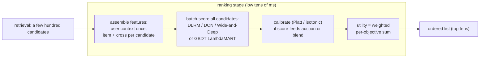

# Ranking Models

An interviewer rarely says "design a ranking model." They say **"retrieval handed
you a few hundred candidates for this user. Now design the model that scores them
and decides the order we actually show. Walk me through the features, the
architecture, and how you keep it fast enough to score all of them per request."**

That question is about three things: feature engineering (especially cross
features between user and item), architecture choice (which interaction model
fits the signal shape), and the latency budget that constrains every decision.
This chapter builds the ranking stage end to end, and shows how Google, Meta,
Pinterest, Airbnb, LinkedIn, Spotify, Snap, and others actually ship it.

## Sections

1. [Clarifying the requirements](01-clarifying-requirements.md) - the dialogue that scopes what the ranker must do.
2. [Framing it as an ML task](02-frame-as-ml-task.md) - objective, input and output, and the three ML categories (pointwise, pairwise, listwise).
3. [Data preparation](03-data-preparation.md) - labels from logs, position bias, cross features, sampling strategies.
4. [Model development](04-model-development.md) - GBDT vs deep, Wide-and-Deep, DLRM, DCN-v2, multi-task ranking, loss functions, and a "when to use which" table.
5. [Evaluation](05-evaluation.md) - NDCG, AUC, logloss, calibration error, and when each metric earns its place.
6. [Serving and scaling](06-serving-and-scaling.md) - the latency budget made concrete, feature stores, and a bottlenecks table.
7. [How teams do it in production](07-how-teams-do-it-in-production.md) - where Google, Meta, Pinterest, Airbnb, LinkedIn, Spotify, Snap, and others diverge, and why.
8. [Interview Q&A](08-interview-qa.md) - commonly asked, tricky, and commonly answered wrong, with clear answers.
9. [Summary](09-summary.md) - the one-page recap, a self-test, and further reading.

## The whole system on one page

Read the sections in order the first time; each one opens with the constraint or
question that forces the next design decision.
