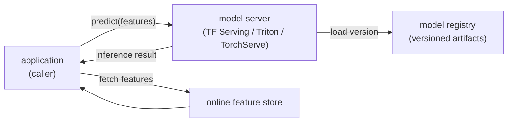

# 2. The serving problem

## The model is not the server

The first thing to say clearly: **the model and the server are different
things.** The model is the trained artifact: the embedding tables, the weight
tensors, the computation graph. The server is infrastructure that loads the
model, exposes a predict API, warms it, batches requests, and hot-swaps versions
without dropping traffic. Conflating them is the mistake that produces bespoke,
unmonitored, un-rollbackable serving code per team.

The canonical pattern is **model-as-a-service**: wrap the trained artifact in a
dedicated model server (TF Serving, NVIDIA Triton, TorchServe, MLServer are the
names you will hear) that the application calls over gRPC or HTTP. The
application stays out of the inference business. You can redeploy the model
without redeploying the app, run multiple versions side by side, and standardize
metrics and logging across every model in the company.

**How it works.** A request enters at the application, which owns the user-facing
logic and stays out of the inference business. In parallel it fetches the model's
inputs from the online feature store and issues a `predict(features)` call to the
dedicated model server over gRPC or HTTP. The server resolves which version to run
by loading it from the model registry by pointer, so a redeploy is a registry
change rather than an application change. It runs the forward pass and hands the
inference result back to the caller. Because the server is a separate process, the
same model can be versioned, scaled, and monitored independently of the app that
consumes it.

## Online, async, or batch: pick the deployment type first

Before tuning latency, confirm you even need real-time serving. The *LLM
Engineer's Handbook* separates three deployment types by **who is waiting on the
result**, and picking the wrong one is a common design-interview miss (over-engineering
a real-time path for a job that runs nightly).

| Deployment type | Use when | Latency target | Examples |
|---|---|---|---|
| Online real-time | a user or upstream service is blocked on the result | ms to low seconds | search-page ranking, fraud check at checkout, ad selection |
| Asynchronous | the result is needed soon but not synchronously; enqueue, process, callback or poll | seconds to minutes | moderating an uploaded video, generating a report, scoring a long document |
| Offline batch | a whole dataset is scored on a schedule with no per-request path | minutes to hours | nightly recommendation refresh, backfilling scores, embedding a corpus |

The cost gradient runs the other way: batch is cheapest (pack large batches on spot
capacity, no idle replicas), async is in between (a queue absorbs spikes so you
size for the mean, not the peak), and online real-time is the most expensive
because you provision for the peak and keep replicas warm. If the product can
tolerate a queue, async or batch can be an order of magnitude cheaper than online.

## Monolith vs microservices serving

Given you need online serving, the second structural choice is whether the model
runs *inside* the business service or as a separate one.

| Architecture | Use when | Cost |
|---|---|---|
| Monolithic (model in the app process) | small model, single consumer, tight latency, small team | one deploy, no network hop, but you scale app and model together and inherit the model's language and memory footprint |
| Microservices (model server behind the app) | large or GPU-bound model, multiple consumers, independent scaling | GPU model service scales apart from the CPU app and is reusable, at the price of a network hop and more operational surface |

The deciding factor is usually the hardware asymmetry: a GPU model that must scale
on QPS while the business logic scales on something else forces the split, because
you do not want to buy a GPU every time you need another CPU-bound app replica.

## The latency budget

The 50 ms p99 end-to-end target is not the model's budget. It is the total
budget, shared across every step on the critical path:

$$T_{p99} \;\geq\; L_{\text{net}} + L_{\text{feat}} + W + L_{\text{model}}(B)$$

where $L_{\text{net}}$ is round-trip network, $L_{\text{feat}}$ is the feature
store lookup, $W$ is the dynamic-batching wait window, and
$L_{\text{model}}(B)$ is inference time at batch size $B$. If feature fetch
costs 10 ms and the network adds 5 ms, the model and its batching overhead have
at most 35 ms.

**Design backwards from the budget.** Size the batch window so it fits inside
the remaining slice; choose hardware so the model forward-pass fits inside the
batch window's remainder; cache features and even whole predictions where inputs
repeat. This ordering, budget first and hardware second, is the senior move.

## Why p99, not average

The mean hides the tail. If 93 percent of requests take 8 ms and 7 percent take
80 ms, the average is about 13 ms while the p99 is 80 ms. The user whose
request lands in the tail always waits; p99 is the latency that the SLA actually
measures. For fan-out systems (a search page that fans out across shards)
individual tail requests multiply, so teams like Booking.com hold to p999
precisely because one slow shard stalls the whole page.

Always report and alert on p99 and p999. Average latency is a diagnostic tool,
not an SLA metric.

## The model server does the boring, hard parts

A production model server handles four things that look simple but are not:

1. **Versioned artifact loading.** It loads a specific version from the registry
   by pointer, not by file copy. A deploy is a pointer change.
2. **Warm-up.** The first few requests through a cold model are slow because JIT
   compilation, kernel caches, and embedding-table paging are cold. A real server
   runs synthetic warm-up requests before opening the new version to traffic.
3. **Dynamic batching.** It groups requests arriving in a short window and runs
   them as one batch to fill the accelerator. The next section covers this in
   detail.
4. **Metrics and health.** It exposes per-version latency histograms, error
   rates, and throughput so monitoring can distinguish a slow version from a slow
   host before a human notices.

None of these belong in application code. They belong in one place, owned by the
serving platform, shared across every model.
