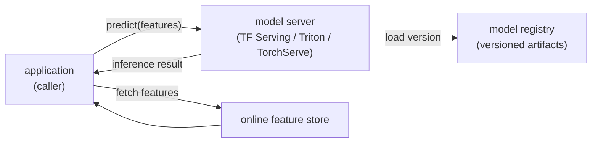

# 2. The serving problem

## The model is not the server

The first thing to say clearly: **the model and the server are different
things.** The model is the trained artifact: the embedding tables, the weight
tensors, the computation graph. The server is infrastructure that loads the
model, exposes a predict API, warms it, batches requests, and hot-swaps versions
without dropping traffic. Conflating them is the mistake that produces bespoke,
unmonitored, un-rollbackable serving code per team.

The canonical pattern is **model-as-a-service**: wrap the trained artifact in a
dedicated model server (TF Serving, NVIDIA Triton, TorchServe, MLServer are the
names you will hear) that the application calls over gRPC or HTTP. The
application stays out of the inference business. You can redeploy the model
without redeploying the app, run multiple versions side by side, and standardize
metrics and logging across every model in the company.

## The latency budget

The 50 ms p99 end-to-end target is not the model's budget. It is the total
budget, shared across every step on the critical path:

$$T_{p99} \;\geq\; L_{\text{net}} + L_{\text{feat}} + L_{\text{wait}} + L_{\text{model}}(B)$$

where $L_{\text{net}}$ is round-trip network, $L_{\text{feat}}$ is the feature
store lookup, $L_{\text{wait}}$ is the dynamic-batching wait window, and
$L_{\text{model}}(B)$ is inference time at batch size $B$. If feature fetch
costs 10 ms and the network adds 5 ms, the model and its batching overhead have
at most 35 ms.

**Design backwards from the budget.** Size the batch window so it fits inside
the remaining slice; choose hardware so the model forward-pass fits inside the
batch window's remainder; cache features and even whole predictions where inputs
repeat. This ordering, budget first and hardware second, is the senior move.

## Why p99, not average

The mean hides the tail. If 93 percent of requests take 8 ms and 7 percent take
80 ms, the average is about 13 ms while the p99 is around 70 ms. The user whose
request lands in the tail always waits; p99 is the latency that the SLA actually
measures. For fan-out systems (a search page that fans out across shards)
individual tail requests multiply, so teams like Booking.com hold to p999
precisely because one slow shard stalls the whole page.

Always report and alert on p99 and p999. Average latency is a diagnostic tool,
not an SLA metric.

## The model server does the boring, hard parts

A production model server handles four things that look simple but are not:

1. **Versioned artifact loading.** It loads a specific version from the registry
   by pointer, not by file copy. A deploy is a pointer change.
2. **Warm-up.** The first few requests through a cold model are slow because JIT
   compilation, kernel caches, and embedding-table paging are cold. A real server
   runs synthetic warm-up requests before opening the new version to traffic.
3. **Dynamic batching.** It groups requests arriving in a short window and runs
   them as one batch to fill the accelerator. The next section covers this in
   detail.
4. **Metrics and health.** It exposes per-version latency histograms, error
   rates, and throughput so monitoring can distinguish a slow version from a slow
   host before a human notices.

None of these belong in application code. They belong in one place, owned by the
serving platform, shared across every model.
