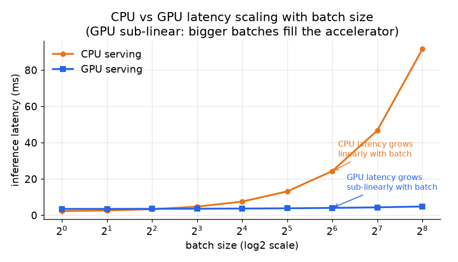

# 3. Batching and throughput

## Why a single request underuses hardware

A GPU (or even a well-optimized CPU inference path) is a massively parallel
device. Sending one request at a time leaves most compute lanes idle: the
arithmetic happens in nanoseconds and the rest of the time is kernel launch
overhead, memory transactions, and waiting. **Dynamic batching** collects
requests that arrive in a short time window and sends them through the model as
one combined batch, amortizing the fixed overhead and filling the hardware.

The throughput gain is real. Pinterest moved from CPU scatter-gather to GPU
batching and saw copy latency drop from 10 ms to under 1 ms by coalescing
tensors into one pre-allocated buffer before a single device transfer. That
single change was more impactful than any model optimization.

## The latency-throughput tradeoff

Dynamic batching introduces a direct tradeoff: a longer wait window and a
larger maximum batch raise throughput and raise tail latency. The model does
more useful work per second, but each request waits longer before its batch is
dispatched.

Formally, if $W$ is the wait window and $B$ is the effective batch size, the
latency a request sees inside the server is:

$$L_{\text{batch}} \;=\; W + \frac{B}{\text{tput}(B)}$$

```python
def latency_in_server(w, batch_size, tput):   # W wait window + service time B/tput
    return round(w + batch_size / tput, 6)     # seconds
# latency_in_server(0.005, 32, 8000) -> 0.009  (5 ms wait + 4 ms to run the batch)
```

The total QPS the server delivers is approximately:

$$\text{QPS} \;\approx\; \frac{B}{W + L_{\text{model}}(B)}$$

```python
def server_qps(batch_size, w, l_model):        # throughput ~ batch / (wait + model time)
    return round(batch_size / (w + l_model), 1)
# server_qps(32, 0.005, 0.004) -> 3555.6  (requests per second one replica delivers)
```

And the p99 budget constraint is:

$$T_{p99} \;\geq\; L_{\text{net}} + L_{\text{feat}} + W + L_{\text{model}}(B)$$

**Size $W$ and $B$ backwards from $T_{p99}$, not for peak throughput on idle
hardware.** Benching at low load gives misleadingly large $W$ budgets; the
constraint bites at the tail under real traffic.

## Little's law: sizing the replica fleet

Little's law (a queueing rule: the average number of items in a system equals how
fast they arrive times how long each stays) connects queue length, arrival rate,
and wait time:

$$\bar{Q} \;=\; \lambda \cdot \bar{W}_{\text{queue}}$$

where $\lambda$ is the arrival rate (QPS) and $\bar{W}_{\text{queue}}$ is the
mean time in the queue.

```python
def little_law(arrival_rate, avg_time_in_system):   # L = lambda * W
    return arrival_rate * avg_time_in_system
# little_law(50000, 0.02) -> 1000.0  (avg 1000 requests in flight at 50k QPS)
```

The utilization (fraction of a replica's capacity in use) per replica must stay
below 1:

$$\rho \;=\; \frac{\lambda}{N_{\text{replicas}} \cdot \mu} \;\lt\; 1$$

where $\mu$ is the per-replica throughput in requests per second.

```python
def utilization(lam, n_replicas, mu):   # rho = lambda / (N * mu), must stay < 1
    return lam / (n_replicas * mu)
# utilization(50000, 600, 100) -> 0.8333333333333334  (83% busy, safely under 1)
```

To size the fleet, invert: you need at least $\lceil \lambda / \mu \rceil$
replicas to stay below saturation, then add headroom for cold-start (the delay
before a freshly booted replica can serve at full speed) and traffic spikes
(covered in section 5).

```python
import math
def min_replicas(lam, mu):   # ceil(lambda / mu) to stay below saturation
    return math.ceil(lam / mu)
# min_replicas(50000, 100) -> 500  (floor before adding spike headroom)
```

## CPU vs GPU: different cost curves

On CPU, inference latency scales roughly linearly with batch size because the
compute is serial:

$$L_{\text{CPU}}(B) \;\approx\; c_0 + c_1 B$$

```python
def cpu_latency(batch, c0, c1):   # linear: doubling the batch ~ doubles the time
    return c0 + c1 * batch
# cpu_latency(32, 0.001, 0.0005) -> 0.017  (seconds, grows straight with batch)
```

On GPU, the cost curve is sub-linear: a larger batch fills the SIMD lanes that
would otherwise idle, so latency grows more slowly than batch size:

$$L_{\text{GPU}}(B) \;\approx\; g_0 + g_1 B^{\alpha}, \quad \alpha \;\lt\; 1$$

```python
def gpu_latency(batch, g0, g1, alpha):   # sub-linear when alpha < 1
    return round(g0 + g1 * batch ** alpha, 5)
# gpu_latency(32, 0.002, 0.001, 0.5) -> 0.00766  (32x the batch, far less than 32x time)
```



*On CPU, latency grows linearly: doubling the batch roughly doubles the time.
On GPU, latency is sub-linear: bigger batches fill the accelerator without
proportional cost. The crossover point is where GPU starts winning per-request.
Illustrative, not a benchmark.*

This difference changes the batching strategy. On CPU you size the window
conservatively to hold the SLO; on GPU you batch larger to amortize the high
fixed cost of GPU invocation.

## Batch fill efficiency

The fraction of the maximum batch that is actually used on average:

$$\eta \;=\; \frac{\mathbb{E}[B]}{B_{\max}} \;=\; \frac{\min(\lambda W,\; B_{\max})}{B_{\max}}$$

```python
def batch_fill(lam, w, b_max):   # eta = min(lambda*W, B_max) / B_max
    return min(lam * w, b_max) / b_max
# batch_fill(50000, 0.0005, 64) -> 0.390625  (window only fills ~39% of the batch)
```

At low QPS, $\lambda W \ll B_{\max}$ and the batch is mostly empty. At high QPS
the batch fills. This means batching mostly helps at sustained high load, where
it matters most; at low load the wait window dominates and adds latency for
little gain.

## Static batching wastes generative workloads

Everything above assumes each request does one fixed forward pass, so a batch
starts and finishes together. Autoregressive generation breaks that assumption:
requests in the same batch decode a different number of tokens, and with static
batching the whole batch is held until its **longest** member finishes. Short
requests sit padded and idle behind a long one (head-of-line blocking), and GPU
utilization falls as the batch drains down to its last unfinished sequence.

**Continuous (iteration-level) batching** fixes this by scheduling at the
granularity of one decode step instead of one whole request: after every token,
a finished sequence is evicted from the batch and a queued request takes its
slot, so the batch stays full without waiting for the slowest member. This is
the mechanism introduced by Orca (Yu et al., 2022) and popularized by vLLM's
implementation. It is the right default for LLM-style autoregressive serving and
is orthogonal to the wait-window knob above, which still governs how requests
first enter the batch.

## When to use which batching approach

| Reach for | When | Instead of |
|---|---|---|
| Dynamic batching with short window | Online serving with a p99 SLA; tune window against the budget | Static batch size, which wastes throughput when traffic is below peak |
| Large GPU batches (Pinterest-style) | GPU hardware with sub-linear cost curve; many candidates per request already provide a natural batch | CPU-era scatter-gather, which wastes GPU lanes |
| No batching (request-at-a-time) | Tiny model, CPU, or p50 is the SLA not p99; latency budget leaves no room for a wait | Any GPU-heavy model where the accelerator is underused |
| Micro-batching within one request | A ranker scoring hundreds of candidates for one user: the candidates are already a natural batch | Dynamic cross-request batching, which adds cross-user complexity |
| Prediction caching | Inputs repeat (e.g., popular item or static context); high cardinality queries make it dead weight | Low-cardinality or real-time personalized inputs where cache hit rate is near zero |

**Provenance.** The production form of cross-request dynamic batching, a wait-window plus max-batch knob sized against the tail budget, is a first-class feature of Triton Inference Server (NVIDIA) and TorchServe (Meta); the queue-then-coalesce mechanism described here is the one those servers implement.

**Tools.** Dynamic cross-request batching ships in Triton Inference Server (NVIDIA), TensorFlow Serving, TorchServe (Meta), and Ray Serve, all of which expose a wait-window and max-batch knob to size against the p99 budget. For GPU-heavy autoregressive models, vLLM adds continuous (in-flight) batching (as soon as one request in the batch finishes, a waiting request takes its slot instead of the batch waiting for everyone) so slots refill without waiting for the whole batch to finish. Micro-batching within one request is usually hand-rolled by stacking the candidate tensors before a single forward pass in PyTorch (Meta) or ONNX Runtime. Prediction caching leans on Redis or Memcached keyed by the repeating input.

**Worked example.** A streaming service scores hundreds of candidate titles per home-screen request on GPU. Because those candidates already form a natural batch, it micro-batches them into one forward pass rather than adding cross-user dynamic batching complexity, filling the sub-linear GPU cost curve for free. For a separate low-QPS CPU model behind a p50 SLA, it serves request-at-a-time, since the wait window would add latency for little fill gain at that load. It caches predictions for a small set of globally popular titles in Redis, but skips caching on the personalized per-user ranker where hit rate would be near zero. A Triton dynamic-batching window is reserved for the high-QPS shared embedding model, sized backward from the tail budget rather than for peak idle throughput.
