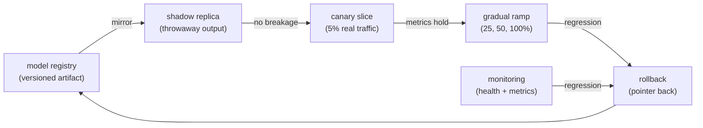
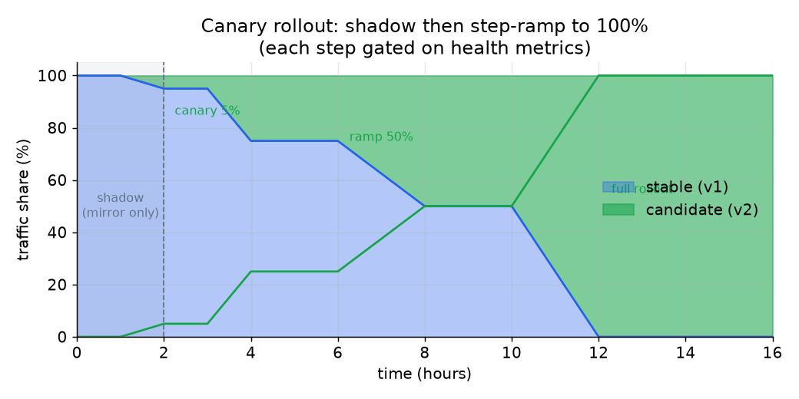

# 4. Deployment strategies

## The cardinal rule

Never flip 100 percent of traffic to a new version at once. A model version that
passed offline evaluation can still crash on real inputs, regress tail latency,
or hurt business metrics in ways offline eval cannot see. The safe-deploy toolkit
exists to retire each risk category in the cheapest order: prove no breakage
first, then prove it helps, then widen.

The model registry is what makes this possible. Every deployable model is an
immutable, versioned artifact with its training provenance, offline metrics, and
a stage (staging, production, archived). The rollout controller chooses how much
traffic each version sees. A deploy is a pointer change and a traffic ramp; a
rollback is a pointer change back.

## Shadow (dark launch, mirroring)

Send a copy of live traffic to the candidate version, run inference, and **throw
the output away**. No user sees it. Compare the new version's latency and
prediction distribution against production offline.

What shadow proves: the new version does not crash on real inputs, does not
regress p99 latency, and does not produce wildly different prediction values
relative to the current version.

What shadow cannot prove: whether the new version actually helps users. Its
predictions never reach anyone, so feedback loops, personalization effects, and
engagement changes are invisible until real traffic is routed.

The cost: shadow doubles inference spend while it runs. At 50 000 QPS on GPU
hardware, this is not cheap. Run shadow for the minimum time to build confidence,
not indefinitely.

## Canary

Route a small real slice (typically 5 percent) to the new version. Watch
per-version serving health (p99, error rate, availability) and online business
metrics (engagement, conversion, coverage) on both the canary and the holdout.
Widen only if the canary holds.

What canary proves: real user impact under a bounded blast radius. If the new
model regresses engagement, 5 percent of traffic is affected, not everyone.

What canary cannot prove: behavior at full scale. Some failure modes only show up
at high concurrency or during traffic spikes. Ramp in steps rather than jumping
from 5 to 100 percent.

Netflix Kayenta automates this entirely: it compares canary and baseline metrics
with statistical rigor and gates the ramp without a human in the loop. That is
the production standard for teams that ship daily.

## Gradual rollout (step ramp)

Widen the canary in steps: 5, 25, 50, 100 percent, with health gates between
each. A problem that only manifests at high concurrency (a memory leak, a
thundering-herd in the embedding cache) surfaces on 25 or 50 percent of traffic
rather than on everyone.

*Shadow phase proves no breakage. Canary at 5% exposes the model to real users
on a small blast radius. The ramp widens in steps as health gates clear. Traffic
only reaches 100% after each gate holds. Illustrative numbers.*

## Blue-green

Stand up the candidate version (green) as a complete parallel fleet alongside
the current production fleet (blue). Once green is verified, cut all traffic over
in a single fast switch. Keep blue warm so rollback is an instant traffic switch
back to it, not a rebuild.

Blue-green gives the fastest possible cutover and the fastest possible rollback,
at the cost of running two full fleets simultaneously. At 50 000 QPS on GPU
hardware, the capacity cost may be prohibitive except for infrequent, high-stakes
deploys (a major architecture change, not a daily checkpoint).

## Rollback

Rollback must be faster and more boring than the original deploy. Because the
registry holds the previous version and the rollout controller owns the traffic
split, a rollback is "point production at the last known-good version." The
trigger should be automatic off a health or metric regression, not manual off a
human noticing an incident.

**Define the rollback trigger before you deploy, not during an incident.** Is it
p99 latency exceeding the budget? Error rate above a threshold? An engagement
drop outside the canary's confidence interval? Wire the trigger into the rollout
controller so that reverting takes seconds.

## When to use which

| Reach for | When | Instead of |
|---|---|---|
| Shadow | Proving the new version does not crash or regress latency, with zero user risk | Canary, when you need to prove zero-impact before any user sees the model |
| Canary plus step ramp (Kayenta) | Measuring real user impact on a bounded blast radius; gating on online metrics | Shadow alone, which cannot measure user impact |
| Gradual rollout in steps | A failure mode that only appears at scale (memory leak, cache stampede) | A direct 5-to-100 jump that misses scale-dependent bugs |
| Blue-green | A high-stakes deploy where instant cutover and instant rollback justify two full fleets | Routine daily checkpoint updates, where the capacity cost is not warranted |
| Automated rollback trigger | Any production system shipping at daily cadence | Manual rollback, which adds minutes of incident time per bad deploy |
| Serve-while-loading (Grab Catwalk) | A gapless hot-swap where the new version must warm before the old stops taking traffic | A swap that routes traffic before the new replica is ready |

**Provenance.** Statistical automated canary analysis (score the canary against the baseline on a metric panel, gate the ramp on the result) was popularized by Kayenta in Netflix's Spinnaker, named in the table above; the serve-while-loading gapless hot-swap is Grab's Catwalk pattern. Both origins are as stated in this file, not attributed beyond it.

**Tools.** On Kubernetes, Argo Rollouts and Flagger drive canary, blue-green, and step-ramp traffic shifting with automated health gates; Spinnaker with Kayenta (Netflix) runs statistical automated canary analysis. Traffic splitting for shadow and percentage canaries rides on a service mesh such as Istio or Linkerd. Model-serving layers KServe and Seldon Core expose shadow (mirror) and canary primitives directly, and a registry (MLflow Model Registry) holds the versioned, stage-tagged artifacts a rollback points back to. Prometheus plus Grafana or Alertmanager supply the health and metric signals that fire the automated rollback trigger.

**Worked example.** A marketplace ships a new listing-ranker checkpoint on a daily cadence. It first mirrors live traffic to the candidate with a KServe shadow to prove no crash and no p99 regression at zero user risk, since shadow alone cannot show whether the model helps. It then routes a 5 percent canary via Flagger with Kayenta-style analysis gating on conversion and latency, widening in 5, 25, 50, 100 steps so a cache stampede that only appears at scale surfaces before full exposure. Blue-green with two full fleets is held back for the rare high-stakes migration (a serving-stack rewrite), not the routine checkpoint, because two fleets on GPU are costly. Throughout, an automated rollback trigger wired into the rollout controller reverts on a health or metric breach in seconds rather than waiting for a human to notice.
