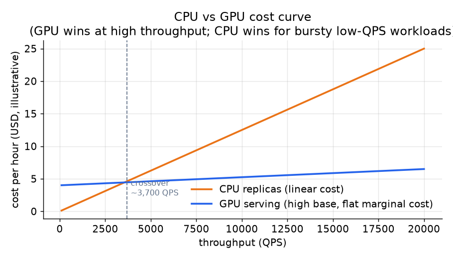

# 5. Autoscaling and cost

## Horizontal scaling

A stateless model server scales horizontally: many identical replicas behind a
load balancer, no per-user state, traffic spread across them. Adding a replica
does not require migrating state; removing one does not lose data. The serving
fleet can grow and shrink freely as long as replicas are truly stateless (the
model weights are read-only, loaded from the registry).

The hard part is not horizontal scaling itself; it is doing it fast enough and
on the right signal.

## Choosing the right autoscaling signal

CPU utilization is the default scaling signal in most orchestrators. For an
inference service, it is usually wrong. The bottleneck is GPU memory bandwidth,
request queue depth, or batch latency, not the host CPU. Scaling on CPU lets
traffic pile up in the inference queue while the CPU sits idle waiting for GPU
returns, or triggers unnecessary scale-out on bursty CPU from feature
preprocessing while the model itself has headroom.

Scale on a serving-specific signal:

- **Request queue length** (or queue wait time): scales before SLA breaches
  rather than after the CPU metric lags.
- **GPU utilization**: directly measures the actual bottleneck on GPU-serving
  fleets.
- **Batch latency percentile**: the metric the SLA cares about, used directly
  as the scale signal.

Uber Michelangelo and Grab Catwalk both document scaling challenges when using
generic CPU metrics; the fix in both cases was to expose a serving-specific
signal.

## Cold start: the autoscaling gotcha

A new replica must load a multi-gigabyte model (a large ranker's embedding tables
can be tens of gigabytes), warm JIT kernels, and prime embedding caches before it
can serve production traffic at full speed. On GPU hardware this can take 30 to
90 seconds. A replica that starts taking traffic before it is warm blows the
latency budget for every request it touches.

Two mitigations:

1. **Readiness probe.** Do not route traffic to a replica until it reports ready.
   The model server's warm-up pass (synthetic requests at startup) moves the cold
   cost off the critical path.
2. **Headroom.** Keep spare capacity running so you are not autoscaling in
   response to a spike that has already arrived. The formula for how much headroom
   to maintain:

$$N_{\text{provisioned}} \;=\; \left\lceil (1 + h) \cdot \frac{\lambda_{\text{peak}}}{\mu} \right\rceil, \qquad h \;\gtrsim\; \frac{T_{\text{coldstart}}}{T_{\text{scale-interval}}}$$

If cold start takes 60 seconds and the autoscaler polls every 30 seconds, $h$
needs to be at least 2. Headroom carries an idle cost; balance it against the
cost of latency spikes during scale-out lag.

```python
import math
def provisioned_replicas(lam_peak, mu, t_coldstart, t_scale_interval):
    # headroom must cover how many scale intervals a cold start spans
    h = t_coldstart / t_scale_interval          # minimum headroom fraction
    base = lam_peak / mu                         # replicas to serve peak load
    return math.ceil((1 + h) * base)             # inflate by headroom, round up
# provisioned_replicas(600, 100, 60, 30) -> h=2, ceil(3 * 6) == 18
```

## CPU vs GPU cost curves

The economics of serving differ sharply between CPU and GPU:

- **CPU replicas** cost roughly linearly with QPS: each additional replica handles
  a fixed request rate, and the fleet cost scales with load.
- **GPU instances** carry a high base cost (the instance itself) but a very
  shallow marginal cost per additional request, because larger batches amortize
  the fixed GPU overhead.

$$\text{Cost}_{\text{CPU}}(\lambda) \;\approx\; \frac{\lambda}{\mu_{\text{CPU}}} \cdot p_{\text{CPU}}$$

$$\text{Cost}_{\text{GPU}}(\lambda) \;\approx\; N_{\text{GPU}} \cdot p_{\text{GPU}}, \quad N_{\text{GPU}} = \left\lceil \frac{\lambda}{\mu_{\text{GPU}}} \right\rceil$$



*At low QPS, CPU is cheaper: you pay only for the replicas you use and GPU
instances are idle. At high sustained QPS, GPU wins: the sub-linear batch curve
means each GPU handles far more requests per dollar. The crossover point depends
on the model size, hardware pricing, and batch fill efficiency. Illustrative.*

Pinterest's motivation for moving to GPU was exactly this: they needed to serve
a much larger model at neutral cost, which required the GPU's batch economics.

## Offline vs online: push work off the critical path

Not every prediction needs live serving. If a prediction does not change between
requests (a daily user affinity score, a precomputed item quality score), compute
it in batch on a schedule and write it to a lookup store. Online serving then
reads a pre-computed value with sub-millisecond lookup latency.

The practical rule: push to batch when freshness can be hours old and the
prediction does not depend on real-time context. Reserve online serving for what
depends on the request (query, real-time user context, inventory state). LinkedIn
Pensieve does this for embedding inference: push embedding computation to
nearline, serve results from a fast store.

Shadow and blue-green carry their own capacity cost:

$$\text{Cost}_{\text{deploy}} \;=\; \text{Cost}_{\text{prod}} \cdot (1 + f_{\text{mirror}}), \quad f_{\text{mirror}} \;\in\; [0, 1]$$

A full shadow mirror doubles inference cost. Size the shadow phase to be as short
as credible, and consider running it at sampled traffic rather than full volume
when the fleet is large.
